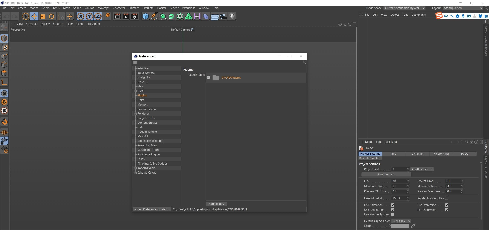
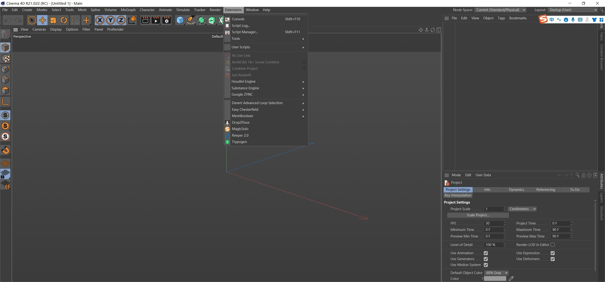

今天我为大家解答一下C4D R21如何安装插件的问题，想必大家都知道R19以上的插件安装方法，直接找到安装目录下的Plugins，将插件文件拖入就可以了。但是R21的插件安装与之前的就有所不同了，在安装目录下就找不到Plugins文件了。如下：

以下就来说说我的解决方法，首先咱们现在安装目录下新建一个Plugins文件夹。

再打开C4D R21，按Ctrl+E（设置）打开窗口。<b>（插件在plugins文件夹里，脚本在prefs文件夹里，预设在library-browser文件夹里。）</b>然后再找到Plugins，在Plugins面板中选择我们之前安装目录下新建的Plugins文件夹。

然后再将插件文件夹拖入安装目录下的Plugins中，再在C4D中Extensions（扩展）中可以看到咱们安装的插件的名字。

以上就是解决R21安装插件的问题。如果大家还有什么问题可以留言一起讨论！！！谢谢大家。

大家也可以参考我的知乎：

[C4D R21如何安装插件？ - 知乎 (zhihu.com)](https://zhuanlan.zhihu.com/p/372989696)
