
2.6.41版本以上有水印的是因为当前版本破解不完美，有很多小伙伴都为此感到困惑，今天我给大家带来解决办法。

首先，咱们随便搭建一个小场景。

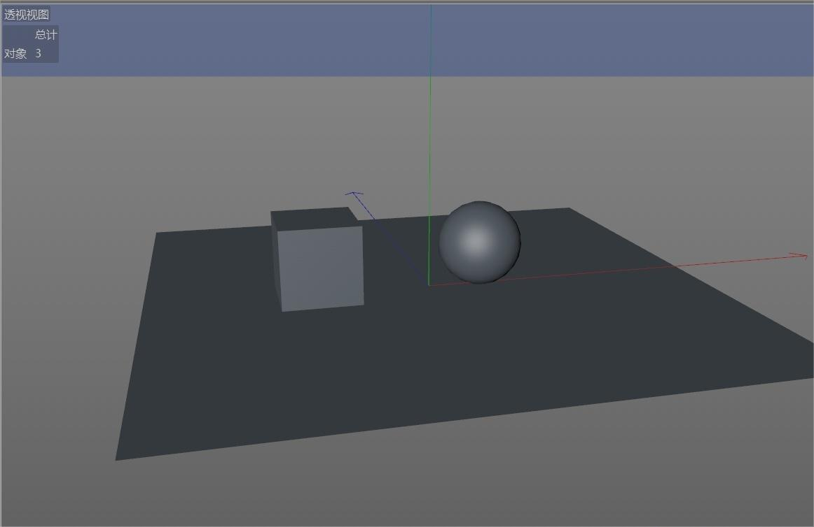

再到Redshift工作界（按照自己喜好去设置Redshift界面）面去，你再点击 开始 渲染，之后你会发现Redshift渲染窗口有水印覆盖。

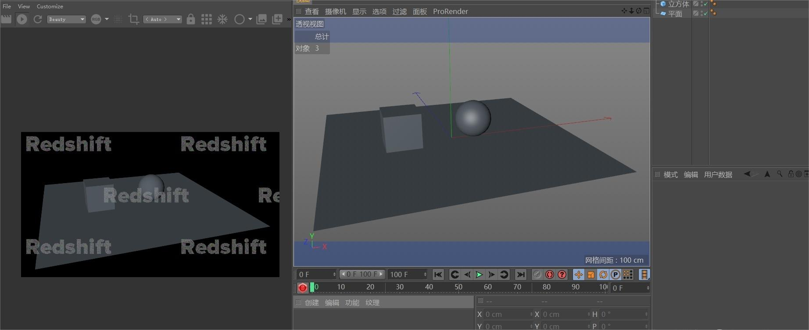

然后你再按键盘的Ctrl+B（渲染设置），将 渲染器 后面的 标准 改成 Redshift，就会出现下面这个界面。

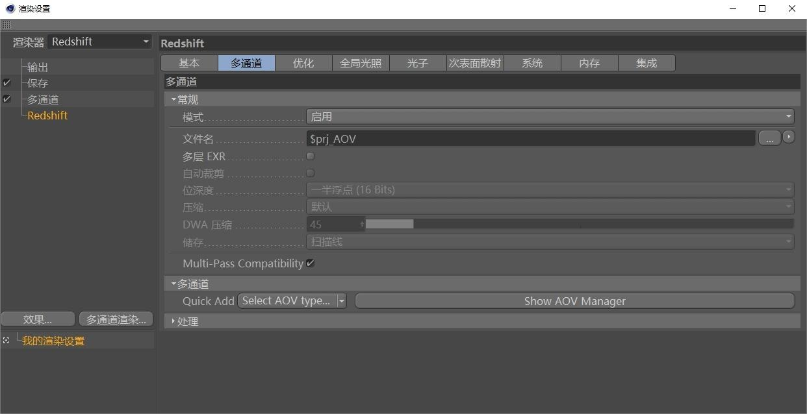

默认是 多通道 属性，在 多通道 属性面板下找到 多通道 下的 Quick Add，再点击 Quick Add 后面的下拉符号，就会出现一条很长的名词，咱们选择 完整渲染。

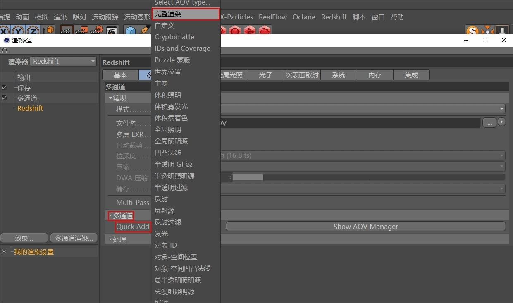

选择了 完整渲染之后，下面就会出现 AOV1 （完整渲染：多通道/IPR（Bucket）），咱们点击它，就会出现很多内容，载将 选项 下面 名字 Beauty 改成一个你喜欢的名字，我在这里就改成zhihu来演示。

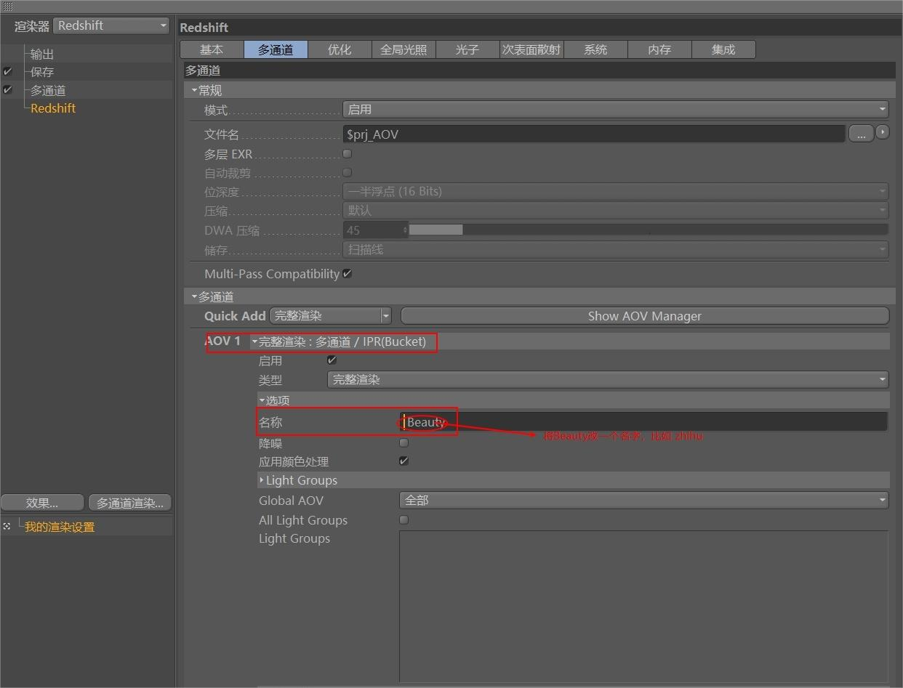

此时你再点击 Quick Add 后面的 Show AOV Manager，就会出现 Redshift AOV 管理器，然后取消勾选 Multi-Pass，勾选 Direct。

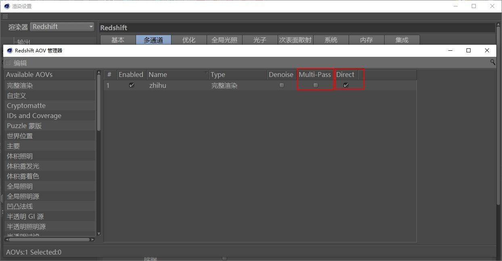

任意点击 完整渲染 这一条，右边就会出现一系列参数，找到 格式，你可以将他的格式改成PNG（这只是其中一种，按照你所需要的来）

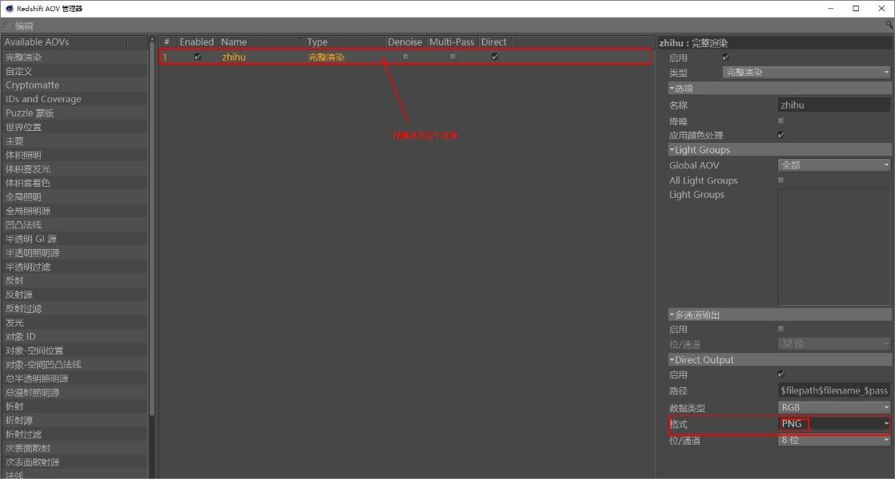

关闭 Redshift AOV 管理器 面板，点击 保存，取消勾选 常规图像 下面的 保存，勾选 多通道 下面的 保存，再选择文件保存路径，还可以改 格式，我这里就改成PNG。

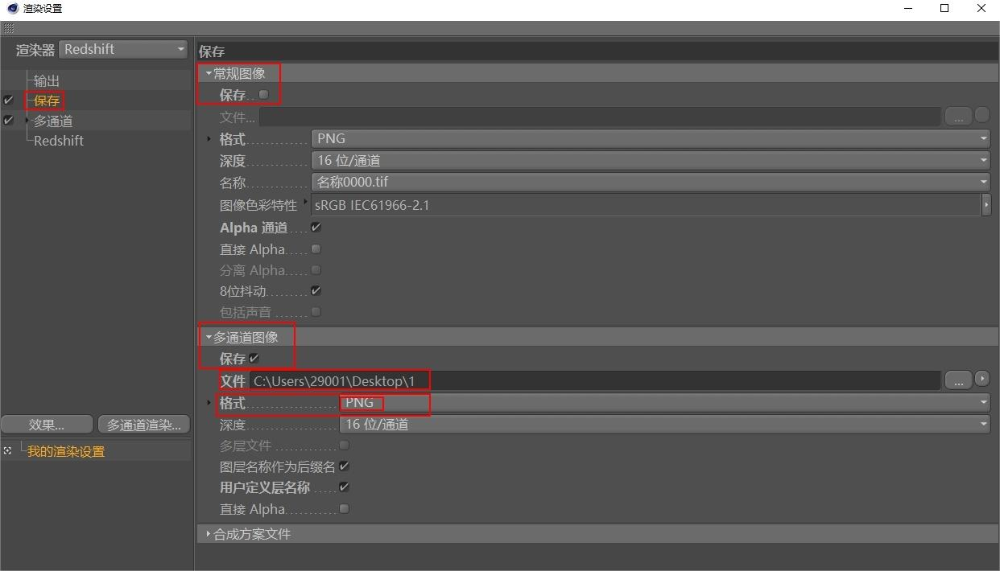

所有设置好之后，关闭渲染设置，回到Redshift工作界面，将多通道 Beauty 换成 zhihu(就是我们在上面改的名字)，再点击旁边的刷新按钮，就会发现渲染面板的水印没有了。

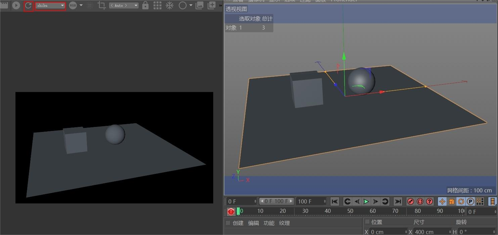

最后按键盘的Shift+R 图片查看器，会发现这里有水印，这里有水印不会影响咱们最终的结果，你可以打开之前保存路径之下的文件夹去看看。

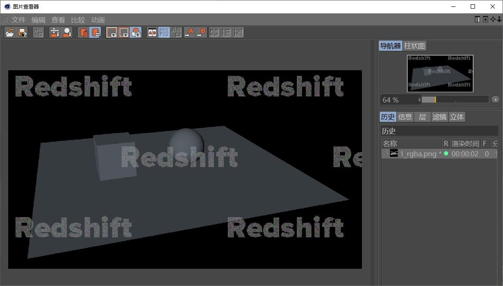

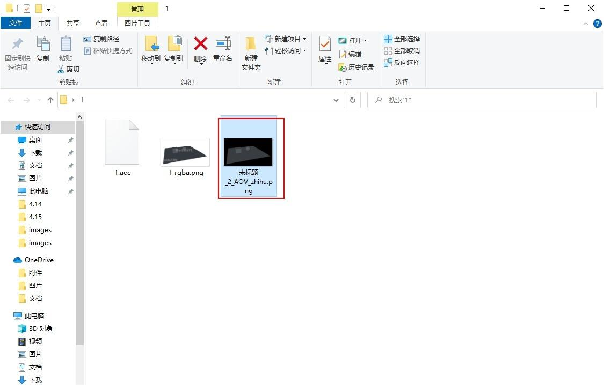

好了，祝大家C4D学习越来越好，加油！！！

大家也可以参考我的知乎：

[C4D Redshift 2.6.41渲染器如何去水印？图文详解 - 知乎 (zhihu.com)](https://zhuanlan.zhihu.com/p/365135282)
