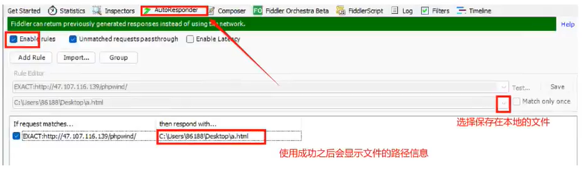

## fiddler的核心作用

- 接口测试

    - 发送自定义的请求，模拟小型接口测试
    
- 定位前后端bug

    - 抓取协议包，前后端联调

- 弱网测试

    - 模拟限速操作，弱网，断网

- 构建模拟测试场景

    - 数据篡改，重定向

- 前端性能分析及优化

## fiddler的工作原理


- 本地应用与服务器之间的所有请求(request)和响应(response)，由fiddler进行转发，此时fiddler以代理服务器的方式存在

- 由于所有的网络数据都需要经过fiddler，因此，fiddler能够截取数据信息，实现网络数据抓包

## fiddler和F12抓包对比

- 相同点:

    - 都可以对http和https请求进行抓包分析
    
- 不同点:

    - F12无法抓取app端的请求，而fiddler工具可以完成
    
    - F12无法修改请求数据，请求之前和请求之后，而fiddler工具可以完成
    
    - F12可以在console控制台输入部分命令，方便查看前端的数据信息，可以通过application上面查看一些请求的数据，尤其是涉及到登录或者邀请相关的知识

## fiddler基本功能使用

### 导包

- File - Export Sessions - All Sessions...


### 规则设置Rules

- 隐藏不需要的数据包：勾选Rules下的Hide CONNECTs和Hide 304s


- 断点调试：Automatic Breakpoints


- 弱网测试设置：Customize Rules...


## fiddler配置证书抓取HTTPS包

- <b>打开Tools下面的Options界面中https选项</b>，勾选Capture HTTPS CONNECTs、Decrypt HTTPS traffic以及Ignore sever certificate errors(unsafe)


- 在connections里面设置配置信息：


- 重置更新证书


## fiddler抓取APP包必须设置

- <b>打开Tools下面的Options界面中Connections选项</b>，勾选Allow remote computers to connect


## fiddler设置过滤器

设置过滤器的核心作用是只抓取需要的数据包内容

- 使用过滤器：勾选Filters


- 隐藏不需要的数据包信息固定格式:

```python
REGEX:(?insx)/[^\?/]*\.(css|ico|jpg|png|gif|bmp|wav|js|jpeg)(\?.*)?$
```

## fiddler弱网设置

给代理设置不同的网络情况：

- 2G、3G、4G、5G

第一步：设置网络传输值

- 点击Fiddler Script，找到以下代码块


- 2G：

    - 上传：500，下载：400

- 3G：

    - 上传：100，下载：100

- 4G：

    - 上传：15，下载：10

第二步：开启弱网测试规则

- 点击Rules - Performance - Simulate Moderm Speeds 


## fiddler线上调试

1、先抓包获取响应信息


2、将响应信息复制到.html文件当中（自己新建一个.html文件）

3、修改需要修改的.html文件内容信息

4、Fiddler设置如下（实现调试网页任何内容）

5、点击AutoResponder




6、回到访问的页面进行刷新：shift+F5 （会发现显示修改后的数据）

> 注意：一定要勾选如图所示，如果不勾选本地文件那么就会关闭调试


## fiddler断点调试

1、查看webforms请求参数信息


2、打开 Rules - Automatic Breakpoints - Before Requests（请求前）断点调试


3、对进行抓包的请求重新发送：点击Reolay - 选中断掉调试的包 - 修改参数信息 - Run to Completion


4、查看请求的响应结果


在发送请求之前输入了正确的账号密码

但是请求发送之后被fiddler拦截，修改了账号密码参数信息

通过fiddler放行之后，返回响应信息是错误的账号密码提示内容

发送请求之前，可以执行重新发送：Replay

- 测试不同的正例，反例抓包获取不同的响应结果
    
- 通过多次调试，抓取必带参数信息，不是必带信息进行删除

## 如何定位前后端的bug？

<b>一般使用抓包工具fiddler进行判断前后端bug</b>

理论上：

- 第一步如果请求参数有问题，那么就是前端的问题

- 第二步如果请求参数没有问题，那么返回数据有问题，那么就是后端的问题

- <b>局限性</b>：没有详细接口文档的情况下，是无法判断接口参数是否有问题

实际上：

- 查看响应结果

- 查看页面错误信息

- 综合进行对比

- 结合需求文档和日志信息

- 比如异常类的信息：一定是后端问题

总结：

- 通过fiddler可以抓取请求和响应参数，通过对参数进行分析，可以定位前后端问题

- 例如在测试登录接口的时候，输入正确的手机号和密码，但是前端提示：请输入正确的手机号或密码

- 仅仅通过界面提示我们只能描述bug现象，但不能分析出前后端具体的问题

- 假设通过抓包发现由于前端参数名错误或者参数值为空，从而导致后台报错

- 那这个问题就是前端的问题，将参数数据和接口文档中的对应报文数据作为附件上传

- 可以解决问题的效率

---

具体可以参考CSDN：[抓包工具Fiddler的下载、安装、配置、基本使用](https://blog.csdn.net/weixin_44904239/article/details/135207151)