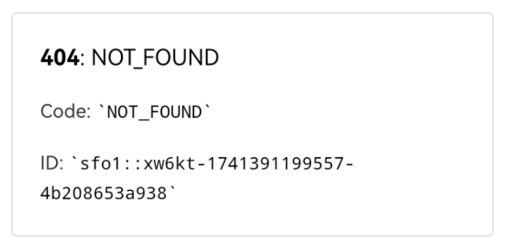

<p align = "justify" style = "text-indent:2em">当GitHub部署到vercel后，通过绑定的域名打开网页发现页面显示404，图片如下：</p>



<p align = "justify" style = "text-indent:2em">要解决上述问题，可以按照以下步骤进行排查和修复：</p>

## 确认Hexo站点构建正确

<p align = "justify" style = "text-indent:2em">首先，确保你的Hexo站点能够在本地正确生成和预览。你可以通过以下命令来构建你的Hexo站点：</p>

```
hexo clean
hexo generate
hexo server
# hexo cl && hexo g && hexo  （git） / hexo cl ; hexo g ; hexo d （vscode）
```

<p align = "justify" style = "text-indent:2em">在浏览器中访问 http://localhost:4000 来查看你的站点是否正确显示。</p>

## 检查Vercel配置路径

<p align = "justify" style = "text-indent:2em">确保你在 Vercel 中设置的部署路径与你的 GitHub 仓库中的文件结构相匹配。</p>

## 清除缓存并重新部署

<p align = "justify" style = "text-indent:2em">有时候，清除Vercel的缓存可以解决一些看似复杂的问题。你可以在Vercel Dashboard中手动触发重新部署，或者使用Vercel CLI：</p>

```
vercel --prod
```

## 查看Vercel日志和错误信息

<p align = "justify" style = "text-indent:2em">在Vercel Dashboard中查看部署日志，可能会有一些有用的错误信息帮助你诊断问题。搜索与404相关的错误信息，看看是否有特定的文件或路径没有被正确处理。</p>

<p align = "justify" style = "text-indent:2em">按照这些步骤操作后，通常可以解决大部分因配置不当导致的404错误。如果问题仍然存在，可能需要检查更具体的Hexo配置或进一步的Vercel设置。</p>