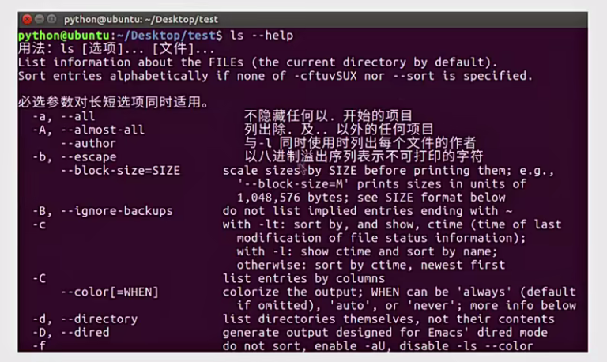
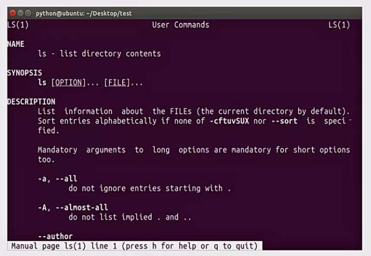
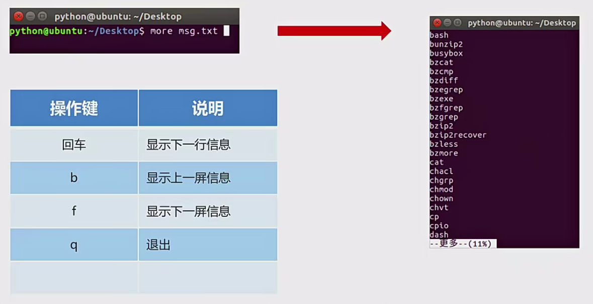
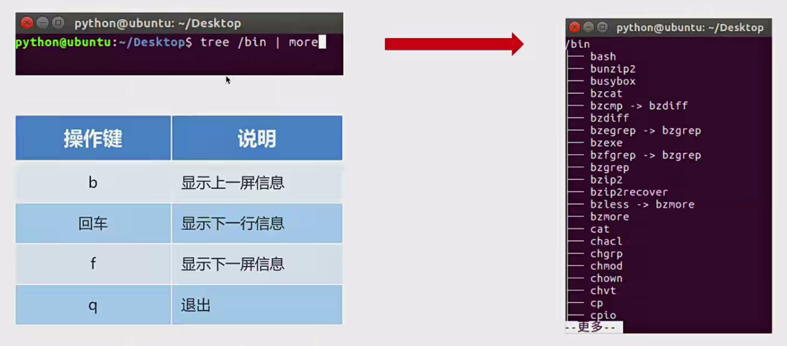
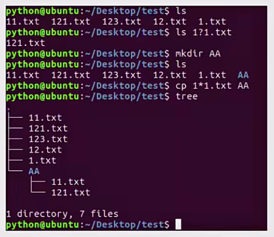
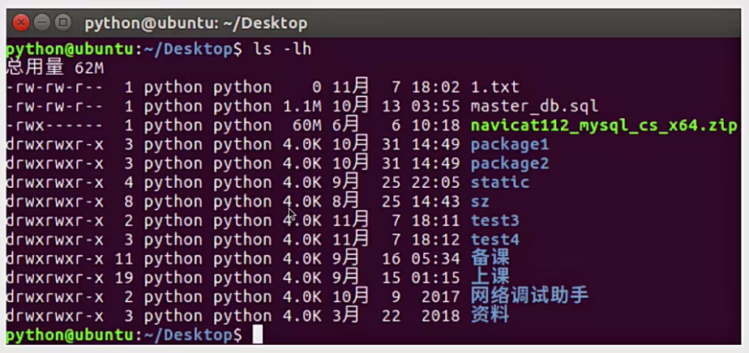

## 查看目录命令

|命令|说明|
|:--:|:--:|
|ls|查看当前路径下的目录信息|
|tree|以树状方式显示目录|
|pwd|查看当前目录路径|
|clear|清除终端内容|
|ctrl + shift + "+"|放大窗口字体|
|ctrl + "-"|缩小窗口字体|

## 切换目录命令

|命令|说明|
|:--:|:--:|
|cd 目录|切换到指定目录|
|cd ~|切换到当前用户的主目录|
|cd ..|切换到上一级目录|
|cd .|切换到当前目录|
|cd -|切换到上一次目录|

## 创建、删除文件和目录命令

|命令|说明|
|:--:|:--:|
|touch 文件名|创建指定文件|
|mkdir 目录名|创建目录(文件夹)|
|rm 文件名|删除指定文件|
|rmdir 目录名|删除空目录|

提示:

1、删除非空目录: rm 非空目录名 -r

2、-r: 递归删除目录及其内容

## 复制、移动文件和目录命令

|命令|说明|
|:--:|:--:|
|cp|复制(拷贝)文件、拷贝目录|
|mv|移动文件、移动目录、重命名|

## 终端命令格式的组成

### 终端命令格式说明

command [-options] [parameter]

- command: 命令名，比如: ls、pwd

- [-options]: 选项，可以有零个、一个或者多个选项，多个选项可以合并，比如使用的 -r 就是选项。

- [parameter]: 参数，可以有零个、一个或者多个参数，比如: touch 文件名、mkdir 目录名、cd 目标目录(路径)，这些文件名和目录名都是参数。

- []: 代表可选

### 知识要点

选项: 用于调整命令的功能，比如: -r选项调整cp命令的功能。

参数: 命令的操作对象，一般是文件名或者目录名。

对于命令，它的选项和参数一般情况下没有顺序要求。

---

## 查看命令帮助的方式

|命令帮助操作|说明|
|:--:|:--:|
|--help|command --help|
|man|man command|

提示:

查看命令帮助目的是查看命令选项及命令选项的说明。

### --help

### man

|操作键|说明|
|:--:|:--:|
|空格|显示下一屏信息|
|回车|显示下一行信息|
|b|显示上一屏信息|
|q|退出|

### 知识要点

--help和man是查看命令帮助的两种方式，主要是查看命令所对应的选项信息。

---

## 查看目录信息命令选项

### ls命令选项

|命令选项|说明|
|:--:|:--:|
|-l|以列表方式显示，默认是字节|
|-h|智能的显示文件大小|
|-a|显示隐藏文件和隐藏目录|

---

## 创建、删除文件夹命令选项

### mkdir命令选项

|命令选项|说明|
|:--:|:--:|
|-p|创建所依赖的文件夹|

### rm命令选项

|命令选项|说明|
|:--:|:--:|
|-i|交互式提示|
|-r|递归删除目录及其内容|
|-f|强制删除，忽略不存在的文件，无需提示|

### 知识要点

创建嵌套文件夹使用“mkdir -p”嵌套目录

删除空目录使用“rmdir 目录名”或者“rm -r 目录名”

删除非空目录使用“rm -r 目录名”

---

## 拷贝、移动文件和文件夹命令选项

### cp命令选项

|命令选项|说明|
|:--:|:--:|
|-i|交互式提示|
|-r|递归拷贝目录及其内容|
|-v|显示拷贝后的路径描述|

### mv命令选项

|命令选项|说明|
|:--:|:--:|
|-i|交互式提示|
|-v|显示移动后的路径描述|

### 知识要点

拷贝文件防止覆盖使用“cp -i”操作

拷贝文件夹使用“cp -r”操作

移动文件防止覆盖使用“mv -i”操作

---

## 重定向命令

重定向也称为输出重定向，把在终端执行命令的结果保存到目标文件。

|命令|说明|
|:--:|:--:|
|>|如果文件存在，会覆盖原有文件内容，相当于文件操作中的'w'模式|
|>>|如果文件存在，会追加写入文件未尾，相当于文件操作中的'a'模式|

### 知识要点

1、终端内容保存到文件使用重定向有两种方式:>和>>。

2、>表示每次只写入最新的数据，原有数据不保留。

3、>>表示每次在原有数据的基础上进行追加，原有数据会保留。

---

## 查看文件内容命令

|命令|说明|
|:--:|:--:|
|cat|查看小型文件|
|more|查看大型文件|
|l|管道，一个命令的输出可以通过管道做为另一个命令的输入，相当于一个容器。|

提示:

|(管道)一般结合more命令使用，主要是分配查看终端显示内容。

### more命令的使用

### 管道命令的使用

### 知识要点

查看小文件内容使用 cat 命令，查看大文件内容使用 more 命令，查看终端显示内容并分屏展示，使用管道结合 more 命令。

---

## 链接命令

### 软链接

类似于Windows下的快捷方式当一个源文件的目录层级比较深，我们想要方便使用它可以给源文件创建一个软链接。

|命令|说明|
|:--:|:--:|
|ln -s|创建软链接|

### 知识要点

软链接的作用是方便文件的访问操作，比如把一个复杂路径下的文件使用软链接就可以完成方便的访问。

创建软链接文件应该使用绝对路径，否则软链接文件有可能失效。

可以给目录创建软链接。

删除源文件，软链接文件会失效。

---

## 查找文件内容命令

|命令|说明|
|:--:|:--:|
|grep|查找/搜索文件内容|

### grep命令及选项的使用

|选项|说明|
|:--:|:--:|
|-v|显示不包含匹配文本的所有行|
|-n|显示匹配行号|
|-i|忽略大小写|

### grep命令结合正则表达式使用

|选项|说明|
|:--:|:--:|
|^|以指定字符串开头|
|$|以指定字符串结尾|
|.|匹配一个非换行符的字符|

### 知识要点

1、通过 grep 命令可以在指定文件中查找指定搜索内容，这里扩展一下，grep 还可以查找管道中的内容。比如: ls/|grep 'lib'

2、在使用 grep 命令时，还可以省略查找内容的引号。比如: ls/|grep lib, grep hello 1.txt

---

## 查找文件命令

|命令|说明|
|:--:|:--:|
|find|在指定目录下查找符合条件的文件|

### find命令及选项的使用

|选项|说明|
|:--:|:--:|
|-name|根据文件名查找文件|

### 通配符

是一种特殊语句，主要有星号(*)和问号(？)，用来模糊搜索文件。

|通配符|说明|
|:--:|:--:|
|*|代表0个或多个任意字符|
|？|代表任意一个字符|

### 知识要点

通配符不仅能结合 find 命令使用，还可以结合其它命令使用，比如: ls、mv、cp 等，这里需要注意只有find命令使用通配符需要加上引号。

示例：

---

## 压缩和解压缩命令

### 压缩格式介绍

|压缩格式|说明|
|:--:|:--:|
|.gz|压缩包后缀|
|.bz2|压缩包后缀|

说明：

.gz和.bz2的压缩包需要使用tar命令来压缩和解压缩。

### tar命令及选项的使用

|命令|说明|
|:--:|:--:|
|tar|压缩和解压缩命令|

|tar命令选项|说明|
|:--:|:--:|
|-c|创建打包文件|
|-v|显示打包或者解包的详细信息|
|-f|指定文件名称，必须放到所有选项后面|
|-z|压缩(.gz)|
|-j|压缩(.bz2)|
|-x|解压缩|
|-C|解压缩到指定目录|

### 知识要点

.bz2和.gz的区别在于，前者比后者压缩率更高，后者比前者花费更少的时间（注意在压缩较大文件时）。

---

## 文件权限命令

### 文件信息

说明：

- 左数第一列是文件类型和权限

- 第三列用户名

- 第四列用户组

- 第五列文件大小

- 第六列文件修改时间

- 第七列文件名

文件类型说明：

- -表示普通文件

- d表示文件夹

文件权限说明：

- 由三个三元组字符组成

- 第一个三元字符组代表文件所有者用户的权限

- 第二个代表文件用户组的权限

- 第三个代表其他用户的权限

- r表示可读，w表示可写

- x表示可执行，-表示没有权限

---

|命令|说明|
|:--:|:--:|
|chmod|修改文件权限|

chmod 修改文件权限有两种方式：

- 字母法

- 数字法

### chmod 字母法

格式: chmod u/g/o/a+/-/=rwx 文件名

|角色|说明|
|:--:|:--:|
|u|user 表示该文件的所有者|
|g|group 表示用户组|
|o|other 表示其他用户|
|a|all 表示所有用户|

|操作符|说明|
|:--:|:--:|
|+|增加权限|
|-|撤销权限|
|=|设置权限|

|权限|说明|
|:--:|:--:|
|r|可读|
|w|可写|
|x|可执行|
|-|无任何权限|

### chmod 数字法

格式: chmod 权限值 文件名

|权限|说明|
|:--:|:--:|
|r|可读，权限值是4|
|w|可写，权限值是2|
|x|可执行，权限值是1|
|-|无任何权限，权限值是0|

### 知识要点

利用 chmod 命令可以控制文件的操作权限。

---

## 获取管理员权限的相关命令

### sudo命令的使用

|命令|说明|
|:--:|:--:|
|sudo -s|切换到root用户，获取管理员权限|
|sudo|某个命令的执行需要获取管理员权限可以在执行命令前面加上sudo|

### whoami命令的使用

|命令|说明|
|:--:|:--:|
|whoami|查看当前用户|

### who命令的使用

|命令|说明|
|:--:|:--:|
|who|查看所有的登录用户|

### exit命令的使用

|命令|说明|
|:--:|:--:|
|exit|退出登录用户|

### passwd命令的使用

|命令|说明|
|:--:|:--:|
|passwd|修改用户密码，不指定用户默认修改当前登录用户密码|

### which命令的使用

|命令|说明|
|:--:|:--:|
|which|查看命令位置|

### 关机和重启命令的使用

|命令|说明|
|:--:|:--:|
|shutdown -h now|立刻关机|
|reboot|重启|