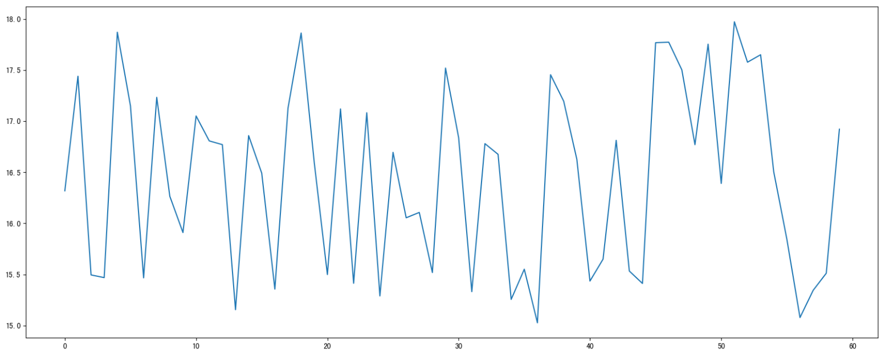
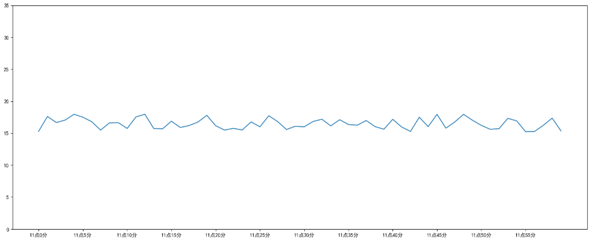
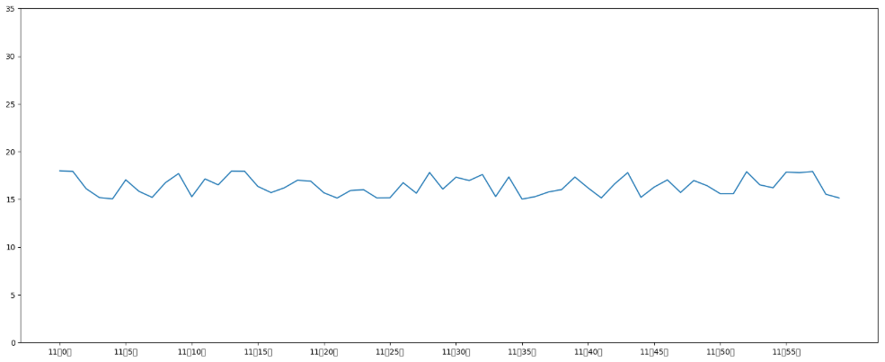
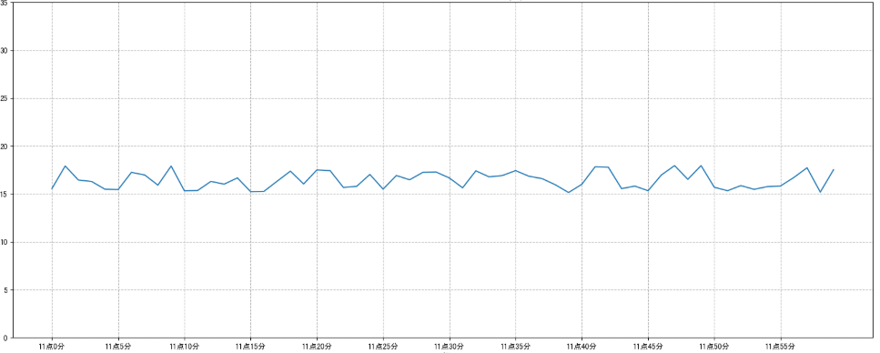
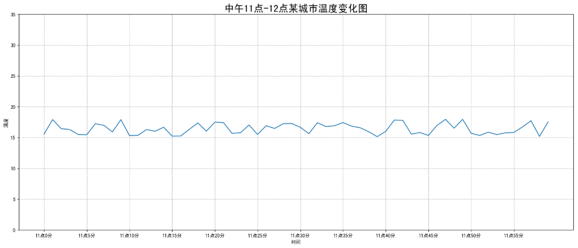
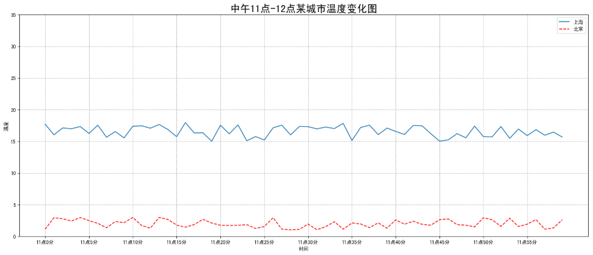
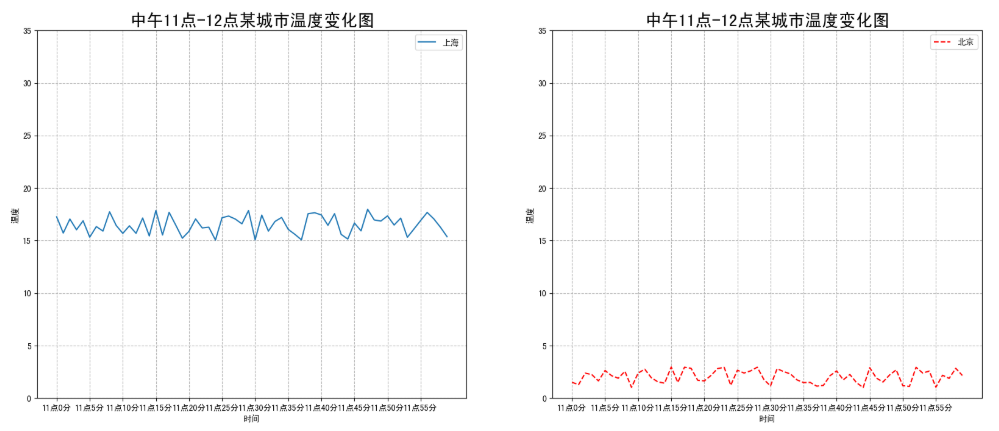
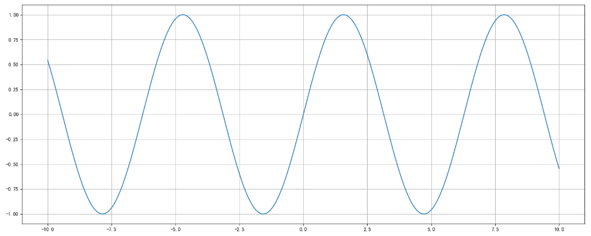

## 完善原始折线图 --- 给图形添加辅助功能

<p align = "justify" style = "text-indent:2em">为了更好地理解所有基础绘图功能，我们通过天气温度变化的绘图来融合所有的基础API使用。</p>

<p align = "justify" style = "text-indent:2em"><b>需求：画出某城市11点到12点1小时内每分钟的温度变化折线图，温度范围在15度~18度。</b></p>

<p align = "justify" style = "text-indent:2em"><b>效果：</b></p>



### 准备数据并画出初始折线图

```python
import matplotlib.pyplot as plt
import random

# 画出温度变化图

# 0、准备x,y坐标的数据
x = range(60)
y_hengyang = [random.uniform(15, 18) for i in x]

# 1、创建画布
plt.figure(figsize=(20, 8), dpi=80)

# 2、绘制折线图
plt.plot(x, y_hengyang)

# 3、显示图像
plt.show()
```


### 添加自定义x,y刻度

- plt.xticks(x, **kwargs)

<p align = "justify" style = "text-indent:2em">x:要显示的刻度值</p>

- plt.yticks(y, **kwargs)

<p align = "justify" style = "text-indent:2em">y:要显示的刻度值</p>

```python
# 2.1 添加x,y轴刻度

# 设置x,y轴刻度
x_ticks_label = ["11点{}分".format(i) for i in x]
y_ticks = range(40)

# 修改x,y轴坐标刻度显示
# plt.xticks(x_ticks_label[::5]) # 坐标刻度不可以直接通过字符串进行修改
plt.xticks(x[::5], x_ticks_label[::5])
plt.yticks(y_ticks[::5])
```



<p align = "justify" style = "text-indent:2em">如果没有解决过中文问题的话，会显示这个样子:</p>



### 中文显示问题解决

解决方案一（推荐）：

下载中文字体（黑体，看准系统版本）
- 步骤一：下载<a href="https://font.chinaz.com/161017462260.htm">SimHei</a>字体（或者其他的支持中文显示的字体也行）

- 步骤二：安装字体

    - linux下：拷贝字体到 usr/share/fonts 下:

        ```
        sudo cp ~/SimHei.ttf /usr/share/fonts/SimHei.ttf
        ```

    - windows和mac下：双击安装

- 步骤三：删除~/.matplotlib中的缓存文件

    ```
    cd ~/.matplotlib
    rm -r *
    ```

- 步骤四：修改配置文件matplotlibrc

    ```
    vi ~/.matplotlib/matplotlibrc
    ```

- 将文件内容修改为：

    ```
    font.family: sans-serif
    font.sans-serif: SimHei
    axes.unicode_minus: False
    ```

解决方案二：

<p align = "justify" style = "text-indent:2em">在Python脚本中动态设置matplotlibrc，这样也可以避免由于更改配置文件而造成的麻烦，具体代码如下:</p>

```python
from pylab import mpl
# 设置显示中文字体
mpl.rcParams["font.sans-serif"] = ["SimHei"]
```

<p align = "justify" style = "text-indent:2em">有时候，字体更改后，会导致坐标轴中的部分字符无法正显示，此时需要更改axes.unicode_minus参数:</p>

```python
# 设置正常显示符号
mpl.rcParams["axes.unicode_minus"] = False
```

### 添加网格显示

为了更加清楚地观察图形对应的值。

```python
# 2.2 添加网格显示
plt.grid(True, linestyle="--", alpha=1)
```



### 添加描述信息

添加x轴、y轴描述信息及标题。

> 通过fontsize参数可以修改图像中字体的大小。

```python
# 2.3 添加描述信息
plt.xlabel("时间")
plt.ylabel("温度")
plt.title("中午11点-12点某城市温度变化图", fontsize=20)
```



### 图像保存

```python
# 保存图片到指定路径
plt.savefig("./lianxi/test.png")
```

- <b>注意：</b>plt.show()会释放figure资源，如果在显示图像之后保存图片将只能保存空图片。

---

<b>完整代码：</b>

```python
import matplotlib.pyplot as plt
import random

from pylab import mpl
# 设置显示中文字体
mpl.rcParams["font.sans-serif"] = ["SimHei"]
# 设置正常显示符号
mpl.rcParams["axes.unicode_minus"] = False

# 0.准备数据
x = range(60)
y_hengyang = [random.uniform(15, 18) for i in x]

# 1.创建画布
plt.figure(figsize=(20, 8), dpi=100)

# 2.绘制图像
plt.plot(x, y_hengyang)

# 2.1 添加x,y轴刻度
# 设置x,y轴刻度
x_ticks_label = ["11点{}分".format(i) for i in x]
y_ticks = range(40)

# 修改x,y轴坐标刻度显示
# plt.xticks(x_ticks_label[::5]) # 坐标刻度不可以直接通过字符串进行修改
plt.xticks(x[::5], x_ticks_label[::5])
plt.yticks(y_ticks[::5])

# 2.2 添加网格显示
plt.grid(True, linestyle="--", alpha=1)

# 2.3 添加描述信息
plt.xlabel("时间")
plt.ylabel("温度")
plt.title("中午11点-12点某城市温度变化图", fontsize=20)

# 2.4 图像保存
plt.savefig("./lianxi/test.png")

# 3.图像显示
plt.show()
```

---

## 在一个坐标系中绘制多个图像

### 多次plot

<p align = "justify" style = "text-indent:2em"><b>需求：再添加一个城市的温度变化。</b></p>

<p align = "justify" style = "text-indent:2em">收集到长沙当天温度变化情况，温度在1度到3度。怎么去添加另一个在同一坐标系当中的不同图形，<b>其实很简单只需要再次plot即可</b>，但是需要区分线条，如下显示：</p>



```python
# 增加北京的温度数据
y_changsha =[random.uniform(1,3)for i in x]

# 绘制折线图
plt.plot(x, y_hengyang)
# 使用多次plot可以画多个折线
plt.plot(x, y_changsha, color='r', linestyle='--')
```

### 设置图像风格

|颜色字符|风格字符|
|:--:|:--:|
|r 红色|- 实线|
|g 绿色|-- 虚线|
|b 蓝色|-.点划线|
|w 白色|: 点虚线|
|c 青色|'' 留空、空格|
|m 洋红| |
|y 黄色| |
|k 黑色| |

### 显示图例

- 注意：如果只在pit.plot()中设置label还不能最终显示出图例，还需要通过plt.legend()将图例显示出来。

```python
# 绘制折线图
plt.plot(x, y_hengyang, label="衡阳")
# 使用多次plot可以画多个折线
plt.plot(x, y_changsha, color='r', linestyle='--', label="长沙")

# 显示图例
plt.legend(loc="best" )
```

|Location String|Location Code|
|:--:|:--:|
|'best'|0|
|'upper right'|1|
|'upper left'|2|
|'lower left'|3|
|'lower right'|4|
|'right'|5|
|'center left'|6|
|'center right'|7|
|'lower center'|8|
|'upper center'|9|
|'center'|10|

---

<b>完整代码：</b>

```python
import matplotlib.pyplot as plt
import random

from pylab import mpl
# 设置显示中文字体
mpl.rcParams["font.sans-serif"] = ["SimHei"]
# 设置正常显示符号
mpl.rcParams["axes.unicode_minus"] = False

# 0.准备数据
x = range(60)
y_hengyang = [random.uniform(15, 18) for i in x]
y_changsha = [random.uniform(1, 3) for i in x]

# 1.创建画布
plt.figure(figsize=(20, 8), dpi=100)

# 2.绘制图像
plt.plot(x, y_hengyang, label="衡阳")
plt.plot(x, y_changsha, color="r", linestyle="--", label="长沙")

# 2.1 添加x,y轴刻度
# 设置x,y轴刻度
x_ticks_label = ["11点{}分".format(i) for i in x]
y_ticks = range(40)

# 修改x,y轴坐标刻度显示
# plt.xticks(x_ticks_label[::5]) # 坐标刻度不可以直接通过字符串进行修改
plt.xticks(x[::5], x_ticks_label[::5])
plt.yticks(y_ticks[::5])

# 2.2 添加网格显示
plt.grid(True, linestyle="--", alpha=1)

# 2.3 添加描述信息
plt.xlabel("时间")
plt.ylabel("温度")
plt.title("中午11点-12点某城市温度变化图", fontsize=20)

# 2.4 图像保存
plt.savefig("./lianxi/test.png")

# 2.5 显示图例
plt.legend(loc=0)

# 3.图像显示
plt.show()
```

---

## 多个坐标系显示 --- plt.subplots（面向对象的画图方法）

<p align = "justify" style = "text-indent:2em">如果我们想要将上海和北京的天气图显示在同一个图的不同坐标系当中，效果如下：</p>



<p align = "justify" style = "text-indent:2em">可以通过subplots函数实现（旧的版本中有subplot，使用起来不方便），推荐subplots函数。</p>

- matplotlib.pyplot.subplots(nrows=1, ncols=1, **fig_kw)创建一个带有多个axes(坐标系/绘图区)的图。

```python
Parameters:

nrows, ncols: 设置有几行几列坐标系
int, optional, default: 1, Number of rows/columns of the subplot grid.

Returns:
fig: 图对象
axes: 返回相应数量的坐标系

设置标题等方法不同:
    set_xticks
    set_yticks
    set_xlabel
    set_ylabel
```

- <b>注意</b>：plt.函数名()相当于面向过程的画图方法，axes.set 方法名()相当于面向对象的画图方法。

---

<b>完整代码：</b>

```python
import matplotlib.pyplot as plt
import random

from pylab import mpl
# 设置显示中文字体
mpl.rcParams["font.sans-serif"] = ["SimHei"]
# 设置正常显示符号
mpl.rcParams["axes.unicode_minus"] = False

# 0.准备数据
x = range(60)
y_shanghai = [random.uniform(15, 18) for i in x]
y_beijing = [random.uniform(1, 3) for i in x]

# 1.创建画布
# plt.figure(figsize=(20, 8), dpi=100)
fig, axes = plt.subplots(nrows=1, ncols=2, figsize=(20, 8), dpi=100)

# 2.绘制图像
# plt.plot(x, y_shanghai, label="上海")
# plt.plot(x, y_beijing, color="r", linestyle="--", label="北京")
axes[0].plot(x, y_shanghai, label="上海")
axes[1].plot(x, y_beijing, color="r", linestyle="--", label="北京")

# 2.1 添加x,y轴刻度
# 设置x,y轴刻度
x_ticks_label = ["11点{}分".format(i) for i in x]
y_ticks = range(40)

# 修改x,y轴坐标刻度显示
# plt.xticks(x_ticks_label[::5]) # 坐标刻度不可以直接通过字符串进行修改
# plt.xticks(x[::5], x_ticks_label[::5])
# plt.yticks(y_ticks[::5])
axes[0].set_xticks(x[::5])
axes[0].set_yticks(y_ticks[::5])
axes[0].set_xticklabels(x_ticks_label[::5])
axes[1].set_xticks(x[::5])
axes[1].set_yticks(y_ticks[::5])
axes[1].set_xticklabels(x_ticks_label[::5])

# 2.2 添加网格显示
# plt.grid(True, linestyle="--", alpha=1)
axes[0].grid(True, linestyle="--", alpha=1)
axes[1].grid(True, linestyle="--", alpha=1)

# 2.3 添加描述信息
# plt.xlabel("时间")
# plt.ylabel("温度")
# plt.title("中午11点-12点某城市温度变化图", fontsize=20)
axes[0].set_xlabel("时间")
axes[0].set_ylabel("温度")
axes[0].set_title("中午11点-12点某城市温度变化图", fontsize=20)
axes[1].set_xlabel("时间")
axes[1].set_ylabel("温度")
axes[1].set_title("中午11点-12点某城市温度变化图", fontsize=20)

# 2.4 图像保存
plt.savefig("./lianxi/test.png")

# 2.5 显示图例
# plt.legend(loc=0)
axes[0].legend(loc=0)
axes[1].legend(loc=0)

# 3.图像显示
plt.show()
```

---

## 折线图的应用场景

- 呈现公司产品(不同区域)每天活跃用户数

- 呈现app每天下载数量

- 呈现产品新功能上线后，用户点击次数随时间的变化

- 拓展: 画各种数学函数图像

    - 注意:plt.plot()除了可以画折线图，也可以用于画各种数学函数图像




---

<b>完整代码：</b>

```python
import matplotlib.pyplot as plt
import numpy as np

# 0.准备数据
x = np.linspace(-10, 10, 1000)
y = np.sin(x)

# 1.创建画布
plt.figure(figsize=(20, 8), dpi=100)

# 2.绘制函数图像
plt.plot(x, y)

# 2.1 添加网格显示
plt.grid()

# 3.显示图像
plt.show()
```