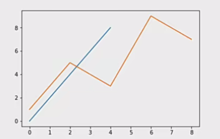
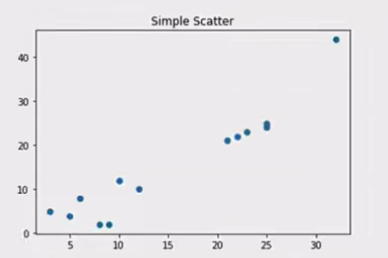
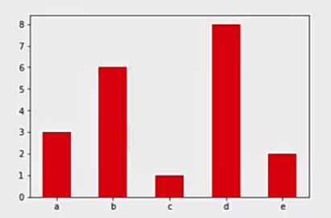
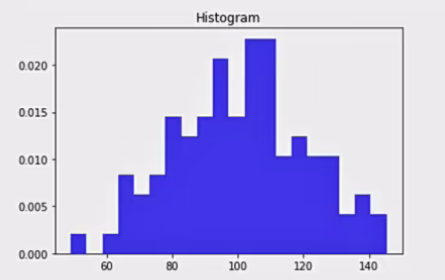
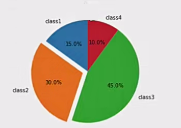
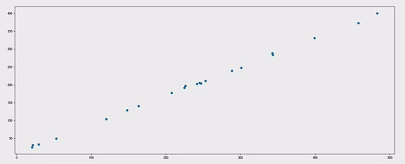
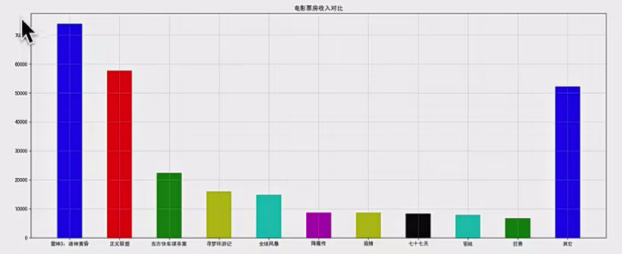

<p align = "justify" style = "text-indent:2em">Matplotlib能够绘制折线图、散点图、柱状图、直方图、饼图。</p>

<p align = "justify" style = "text-indent:2em">我们需要知道不同的统计图的意义，以此来决定选择哪种统计图来呈现我们的数据。</p>

---

## 常见图形种类及意义

- <b>折线图</b>：以折线的上升或下降来表示统计数量的增减变化的统计图。

<p align = "justify" style = "text-indent:3em"><b>特点：能够显示数据的变化趋势，反映事物的变化情况。(变化)</b></p>

<p align = "justify" style = "text-indent:3em">api: plt.plot(x, y)</p>

<p align = "justify" style = "text-indent:3em">完整代码：</p>

```python
import matplotlib.pyplot as plt
import numpy as np

# 0.准备数据
x = np.linspace(0, 8, 1000)
y = np.linspace(0, 8, 1000)

# 1.创建画布
plt.figure(figsize=(20, 8), dpi=100)

# 2.绘制函数图像
plt.plot(x, y)

# 2.1 添加网格显示
plt.grid()

# 3.显示图像
plt.show()
```



- <b>散点图</b>：用两组数据构成多个坐标点，考察坐标点的分布，判断两变量之间是否存在某种关联或总结坐标点的分布模式。

<p align = "justify" style = "text-indent:3em"><b>特点：判断变量之间是否存在数量关联趋势，展示离群点。(分布规律)</b>

<p align = "justify" style = "text-indent:3em">api: plt.scatter(x, y)</p>



- <b>柱状图</b>：排列在工作表的列或行中的数据可以绘制到柱状图中。

<p align = "justify" style = "text-indent:3em"><b>特点：绘制连离散的数据，能够一眼看出各个数据的大小，比较数据之间的差别。(统计/对比)</b></p>

<p align = "justify" style = "text-indent:3em">api: plt.bar(x, width, align='center', **kwargs)</p>

```css
Parameters:
x: 需要传递的数据

width: 柱状图的宽度

align: 每个柱状图的位置对齐方式
    {'center', 'edge'}, optional, default: 'center'

**kwargS:
color: 选择柱状图的颜色
```



- <b>直方图</b>：由一系列高度不等的纵向条纹或线段表示数据分布的情况。一般用横轴表示数据范围，纵轴表示分布情况。

<p align = "justify" style = "text-indent:3em"><b>特点：绘制连续性的数据展示一组或者多组数据的分布状况。(统计)</b></p>

<p align = "justify" style = "text-indent:3em">api: matplotlib.pyplot.hist(x, bins=None)</p>

```css
Parameters:

x: 需要传递的数据

bins: 组距
```



- <b>饼图</b>：用于表示不同分类的占比情况，通过弧度大小来对比各种分类。

<p align = "justify" style = "text-indent:3em"><b>特点：分类数据的占比情况。(占比)</b></p>

<p align = "justify" style = "text-indent:3em">api: plt.pie(x, labels=, autopct=, colors)</p>

```css
Parameters:

x: 数量，自动算百分比

labels: 每部分名称

autopct: 占比显示指定%1.2f%%

colors: 每部分颜色
```



---

## 散点图绘制

需求: 探究房屋面积和房屋价格的关系。

房屋面积数据：

x = [225.98, 247.07, 253.14, 457.85, 241.58, 301.01, 20.67, 288.64, 163.56, 120.06, 207.83, 342.75, 147.9, 53.06, 224.72, 29.51, 21.61, 483.21, 245.25, 399.25, 343.35]

房屋价格数据：

y = [196.63, 203.88, 210.75, 372.74, 202.41, 247.61, 24.9, 239.34, 140.32, 104.15, 176.84, 288.23, 128.79, 49.64, 191.74, 33.1, 30.74, 400.02, 205.35, 330.64, 283.45]

完整代码：

```python
import matplotlib.pyplot as plt

#0.准备数据
x = [225.98, 247.07, 253.14, 457.85, 241.58, 301.01, 20.67, 288.64, 163.56, 120.06, 207.83, 342.75, 147.9, 53.06, 224.72, 29.51, 21.61, 483.21, 245.25, 399.25, 343.35]
y = [196.63, 203.88, 210.75, 372.74, 202.41, 247.61, 24.9, 239.34, 140.32, 104.15, 176.84, 288.23, 128.79, 49.64, 191.74, 33.1, 30.74, 400.02, 205.35, 330.64, 283.45]

# 1.创建画布
plt.figure(figsize=(20, 8), dpi=100)

# 2.绘制散点图
plt.scatter(x, y)

# 3.显示图像
plt.show()
```



---

## 柱状图

需求：对比每部电影的票房收入。

- 准备数据

['雷神3:诸神黄昏', '正义联盟', '东方快车谋杀案', '寻梦环游记', '全球风暴', '降魔传', '追捕', '七十七天', '密战', '狂兽', '其它']

[73853, 57767, 22354, 15969, 14839, 8725, 8716, 8318, 7916, 6764, 52222]

- 绘制柱状图

完整代码：

```python
import matplotlib.pyplot as plt

# 0.准备数据
# 电影名字
movie_name = ['雷神3:诸神黄昏', '正义联盟', '东方快车谋杀案', '寻梦环游记', '全球风暴', '降魔传', '追捕', '七十七天', '密战', '狂兽', '其它']
# 横坐标
x = range(len(movie_name))
# 票房数据
y = [73853, 57767, 22354, 15969, 14839, 8725, 8716, 8318, 7916, 6764, 52222]

# 1.创建画布
plt.figure(figsize=(20, 8), dpi=100)

# 2.绘制柱状图
plt.bar(x, y, width=0.5, color=['b','r','g','y', 'c','m', 'y','k','c','g','b'])

# 2.1b修改x轴的刻度显示
plt.xticks(x, movie_name)

# 2.2 添加网格显示
plt.grid(linestyle="--", alpha=0.5)

# 2.3 添加标题
plt.title("电影票房收入对比")

# 3.显示图像
plt.show()
```



---

## 参考链接

https://matplotlib.org/index.html