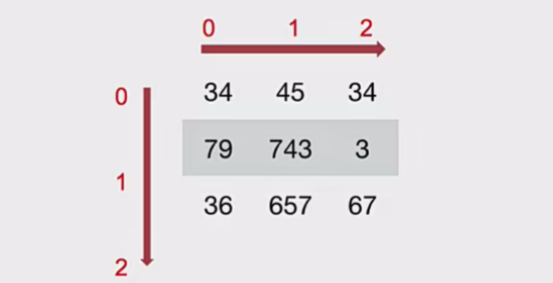
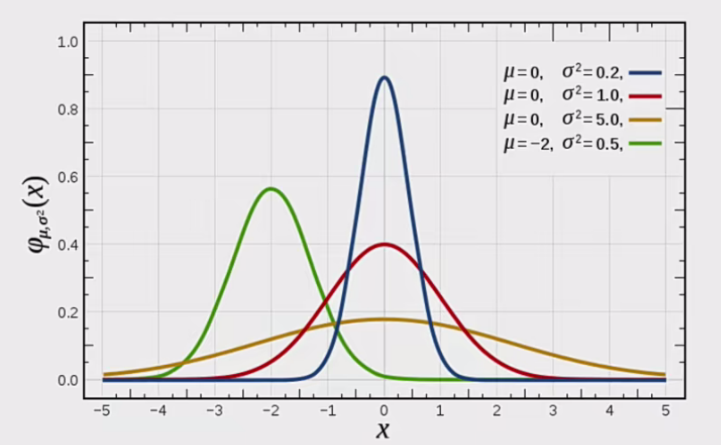
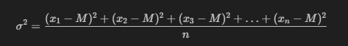
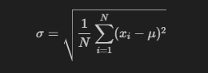
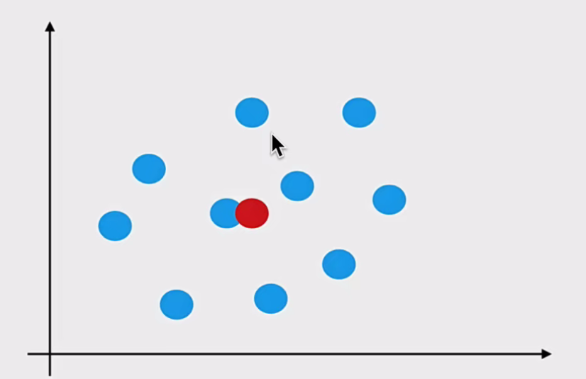
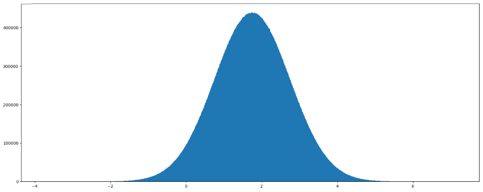
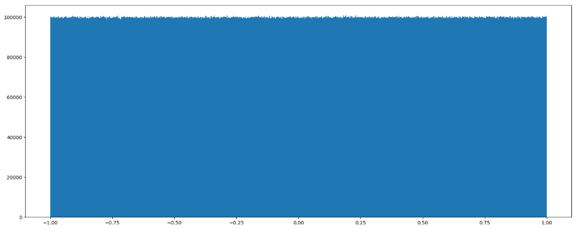

## ndarray的使用

### ndarray的属性

数组属性反映了数组本身固有的信息。

|属性名字|属性解释|
|:--:|:--:|
|ndarray.shape|数组维度的元组|
|ndarray.ndim|数组维数|
|ndarray.size|数组中的元素数量|
|ndarray.itemsize|一个数组元素的长度（字节）|
|ndarray.dtype|数组元素的类型|

---

### ndarray的形状

首先创建一些数组。

```Python
# 创建不同形状的数组
>>> a = np.array([[1,2,3],[4,5,6]])
>>> b = np.array([1,2,3,4])
>>> c = np.array([[[1,2,3],[4,5,6]],[[1,2,3],[4,5,6]]])
```

分别打印出形状。

```python
>>> a.shape
>>> b.shape
>>> C.shape

(2,3)  # 二维数组
(4,)    # 一维数组
(2,2,3)   # 三维数组
```

如何理解数组的形状?

二维数组：



三维数组：


---

### ndarray的类型

```python
>>> type(score.dtype)

<type 'numpy.dtype'>
```

dtype是numpy.dtype类型，先看看对于数组来说都有那些类型：

|名称|描述|简写|
|:--:|:--:|:--:|
|np.bool|用一个字节存储的布尔类型(True或False)|'b'|
|np.int8|一个字节大小，-128至127|'i'|
|np.int16|整数，-32768至32767|'i2'|
|np.int32|整数，-2^31 至2^32-1|'i4'|
|np.int64|整数，-2^63 至2^63-1|'i8'|
|np.uint8|无符号整数，0至255|'u'|
|np.uint16|无符号整数，0至65535|'u2'|
|np.uint32|无符号整数，0至2^32-1|'u4'|
|np.uint64|无符号整数，0至2^64-1|'u8'|
|np.float16|半精度浮点数: 16位，正负号1位，指数5位，精度10位|'f2'|
|np.float32|单精度浮点数: 32位，正负号1位，指数8位，精度23位|'f4'|
|np.float64|双精度浮点数: 64位，正负号1位，指数11位，精度52位|'f8'|
|np.complex64|复数，分别用两个32位浮点数表示实部和虚部|'c8'|
|np.complex128|复数，分别用两个64位浮点数表示实部和虚部|'c16'|
|np.object_|python对象|'O'|
|np.string_|字符串|'S'|
|np.unicode_|unicode类型|'U'|

<b>创建数组的时候指定类型</b>

```python
>>> a = np.array([[1,2,3],[4,5,6]], dtype=np.float32)>>> a.dtype
dtype('float32')

>>> arr = np.array(['python', 'tensorflow', 'scikit-learn', 'numpy'], dtype = np.string_)
>>> arr

array([b'python', b'tensorflow', b'scikit-learn', b'numpy'], dtype='|S12')
```

- 注意: 若不指定，整数默认int64，小数默认float64。

---

## 生成数组的方法

### 生成0和1的数组

- <b>np.ones(shape, dtype)</b>
- np.ones_like(a, dtype)
- <b>np.zeros(shape, dtype)</b>
- np.zeros_like(a, dtype)

```python
ones = np.ones([4, 8])
ones
```

返回结果:

```python
array([[1., 1., 1., 1., 1., 1., 1., 1.],
       [1., 1., 1., 1., 1., 1., 1., 1.],
       [1., 1., 1., 1., 1., 1., 1., 1.],
       [1., 1., 1., 1., 1., 1., 1., 1.]])
```

```python
np.zeros_like(ones)
```

返回结果:

```python
array([[0., 0., 0., 0., 0., 0., 0., 0.],
       [0., 0., 0., 0., 0., 0., 0., 0.],
       [0., 0., 0., 0., 0., 0., 0., 0.],
       [0., 0., 0., 0., 0., 0., 0., 0.]])
```

---

### 从现有数组生成

#### 生成方式

- np.array(object, dtype)

- np.asarray(a, dtype)

```python
a = np.array([[1,2,3],[4,5,6]])

# 从现有的数组当中创建
a1 = np.array(a) # 深拷贝

# 相当于索引的形式，并没有真正的创建一个新的
a2 = np.asarray(a) # 浅拷贝
```

#### 关于array和asarray的不同

```python
a = np.array([[1, 2, 3], [4, 5, 6]])
a

al = np.array(a) # 深拷贝
al

a2 = np.asarray(a) # 浅拷贝
a2

a[0, 0] = 100
a

a1

a2
```

```python
array([[1, 2, 3], [4, 5, 6]]) # a

array([[1, 2, 3], [4, 5, 6]]) # a1

array([[1, 2, 3], [4, 5, 6]]) # a2

array([[100, 2, 3], [4, 5, 6]]) # a

array([[1, 2, 3], [4, 5, 6]]) # a1

array([[100, 2, 3], [4, 5, 6]]) # a2
```

---

### 生成固定范围的数组

#### np.linspace (start, stop, num, endpoint)

- 创建等差数组 - 指定数量

- 参数:

    - start: 序列的起始值
    - stop: 序列的终止值
    - num: 要生成的等间隔样例数量，默认为50
    - endpoint: 序列中是否包含stop值，默认为ture

```python
# 生成等间隔的数组
np.linspace(0, 100, 11)
```

返回结果：

```python
array([0., 10., 20., 30., 40., 50., 60., 70., 80.,  90., 100.])
```

#### np.arange (start, stop, step, dtype)

- 创建等差数组 - 指定步长

- 参数：

    - step: 步长, 默认值为1

```python
np.arange(10, 50, 2)
```

返回结果：

```python
array([10, 12, 14, 16, 18, 20, 22, 24, 26, 28, 30, 32, 34, 36, 38, 40, 42, 44, 46, 48])
```

#### np.logspace (start, stop, nym)

- 创建等比数列

- 参数：

    - num: 要生成的等比数列数量，默认为50

```python
# 生成10^X
np.logspace(0, 2, 3)
```

返回结果：

```python
array([1., 10., 100.])
```

---

### 生成随机数组

#### 使用模块介绍

- np.random模块

#### 正态分布

一、基础概念复习：正态分布 (理解)

a.什么是正态分布

<p align = "justify" style = "text-indent:3em">正态分布是一种概率分布。正态分布是具有两个参数μ和σ的连续型随机变量的分布，第一参数μ是服从正态分布的随机变量的均值，第二个参数σ是此随机变量的方差，所以正态分布记作N(μ, σ)。</p>



b.正态分布的应用

生活、生产与科学实验中很多随机变量的概率分布都可以近似地用正态分布来描述。

c.正态分布特点

μ决定了其位置，其标准差σ决定了分布的幅度。当μ=0, σ=1时的正态分布是标准正态分布。

标准差如何来?

- 方差

是在概率论和统计方差衡量一组数据时离散程度的度量。

```Markdown
$$\sigma^2 = \frac{(x_1 - M)^2 + (x_2 - M)^2 + (x_3 - M)^2 + \ldots + (x_n - M)^2}{n}$$
```



其中M为平均值，n为数据总个数，σ为标准差，σ^2可以理解一个整体为方差。

```Markdown
$$\sigma = \sqrt{ \frac{1}{N} \sum_{\substack{i=1 \\ \\}}^{N} (x_i - \mu)^2 }$$
```



- 标准差与方差的意义

可以理解成数据的一个离散程度的衡量。



二、正态分布创建方式

- np.random.randn(d0, d1, ..., dn)

功能: 从标准正态分布中返回一个或多个样本值

- np.random.normal(loc=0.0, scale=1.0, size=None)

loc: float

此概率分布的均值 (对应着整个分布的中心centre)

comscale: float

此概率分布的标准差 (对应于分布的宽度，scale越大越矮胖，scale越小，越瘦高)

size: int or tuple of ints

输出的shape，默认为None，只输出一个值

- np.random.standard normal(size=None)

返回指定形状的标准正态分布的数组。

---

<b>举例1: 生成狗值为1.75，标准差为1的正态分布数据，100000000个</b>

```python
x1 = np.random.normal(1.75, 1, 100000000)
```

返回结果：

```python
array([2.90646763, 1.46737886, 2.21799024,..., 1.56047411, 1.87969135, 0.9028096 ])
```

```python
# 生成均匀分布的随机数
x1 = np.random.normal(1.75, 1, 100000000)

# 画图看分布状况
# 1)创建画布
plt.figure(figsize=(20, 10), dpi=100)

# 2)绘制直方图
plt.hist(x1, 1000)

# 3)显示图像
plt.show()
```



---

例如: 我们可以模拟生成一组股票的涨跌幅的数据

<b>举例2:随机生成4支股票1周的交易日涨幅数据</b>

4支股票，<b>一周(5天)</b>的涨跌幅数据，如何获取?

- 随机生成涨跌幅在某个正态分布内，比如均值0，方差1

<b>股票涨跌幅数据的创建</b>

```python
# 创建符合正态分布的4只股票5天的涨跌幅数据
stock_change =np.random.normal(0, 1, (4, 5))
stock_change
```

返回结果：

```python
array([[-0.5142373 , -0.32586912,  0.39132714,  1.02290317, -0.33438889],
       [-0.08775205,  1.99655647,  0.24488145, -1.25742494, -0.35522986],
       [ 0.85280747,  1.87762957,  0.68582294,  1.05605474, -1.6015672 ],
       [-0.53759709,  1.62663522, -0.2319302 , -0.27205088, -0.49244907]])
```

---

#### 均匀分布

- np.random.rand(d0, d1, ..., dn)

    - 返回[0.0, 1.0)内的一组均匀分布的数。

- <b>np.random.uniform(low=0.0, high=1.0, size=None)</b>

    - 功能:从一个均匀分布[low, high)中随机采样，注意定义域是左闭右开，即包含low，不包含high.
    - 参数介绍:
        - low: 采样下界，float类型，默认值为0;
        - high: 采样上界，float类型，默认值为1;
        - size: 输出样本数目，为int或元组(tuple)类型，例如，size=(m,n,k),则输出mnk个样本，缺省时输出1个值。

    - 返回值: ndarray类型，其形状和参数size中描述一致。

- np.random.randint(low, high=None, size=None, dtype='/')

    - 从一个均匀分布中随机采样，生成一个整数或N维整数数组。

    - 取数范围: 若high个为None时，取[low,high)之间随机整数，否则取值[0,low)之间随机整数。

```python
# 生成均匀分布的随机数
x2 = np.random.uniform(-1, 1, 100000000)
```

返回结果:

```python
array([0.22411206, 0.31414671, 0.85655613, ..., -0.92972446, 0.95985223, 0.23197723])
```

画图看分布状况:

```python
import matplotlib.pyplot as plt

# 生成均匀分布的随机数
x2 = np.random.uniform(-1, 1, 100000000)

# 画图看分布状况
# 1)创建画布
plt.figure(figsize=(10,10), dpi=100)

#2)绘制直方图
plt.hist(x=x2, bins=1000) #x代表要使用的数据，bins表示要划分区间数

# 3)显示图像
plt.show()
```

