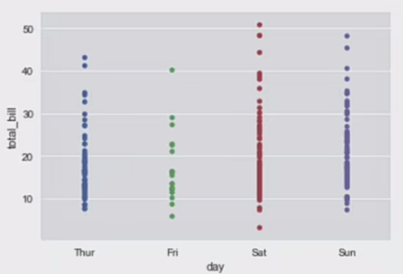
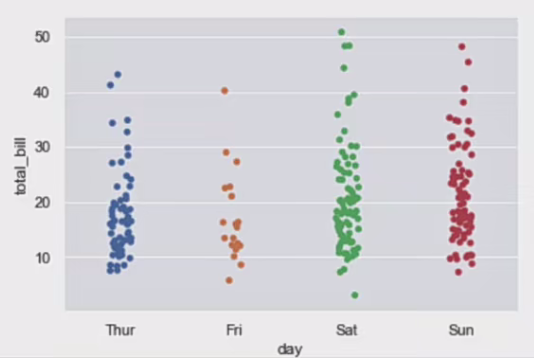
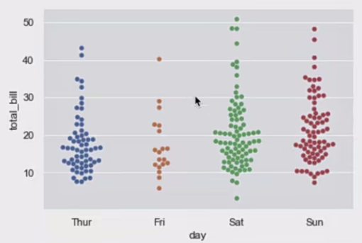
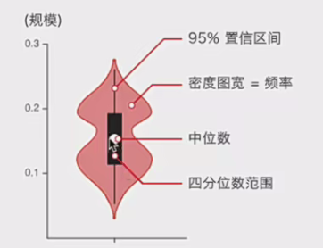
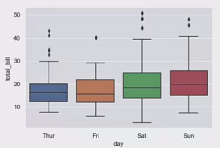
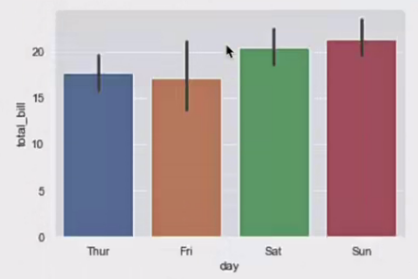
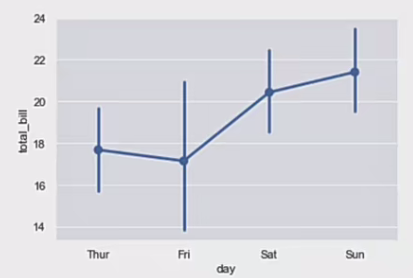

<p align = "justify" style = "text-indent:2em">数据集中的数据类型有很多种，除了连续的特征变量之外，最常见的就是类别型的数据了，比如人的性别、学历、爱好等，这些数据类型都不能用连续的变量来表示，而是用分类的数据来表示。</p>

Seaborn针对分类数据提供了专门的可视化函数，这些函数大致可以分为如下三种:

- 分类数据散点图: swarmplot()与 stripplot()。

- 类数据的分布图: boxplot()与 violinplot()。

- 分类数据的统计估算图: barplot()与 pointplot()。

---

## 类别散点图

通过 stripplot()函数可以画一个散点图， stripplot0函数的语法格式如下。

```python
n.stripplot(x=None, y=None, hue=None, data=None, order=None, hue_order=None, jitter=False)
```

上述函数中常用参数的含义如下:

- (1)x，y，hue: 用于绘制长格式数据的输入。

- (2)data: 用于绘制的数据集。如果x和y不存在，则它将作为宽格式，否则将作为长格式。

- (3)jitter: 表示抖动的程度(仅沿类别轴)。当很多数据点重叠时，可以指定抖动的数量或者设为Tue使用默认值。

为了让大家更好地理解，接下来，通过 stripplot()函数绘制一个散点图，示例代码如下:

```python
# 获取tips数据
tips = sns.load_dataset("tips")
sns.stripplot(x="day", y="total_bill", data=tips )
```

运行结果如下图所示:



<p align = "justify" style = "text-indent:2em">从上图中可以看出，图表中的横坐标是分类的数据，而且一些数据点会互相重叠，不易于观察。为了解决这个问题，可以在调用striplot()函数时传入jitter参数，以调整横坐标的位置，改后的示例代码如下:</p>

```python
sns.stripplot(x="day", y="total_bill", data=tips, jitter=True)
```

运行结果如下图所示:



<p align = "justify" style = "text-indent:2em">除此之外，还可调用 swarmplot()函数绘制散点图，该函数的好处是所有的数据点都不会重叠，可以很清晰地观察到数据的分布情况，示例代码如下。</p>

sns.swarmplot(x="day", y="total_bill", data=tips)

运行结果如图所示:



## 类别内的数据分布

<p align = "justify" style = "text-indent:2em">要想查看各个分类中的数据分布，显而易见，散点图是不满足需求的，原因是它不够直观。针对这种情况，我们可以绘制如下两种图形进行查看:</p>

- 箱形图:

    - 箱形图(Box-plot)又称为盒须图、盒式图或箱线图，是一种用作显示一组数据分散情况资料的统计图。因形状如箱子而得名。

    - 箱形图于1977年由美国著名统计学家约翰·图基(JohnTukey)发明。<b>它能显示出一组数据的最大值、最小值、中位数、及上下四分位数</b>。


- 小提琴图:

    - 小提琴图 (iolin Plot) 用于显示数据分布及其概率密度。

    - <b>这种图表结合了箱形图和密度图的特征，主要用来显示数据的分布形状</b>。

    - <b>中间的黑色粗条表示四分位数范围，从其延伸的幼细黑线代表95% 置信区间，而白点则为中位数</b>。

    - <b>箱形图在数据显示方面受到限制，简单的设计往往隐藏了有关数据分布的重要细节</b>。例如使用箱形图时，我们不能了解数据分布。虽然小提琴图可以显示更多详情，但它们也可能包含较多干扰信息。



接下来，针对 Seaborn库中箱形图和提琴图的绘制进行简单的介绍。

### 绘制箱形图

seaborn中用于绘制箱形图的函数为 boxplot()，其语法格式如下:

```python
seaborn.boxplot(x=None, y=None, hue=None, data=None, orient=None, color=None, saturation=0.75, ...)
```

常用参数的含义如下:

- (1)palette: 用于设置不同级别色相的颜色变量。---- palette=["r", "g", "b", "y"]

- (2)saturation: 用于设置数据显示的颜色饱和度。----使用小数表示

使用 boxplot()函数绘制箱形图的具体示例如下:

```python
sns.boxplot(x="day", y="total_bill", data=tips)
```

<p align = "justify" style = "text-indent:2em">上述示例中，使用 seaborn中内置的数据集tips绘制了一个箱形图，图中x轴的名称为day，其刻度范围是Thur~Sun(周四至周日)，y轴的名称为 total_bill，刻度范围为10-50左右。</p>

运行结果如图所示：



从图中可以看出，

- Thur列大部分数据都小于30，不过有5个大于30的异常值

- Fri列中大部分数据都小于30，只有一个异常值大于40

- Sat一列中有3个大于40的异常值

- Sun列中有两个大于40的异常值

### 绘制提琴图

seaborn中用于绘制提琴图的函数为violinplot()，其语法格式如下:

```python
seaborn.violinplot(x=None, y=None, hue=None, data=None)
```

通过violinplot()函数绘制提琴图的示例代码如下:

```python
sns.violinplot(x="day", y="total_bill", data=tips)
```

上述示例中，使用seaborn中内置的数据集绘制了一个提琴图，图中x轴的名称为day，y轴的名称为total_bi。

运行结果如图所示：


从图中可以看出，

- Thur一列中位于5~25之间的数值较多

- Fri列中位于5-30之间的较多

- Sat一列中位于5-35之间的数值较多

- Sun一列中位于5-40之间的数值较多

---

## 类别内的统计估计

要想查看每个分类的集中趋势，则可以使用条形图和点图进行展示。Seaborn库中用于绘制这两种图表的具体函数如下：

- barplot()函数: 绘制条形图

- pointplot()函数: 绘制点图

这些函数的API与上面那些函数都是一样的，这里只讲解函数的应用，不再过多对函数的语法进行讲解了。

### 绘制条形图

<p align = "justify" style = "text-indent:2em">最常用的查看集中趋势的图形就是条形图。默认情况下，barplot函数会在整个数据集上使用均值进行估计。<b>若每个类别中有多个类别时(使用了hue参数)</b>，则条形图可以使用引导来计算估计的<b>置信区间(是指由样本统计量所构造的总体参数的估计区间)</b>，并使用误差条来表示置信区间。</p>

使用 barplot()函数的示例如下:

```python
sns.barplot(x="day", y="total_bill", data=tips)
```

运行结果如图所示:



### 绘制点图

<p align = "justify" style = "text-indent:2em">另外一种用于估计的图形是点图，可以调用 pointplot0函数进行绘制，该函数会用高度低计值对数据进行描述，而不是显示完整的条形，它只会绘制点估计和置信区间。</p>

通过 pointplot()函数绘制点图的示例如下:

```python
sns.pointplot(x="day", y="total_bill", data=tips)
```

运行结果如图所示:

