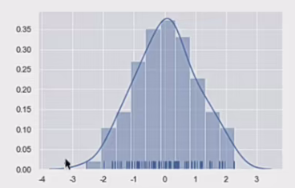
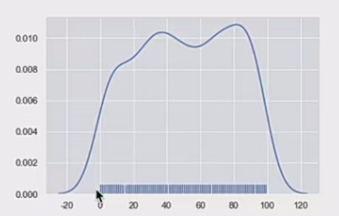
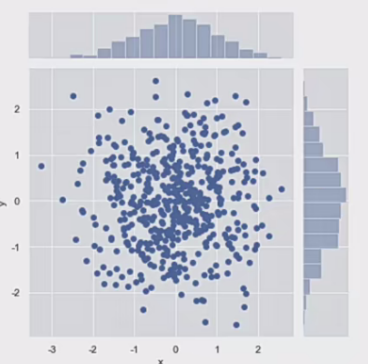
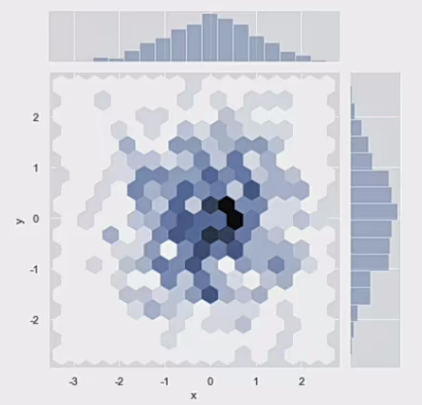
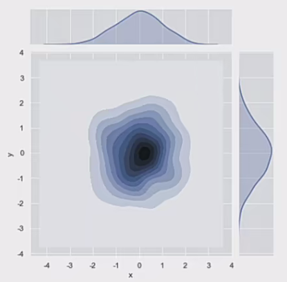
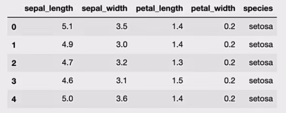
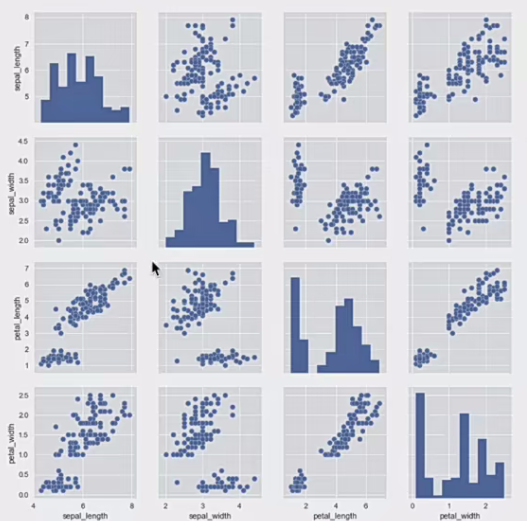

<p align = "justify" style = "text-indent:2em">Matplotlib虽然已经是比较优秀的绘图库了，但是它有个今人头疼的问题，那就是API使用过于复杂，它里面有上千个函数和参数，属于典型的那种可以用它做任何事，却无从下手。</p>

<p align = "justify" style = "text-indent:2em">Seaborn基于 Matplotlib核心库进行了更高级的API封装，可以轻松地画出更漂亮的图形，而Seaborn的漂亮主要体现在配色更加舒服，以及图形元素的样式更加细腻。</p>

<p align = "justify" style = "text-indent:2em">不过，使用Seaborn绘制图表之前，需要安装和导入绘图的接口，具体代码如下:</p>

```python
# 安装
pip3 install seaborn
```

```python
# 导入
import seaborn as sns
```

---

## 可视化数据的分布

当处理一组数据时，通常先要做的就是了解变量是如何分布的。

- 对于单变量的数据来说 采用直方图或核密度曲线是个不错的选择

- 对于双变蚩来说，可采用多面板图形展现，比如 散点图、二维直方图、核密度估计图形等。

针对这种情况，Seaborn库提供了对单变量和双变量分布的绘制函数，如 displot()函数、jointplot()函数，下面来介绍这些函数的使用，具体内容如下:

## 绘制单变量分布

<p align = "justify" style = "text-indent:2em">可以采用最简单的直方图描述单变量的分布情况。Seaborn中提供了 distplot()函数，它默认绘制的是一个带有核密度估计曲线的直方图。distplot()函数的语法格式如下：</p>

```python
seaborn.distplot(a, bins=None, hist=True, kde=True, rug=False, fit=None, color=None)
```

上述函数中常用参数的含义如下:

- (1)a: 表示要观察的数据，可以是 Series、一维数组或列表。

- (2)bins: 用于控制条形的数量。

- (3)hist: 接收布尔类型，表示是否绘制(标注)直方图。

- (4)kde: 接收布尔类型，表示是否绘制高斯核密度估计曲线，

- (5)rug: 接收布尔类型，表示是否在支持的轴方向上绘制rugplot。

通过 distplot()函数绘制直方图的示例如下。

```python
import numpy as np
np.random.seed(0) # 确定随机数生成器的种子,如果不使用每次生成图形不一样
arr = np.random.randn(100) # 生成随机数组

ax = sns.distplot(arr, bins=10, hist=True, kde=True, rug=True) # 绘制直方图
```

<p align = "justify" style = "text-indent:2em">上述示例中，首先导入了用于生成数组的numpy库，然后使用seaborn调用set()函数获取默认绘图，并且调用random模块的seed函数确定随机数生成器的种子，保证每次产生的随机数是一样的，接着调用randn()函数生成包含100个随机数的数组，最后调用distplot()函数绘制直方图。</p>

运行结果如下图所示:



从上图中看出:

- 直方图共有10个条柱，每个条柱的颜色为蓝色，并且有核密度估计曲线。

- 根据条柱的高度可知，位于-1-1区间的随机数值偏多，小于-2的随机数值偏少。

<p align = "justify" style = "text-indent:2em">通常，采用直方图可以比较直观地展现样本数据的分布情况，不过，直方图存在一些问题，它会因为条柱数量的不同导致直方图的效果有很大的差异。为了解决这个问题，可以绘制核密度估计曲线进行展现。</p>

- <b>核密度估计</b>是在概率论中用来估计未知的密度函数，属于非参数检验方法之一，可以比较直观地看出数据样本本身的分布特征。

通过 distplot()函数绘制核密度估计曲线的示例如下。

```python
# 创建包含500个位于[0, 100]之间整数的随机数组
array_random = np.random.randint(0, 100, 500)

# 绘制核密度估计曲线
sns.distplot(array_random, hist=False, rug=True)
```

<p align = "justify" style = "text-indent:2em">上述示例中，首先通过 random.randint()函数返回一个最小值不低于0、最大值低于100的500个随机整数数组然后调用displot()函数绘制核密度估计曲线。</p>

运行结果如图所示:



从上图中看出，图表中有一条核密度估计曲线，并且在x轴的上方生成了观测数值的小细条。

---

## 绘制双变量分布

<p align = "justify" style = "text-indent:2em">两个变量的二元分布可视化也很有用。在Seaborn中最简单的方法是使用jointplot()函数，该函数可以创建一个多面板图形，比如散点图、二维直方图、核密度估计等，以显示两个变量之间的双变量关系及每个变量在单坐标轴上的单变量分布。</p>

jointplot()函数的语法格式如下。

```python
seaborn.jointplot(x, y, data=None, 
kind='scatter', stat_func=None, color=None, ratio=5, space=0.2, dropna=True)
```

上述函数中常用参数的含义如下:

- (1)kind: 表示绘制图形的类型。

- (2)stat_func: 用于计算有关系的统计量并标注图。

- (3)color: 表示绘图元素的颜色，

- (4)size: 用于设置图的大小(正方形)。

- (5)ratio: 表示中心图与侧边图的比例。该参数的值越大，则中心图的占比会越大。

- (6)space: 用于设置中心图与侧边图的间隔大小。

下面以散点图、二维直方图、核密度估计曲线为例，为大家介绍如何使用 Seaborn绘制这些图形。

### 绘制散点图
调用 seaborn.jointplot()函数绘制散点图的示例如下:

```python
import numpy as np
import pandas as pd
import seaborn as sns

# 创建DataFrame对象
dataframe_obj = pd.Dataframe({"x": np.random.randn(500), "y": np.random.randn(500)})

# 绘制散布图
sns.jointplot(x="x", y="y", data=dataframe_obj)
```

<p align = "justify" style = "text-indent:2em">上述示例中，首先创建了一个 DataFrame对象 dataframe_obj作为散点图的数据，其中x轴和y轴的数据均为500个随机数，接着调用 jointplot()函数绘制一个散点图，散点图x轴的名称为“x”，y轴的名称为“y”。</p>

运行结果如图所示:



### 绘制二维直方图

<p align = "justify" style = "text-indent:2em"><b>二维直方图类似于“六边形”图，主要是因为它显示了落在六角形区域内的观察值的计数，适用于较大的数据集。</b>当调用 jointplot()函数时，只要传入kind="hex"，就可以绘制二维直方图，具体示例代码如下：</p>

```python
# 绘制二维直方图
sns.jointplot(x="x", y="y", data=dataframe_obj, kind="hex")
```

运行结果如图所示：



<p align = "justify" style = "text-indent:2em">从六边形颜色的深浅，可以观察到数据密集的程度，另外，图形的上方和右侧仍然给出了直方图。注意，在绘制二维直方图时，最好使用白色背景。</p>

### 绘制核密度估计图形

<p align = "justify" style = "text-indent:2em">利用核密度估计同样可以查看二元分布，其用等高线图来表示。当调用jointplot()函数时只要传入ind="kde"，就可以绘制核密度估计图形，具体示例代码如下：</p>

```python
sns.jointplot(x="x", y="y", data=dataframe_obj, kind="kde" )
```

上述示例中，绘制了核密度的等高线图，另外，在图形的上方和右侧给出了核密度曲线图。

运行结果如图所示:



通过观等高线的颜色深浅，可以看出哪个范围的数值分布的最多，哪个范围的数值分布的最少。

---

## 绘制成对的双变量分布

<p align = "justify" style = "text-indent:2em">要想在数据集中绘制多个成对的双变量分布，则可以使用pairplot()函数实现，该函数会创建一个坐标轴矩阵，并且显示Datafram对象中每对变量的关系。另外，pairplot()函数也可以绘制每个变量在对角轴上的单变量分布。</p>

接下来，通过 sns.pairplot()函数绘制数据集变量间关系的图形，示例代码如下:

```python
# 加载seaborn中的数据集
dataset = sns.load_dataset("iris")

dataset.head()
```



上述示例中，通过load_dataset()函数加载了seaborn中内置的数据集，根据iris数据集绘制多个双变量分布。

```python
# 绘制多个成对的双变量分布
sns.pairplot(dataset)
```

结果如下图所示:

