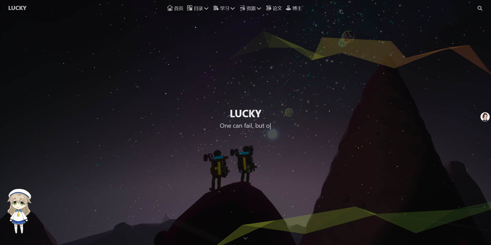

## 分离搜索与菜单栏

<p align = "justify" style = "text-indent:2em">找到并打开后面路径，...\themes\butterfly\layout\includes\header\nav.pug，直接使用下面的代码替代源代码。</p>

```css
nav#nav
  span#blog-info
    a.nav-site-title(href=url_for('/'))
      if theme.nav.logo
        img.site-icon(src=url_for(theme.nav.logo) alt='Logo')
      if theme.nav.display_title
        span.site-name=config.title
    if globalPageType === 'post'
      a.nav-page-title(href=url_for('/'))
        span.site-name=(page.title || config.title)
  #menus
    if theme.menu
      != partial('includes/header/menu_item', {}, {cache: true})
      #toggle-menu
        span.site-page
          i.fas.fa-bars.fa-fw
  if theme.search.use
      #search-button
        span.site-page.social-icon.search
          i.fas.fa-search.fa-fw
```

---

## 导航栏居中

<p align = "justify" style = "text-indent:2em">先找到source文件夹并在其下面新建一个css文件夹，再在css文件夹下新建nav.css文件，直接使用下面的代码替代源代码。</p>

```css
/* 桌面端布局 */
@media (min-width: 1024px) {
    
}

#nav {
  display: flex;
  justify-content: space-between; /* 主轴对齐方式为间距平均分布 */
  font-size: 1.5rem !important; /* 导航栏字体大小 */
  align-items: center;
  padding: 1rem 2rem;
}

#blog-info {
  width: calc(100% / 4) !important;
  flex-shrink:0;
}

/* 菜单容器设置为弹性容器并居中 */
#menus {
  display: flex !important;
  width: calc(100% / 2) !important;
  flex-shrink:1;
}

.menus_items {
  width: 100%;
  display: flex !important;
  justify-content: space-around; /* 菜单项水平对齐 */
  padding-left: 5vw;
  padding-right: 5vw;
  font-size: 1.5vw !important; /* 导航栏字体大小 */
}

.menus_item {
  flex-shrink:1;
  text-overflow:ellipsis;
  white-space: nowrap;
}

#search-button {
  text-align: right;
  width: calc(100% / 4) !important;
  flex-shrink:0;
}

/* 二级导航栏水平展示 */
.menus_item_child li:not(#sidebar-menus li) {
    float: left;
    border-radius: 6px !important;
    -webkit-border-radius: 6px !important;
    -moz-border-radius: 6px !important;
    -ms-border-radius: 6px !important;
    -o-border-radius: 6px !important;
}

.menus_item_child:not(#sidebar-menus ul) {
    left: 50%;
    translate: -50%;
}
```

---

## 样式引用

<p align = "justify" style = "text-indent:2em">在_config.butterfly.yml或者./themes/butterfly/_config.yml中找到inject，并在head中添加以下代码：</p>

```css
inject:
  head:
    - <link rel="stylesheet" href="/css/nav.css">
  bottom:
  
```

---

<b>效果如下：</b>

