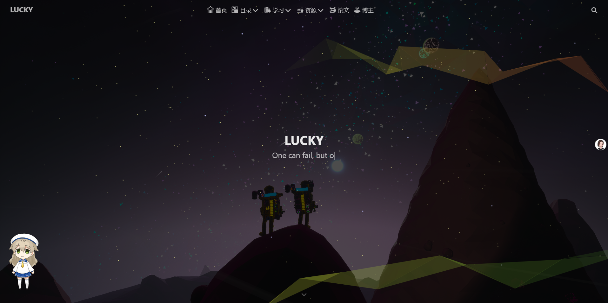

## 分离搜索与菜单栏

<p align = "justify" style = "text-indent:2em">找到并打开后面路径，...\themes\butterfly\layout\includes\header\nav.pug，直接使用下面的代码替代源代码。</p>

```css
nav#nav
  span#blog-info
    a.nav-site-title(href=url_for('/'))
      if theme.nav.logo
        img.site-icon(src=url_for(theme.nav.logo) alt='Logo')
      if theme.nav.display_title
        span.site-name=config.title
    if globalPageType === 'post'
      a.nav-page-title(href=url_for('/'))
        span.site-name=(page.title || config.title)
  #menus
    if theme.menu
      != partial('includes/header/menu_item', {}, {cache: true})
      #toggle-menu
        span.site-page
          i.fas.fa-bars.fa-fw
    if theme.search.use
      #search-button
        span.site-page.social-icon.search
          i.fas.fa-search.fa-fw
```

---

## 导航栏居中

<p align = "justify" style = "text-indent:2em">先找到source文件夹并在其下面新建一个css文件夹，再在css文件夹下新建nav.css文件，直接使用下面的代码替代源代码。</p>

```css
#nav {
    font-size: 23px !important; /* 导航栏字体大小 */
}
/* 桌面端布局 */
@media (min-width: 1024px) {
    nav#nav {
      display: flex;
      justify-content: space-between; /* 主轴对齐方式为间距平均分布 */
      align-items: center;
      padding: 1rem 2rem;
    }
  
    /* 菜单容器设置为弹性容器并居中 */
    #menus {
      display: flex;
      gap: 4rem; /* 菜单项之间的间距 */
      flex-grow: 1; /* 让菜单占据剩余空间 */
      justify-content: space-between; /* 菜单项水平对齐 */
    }
  
    /* 搜索按钮强制靠右 */
    #search-button {
      order: 0; 
    }
}
/* 二级导航栏水平展示 */
.menus_item_child li:not(#sidebar-menus li) {
    float: left;
    border-radius: 6px !important;
    -webkit-border-radius: 6px !important;
    -moz-border-radius: 6px !important;
    -ms-border-radius: 6px !important;
    -o-border-radius: 6px !important;
}

.menus_item_child:not(#sidebar-menus ul) {
    left: 50%;
    translate: -50%;
}
```

---

## 样式引用

<p align = "justify" style = "text-indent:2em">在_config.butterfly.yml或者./themes/butterfly/_config.yml中找到inject，并在head中添加以下代码：</p>

```css
inject:
  head:
    - <link rel="stylesheet" href="/css/nav.css">
  bottom:
  
```

---

<b>效果如下：</b>

