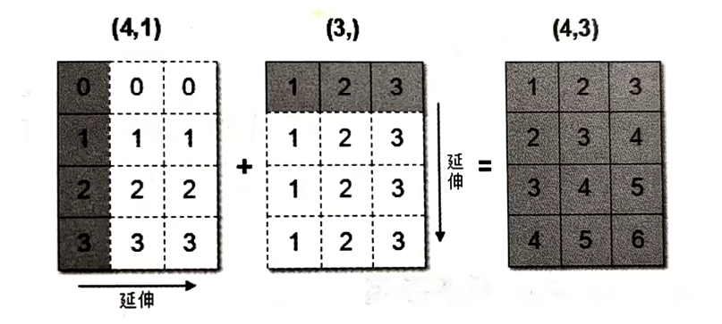

## 数组的索引、切片

一维、二维、三维的数组如何索引?

- 直接进行索引，切片
- 对象[:, :] --先行后列

二维数组索引方式:

举例: 获取第一个股票的前3个交易日的涨跌幅数据

```python
# 二维的数组，两个维度
stock_change[0, 0:3]
```

返回结果:

```python
array([-0.03862668, -1.46128096, -0.75596237])
```

三维数组索引方式:

```python
# 三维
a1 = np.array([[[1,2,3], [4,5,6]], [[12,3,34], [5,6,7]]])

# 返回结果
array([[[1,2,3], [4,5,6]], [[12,3,34], [5,6,7]]])

# 索引、切片
>>> a1[0,0,1] # 输出:2
```

---

## 形状修改

### ndarray.reshape(shape, order)

- 返回一个具有相同数据域，但shape不一样的视图

- 行、列不进行互换

```python
# 在转换形状的时候，一定要注意数组的元素匹配
stock_change.reshape([5, 4])
stock_change.reshape([-1, 10]) # 数组的形状被修改为: (2,10)，-1: 表示通过待计算
```

### ndarray.resize(new_shape)

- 修改数组本身的形状 (需要保持元素个数前后相同)

- 行、列不进行互换

```python
stock_change.resize([5, 4])

# 查看修改后结果
stock change.shape
(5, 4)
```

### ndarray.T

- 数组的转置

- 将数组的行、列进行互换

```python
stock_change.T.shape
(4, 5)
```

---

## 类型修改

### ndarray.astype(type)

- 返回修改了类型之后的数组

```python
stock_change.astype(np.int32)
```

### ndarray.tostring([order])或者ndarray.tobytes([order])

- 构造包含数组中原始数据字节的Python字节事

```python
arr = np.array([[[1,2,3], [4,5,6]], [[12,3,34], [5,6,7]]])
arr.tostring()
```

### jupyter输出太大可能导致崩溃问题【了解】

如果遇到

```python
I0Pub data rate exceeded.
  The notebook server will tenporarily stop sending output 
  to the client in order to avoid crashing it.
  To change this limit, set the config variable
  `--NotebookApp.iopub_data_rate_limit`.
```

这个问题是在jupyer当中对输出的字节数有限制，需要去修改配置文件。

创建配置文件

```python
jupyter notebook --generate-config
vi ~/.jupyter/jupyter_notebook_config.py
```

取消注释,多增加

```python
## (bytes/sec) Maximum rate at which messages can be sent on iopub before they are limited.
c.NotebookApp.iopub_data_rate_limit = 10000000
```

但是不建议这样去修改，jupyter输出太大会崩溃。

---

## 数组的去重

### np.unique()

```python
temp = np.array([[1,2,3,4],[3,4,5,6]])
>>> np.unique(temp)
array([1,2,3,4,5,6])
```

---

## 逻辑运算

```python
# 生成10名同学，5门功课的数据
>>> score = np.random.randint(40, 100, (10, 5))

# 取出最后4名同学的成绩，用于逻辑判断
>>> test score = score[6:, 0:5]

# 逻辑判断，如果成绩大于60就标记为True 否则为False
>>> test_score > 60
array([[ True, True, True, False, True],
       [ True, True, True, False, True],
       [ True, True, False, False, True],
       [ False, True, True, True, True]])

# B00L赋值，将满足条件的设置为指定的值-布尔索引
>>> test_score[test_score > 60] = 1
>>> test_score
array([[1, 1, 1, 52, 1],
       [1, 1, 1, 59, 1],
       [1, 1, 44, 44, 1],
       [59, 1, 1, 1, 1]])
```
---

## 通用判断函数

- np.all()

```python
# 判断前两名同学的成绩[0:2, :]是否全及格
>>> np.all(score[0:2, :] > 60)
False
```

- np.any()

```python
# 判断前两名同学的成绩[0:2, :]是否有大于90分的
>>> np.any(score[0:2, :] > 90)
True
```

---

## np.where (三元运算符)

通过使用np.where能够进行更加复杂的运算

- np.where()

```python
# 判断前四名学生，前四门课程中，成绩中大于60的置为1，否则为0
temp = score[:4, :4]
np.where(temp > 60, 1, 0)
```

- 复合逻辑需要结合np.logical_and和np.logical_or使用

```python
#判断前四名学生，前四门课程中，成绩中大于60且小于90的换为1，否则为0
np.where(np.logical_and(temp > 60, temp < 90), 1, 0)

#判断前四名学生，前四门课程中，成绩中大于90或小于60的换为1，否则为0
np.where(np.logical_or(temp > 90, temp < 60), 1, 0)
```

---

## 统计运算

### 统计指标

在数据挖掘/机器学习领域，统计指标的值也是我们分析问题的一种方式。常用的指标如下:

- min(a, axis)

  - Return the minimum of an array or minimum along an axis.（返回数组的最小值或沿轴的最小值。）

- max(a, axis)

  - Return the maximum of an array or maximum along an axis.（返回数组的最大值或沿轴的最大值。）

- median(a, axis)

  - Compute the median along the specified axis.（计算沿指定轴的中位数。）

- mean(a, axis, dtype)

  - Compute the arithmetic mean along the specified axis.（计算沿指定轴的算术平均值。）
  
- std(a, axis, dtype)

  - Compute the standard deviation along the specified axis.（计算沿指定轴的标准差。）

- var(a, axis, dtype)

  - Compute the variance along the specified axis.（计算沿指定轴的方差。）

### 案例: 学生成绩统计运算

<p align = "justify" style = "text-indent:2em">进行统计的时候，<b>axis轴的取值并不一定，Numpy中不同的API轴的值都不一样，在这里，axis 0代表列，axis 1代表行去进行统计</b>。</p>

```python
# 接下来对于前四名学生，进行一些统计运算
# 指定列 去统计
temp = score[:4, 0:5]
print("前四名学生，各科成绩的最大分:{}".format(np.max(temp, axis=0)))
print("前四名学生，各科成绩的最小分:{}".format(np.min(temp, axis=0)))
print("前四名学生，各科成绩波动情况:{}".format(np.std(temp, axis=0)))
print("前四名学生，各科成绩的平均分:{}".format(np.mean(temp, axis=0)))
```

结果:

```python
前四名学生，各科成绩的最大分: [96 97 72 98 89]
前四名学生，各科成绩的最小分: [55 57 45 76 77]
前四名学生，各科成绩波动情况: [16.25576821 14.92271758 8.0311892 10.40432602 4.32290412]
前四名学生，各科成绩的平均分: [78.5 75.75 62.5 85.3 82.25]
```

如果需要统计出某科最高分对应的是哪个同学?

- np.argmax(temp, axis=)

- np.argmin(temp, axis=)

```python
print("前四名学生，各科成绩最高分对应的学生下标:{}".format(np.argmax(temp, axis=0)))
```

结果:

```python
前四名学生，各科成绩最高分对应的学生下标: [0 2 0 0 1]
```

---

## 数组与数的运算

```python
arr = np.array([[1,2,3,2,1,4], [5,6,1,2,3,1]])
arr + 1
arr / 2

# 可以对比python列表的运算，看出区别
a = [1,2,3,4,5]
a * 3
```

---

### 数组与数组的运算

```python
arr1 = np.array([[1,2,3,2,1,4], [5,6,1,2,3,1]])
arr2 = np.array([[1,2,3,4], [3,4,5,6]])
```

上面这个能进行运算吗，结果是不行的!

### 广播机制

<p align = "justify" style = "text-indent:2em">数组在进行矢量化运算的，<b>要求数组的形状是相等的</b>。当形状不相等的数组执行算术运算的时候，就会出现广播机制，该机制会对数组进行扩展，使数组的shape属性值一样，这样，就可以进行矢量化运算了。下面通过一个例子进行说明:</p>

```python
arr1 = np.array([[0],[1],[2],[3]])
arr1.shape
# (4, 1)

arr2 = np.array([1,2,3])
arr2.shape
# (3,)

arr1+arr2

# 结果是:
array([[1,2,3], [2,3,4], [3,4,5], [4,5,6]])
```

<p align = "justify" style = "text-indent:2em">上述代码中，数组arr1是4行1列，arr2是1行3列。这两个数组要进行相加，按照广播机制会对数组ar1和arr2都进行扩展，使得数组arr1和arr2都变成4行3列。</p>

下面通过一张图来描述广播机制扩展数组的过程:



广播机制实现了时两个或两个以上数组的运算，即使这些数组的shape不是完全相同的，只需要满足如下任意一个条件即可。

- 1.数组的某一维度等长

- 2.其中一个数组的某一维度为1

广播机制需要<b>扩展维度小的数组</b>，使得它与维度最大的数组的shape值相同，以便使用元素级函数或者运算符进行运算。

如果是下面这样，则不匹配:

```python
A (1d array): 10
B (1d array): 12
A (2d array):     2 x 1
B (3d array): 8 x 4 x 3
```

思考: 下面两个ndarray是否能够进行运算?

```python
arr1 = np.array([[1,2,3,2,1,4],[5,6,1,2,3,1]])
arr2 = np.array([[1],[3]])
```