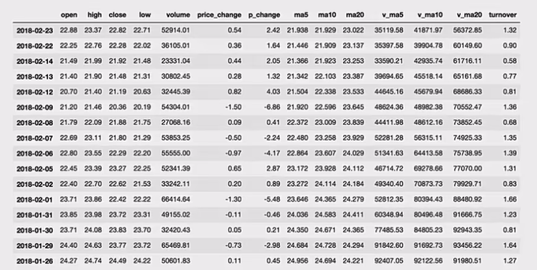
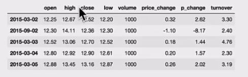
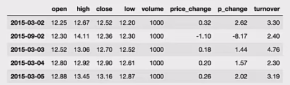
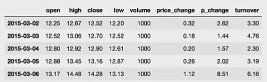
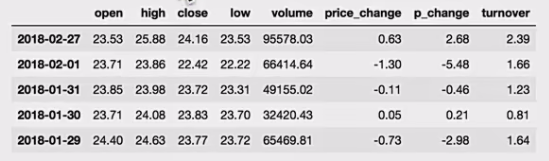
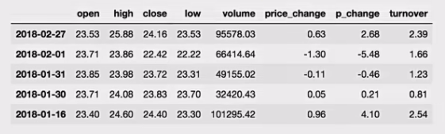
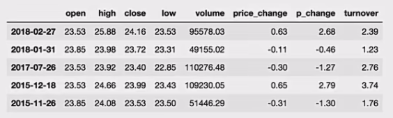
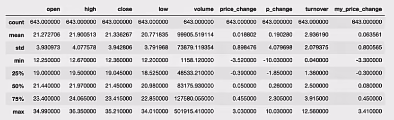

为了更好的理解这些基本操作，我们将读取一个真实的股票数据。关于文件操作，后面在介绍，这里只先用一下API。

```python
# 读取文件
data = pd.read_csv("./data/stock_day.csv" )

# 删除一些列，让数据更简单些，再去做后面的操作
data = data.drop(["ma5" ,"ma10","ma20" ,"v_ma5","v_ma10" ,"'v_ma20"], axis=1)
```



---

## 索引操作

<p align = "justify" style = "text-indent:2em">Numpy当中我们已经讲过使用索引选取序列和切片选择，pandas也支持类似的操作，也可以直接使用列名、行名称，甚至组合使用。</p>

### 直接使用行列索引(先列后行)

获取'2018-02-27"这天的'close'的结果

```python
# 直接使用行列索引名字的方式 (先列后行)
data['open']['2018-02-27']
23.53

# 不支持的操作
# 错误
data['2018-02-27']['open']
# 错误
data[:1, :2]
```

### 结合loc或者iloc使用索引

获取从'2018-02-27':'2018-02-22'，'open'的结果

```python
# 使用loc: 只能指定行列索引的名字
data.loc['2018-02-27':'2018-02-22','open']

2018-02-27  23.53
2018-02-26  22.80
2018-02-23  22.88
Name: open, dtype: float64

# 使用iloc可以通过索引的下标去获取
# 获取前3天数据，前5列的结果
data.iloc[:3, :5]

            open    high    close   low
2018-02-27  23.53   25.88   24.16   23 53
2018-02-26  22.80   23.78   23 53   22.80
2018-02-23  22.88   23.37   22.82   22.71
```

### 使用ix组合索引

> Warning: Starting in 0.20.0, the .ix indexer is deprecated, in favor of the more strict .iloc and .loc indexers.

获取行第1天到第4天，['open','close','high’,low"]这个四个指标的结果

```python
# 使用ix进行下表和名称组合做引
data.ix[0:4, ['open','close','high','low']]

# 推荐使用loc和iloc来获取的方式
data.loc[data.index[0:4],['open','close', 'high','low']]
data.iloc[0:4, data.columns.get_indexer(['open', 'close', 'high', 'low'])]

            open    close   high    low
2018-02-27  23.53   24.16   25.88   23.53
2018-02-26  22.80   23.53   23.78   22.80
2018-02-23  22.88   22.82   23.37   22.71
2018-02-22  22.25   22.28   22.76   22.02
```

---

## 赋值操作

对DataFrame当中的close列进行重新赋值为1

```python
# 直接修改原来的值
data['close'] = 1

# 或者
data.close = 1
```

---

## 排序

排序有两种形式，一种对于索引进行排序，一种对于内容进行排序。

### DataFrame排序

- 使用df.sort_values(by=, ascending=)

    - 单个键或者多个键进行排序

    - 参数:

        - by:指定排序参考的键

        - ascending: 默认升序
        
        - ascending = False: 降序

        - ascending = True: 升序

```python
# 按照开盘价大小进行排序，使用ascending指定按照大小排序
data.sort_values(by="open", ascending=True).head( )
```



```python
# 按照多个键进行排序
data.sort_values(by=['open', 'high'])
```



- 使用df.sort index给索引进行排序

这个股票的日期索引原来是从大到小，现在重新排序，从小到大。

```python
# 对索引进行排序
data.sort_index()
```



### Series排序

- 使用series.sort_values(ascending=True)进行排序

series排序时，只有一列，不需要参数。

```python
data['p_change'].sort_values(ascending=True).head( )

2015-09-01  -10.03
2015-09-14  -10.02
2016-01-11  -10.02
2015-07-15  -10.02
2015-08-26  -10.01
Name: p_change, dtype: float64
```

- 使用series.sort_index()进行排序

与df一致

```python
# 对索引进行排序
data['p_change'].sort_index().head()

2015-03-02  2.62
2015-03-03  1.44
2015-03-04  1.57
2015-03-05  2.02
2015-03-06  8.51
Name: p_change, dtype: float64
```

---

## 算术运算

- add(other)

比如进行数学运算加上具体的一个数字

```python
data['open'].add(1)

2018-02-27  24.53
2018-02-26  23.80
2018-02-23  23.88
2018-02-22  23.25
2018-02-14  22.49
```

- sub(other)

比如进行数学运算减去具体的一个数字

---

## 逻辑运算

### 逻辑运算符号

- 例如筛选data["open"]>23的日期数据

    - data["open"]>23返回逻辑结果

```python
data["open"] > 23

2018-02-27  True
2018-02-26  False
2018-02-23  False
2018-02-22  False
2018-02-14  False
```

```python
# 逻辑判断的结果可以作为筛选的依据
data[data["open"] > 23].head()
```



- 完成多个逻辑判断

```python
data[(data["open"] > 23) & (data["open"] < 24)].head()
```



### 逻辑运算函数

- query(expr)

    - expr: 查询字符串
    
通过query使得刚才的过程更加方便简单

```python
data.query("open<24 & open>23").head()
```

- isin(values)

例如判断'open'是否为23.53和23.85

```python
# 可以指定值进行一个判断，从而进行筛选操作
data[data["open"].isin([23.53, 23.85])]
```



---

## 统计运算

### describe

综合分析: 能够直接得出很多统计结果，count，mean，std，min，max等

```python
# 计算平均值、标准差、最大值、最小值
data.describe()
```



### 统计函数

<p align = "justify" style = "text-indent:2em">Numpy当中已经详细介绍，在这里我们演示min(最小值),max(最大值),mean(平均值),median(中位数),var(方差),std(标准差),mode(众数)结果：</p>