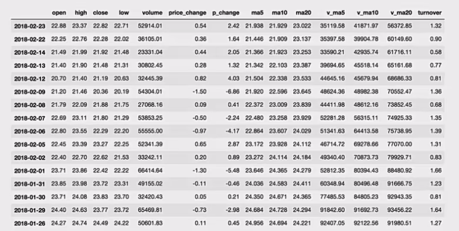
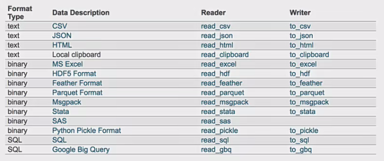

为了更好的理解这些基本操作，我们将读取一个真实的股票数据。关于文件操作，后面在介绍，这里只先用一下API。

```python
# 读取文件
data = pd.read_csv("./data/stock_day.csv" )

# 删除一些列，让数据更简单些，再去做后面的操作
data = data.drop(["ma5" ,"ma10","ma20" ,"v_ma5","v_ma10" ,"'v_ma20"], axis=1)
```



---

## 索引操作

<p align = "justify" style = "text-indent:2em">Numpy当中我们已经讲过使用索引选取序列和切片选择，pandas也支持类似的操作，也可以直接使用列名、行名称，甚至组合使用。</p>

### 直接使用行列索引(先列后行)

获取'2018-02-27"这天的'close'的结果

```python
# 直接使用行列索引名字的方式 (先列后行)
data['open']['2018-02-27']
23.53

# 不支持的操作
# 错误
data['2018-02-27']['open']
# 错误
data[:1, :2]
```

### 结合loc或者iloc使用索引

获取从'2018-02-27': '2018-02-22'，'open'的结果

```python
# 使用loc: 只能指定行列索引的名字
data.loc['2018-02-27':'2018-02-22','open']

2018-02-27  23.53
2018-02-26  22.80
2018-02-23  22.88
Name: open, dtype: float64

# 使用iloc可以通过索引的下标去获取
# 获取前3天数据，前5列的结果
data.iloc[:3, :5]

            open    high    close   low
2018-02-27  23.53   25.88   24.16   23 53
2018-02-26  22.80   23.78   23 53   22.80
2018-02-23  22.88   23.37   22.82   22.71
```

### 使用ix组合索引

> Warning: Starting in 0.20.0, the .ix indexer is deprecated, in favor of the more strict .iloc and .loc indexers.

获取行第1天到第4天，['open','close','high','low']这个四个指标的结果

```python
# 使用ix进行下表和名称组合做引
data.ix[0:4, ['open','close','high','low']]

# 推荐使用loc和iloc来获取的方式
data.loc[data.index[0:4],['open','close', 'high','low']]
data.iloc[0:4, data.columns.get_indexer(['open', 'close', 'high', 'low'])]

            open    close   high    low
2018-02-27  23.53   24.16   25.88   23.53
2018-02-26  22.80   23.53   23.78   22.80
2018-02-23  22.88   22.82   23.37   22.71
2018-02-22  22.25   22.28   22.76   22.02
```

---

## 赋值操作

对DataFrame当中的close列进行重新赋值为1

```python
# 直接修改原来的值
data['close'] = 1

# 或者
data.close = 1
```

---

## 排序

排序有两种形式，一种对于索引进行排序，一种对于内容进行排序。

### DataFrame排序

- 使用df.sort_values(by=, ascending=)

    - 单个键或者多个键进行排序

    - 参数:

        - by:指定排序参考的键

        - ascending: 默认升序
        
        - ascending = False: 降序

        - ascending = True: 升序

```python
# 按照开盘价大小进行排序，使用ascending指定按照大小排序
data.sort_values(by="open", ascending=True).head( )
```


```python
# 按照多个键进行排序
data.sort_values(by=['open', 'high'])
```


- 使用df.sort_index给索引进行排序

这个股票的日期索引原来是从大到小，现在重新排序，从小到大。

```python
# 对索引进行排序
data.sort_index()
```


### Series排序

- 使用series.sort_values(ascending=True)进行排序

series排序时，只有一列，不需要参数。

```python
data['p_change'].sort_values(ascending=True).head( )

2015-09-01  -10.03
2015-09-14  -10.02
2016-01-11  -10.02
2015-07-15  -10.02
2015-08-26  -10.01
Name: p_change, dtype: float64
```

- 使用series.sort_index()进行排序

与df一致

```python
# 对索引进行排序
data['p_change'].sort_index().head()

2015-03-02  2.62
2015-03-03  1.44
2015-03-04  1.57
2015-03-05  2.02
2015-03-06  8.51
Name: p_change, dtype: float64
```

---

## 算术运算

- add(other)

比如进行数学运算加上具体的一个数字

```python
data['open'].add(1)

2018-02-27  24.53
2018-02-26  23.80
2018-02-23  23.88
2018-02-22  23.25
2018-02-14  22.49
```

- sub(other)

比如进行数学运算减去具体的一个数字

---

## 逻辑运算

### 逻辑运算符号

- 例如筛选data["open"]>23的日期数据

    - data["open"]>23返回逻辑结果

```python
data["open"] > 23

2018-02-27  True
2018-02-26  False
2018-02-23  False
2018-02-22  False
2018-02-14  False
```

```python
# 逻辑判断的结果可以作为筛选的依据
data[data["open"] > 23].head()
```


- 完成多个逻辑判断

```python
data[(data["open"] > 23) & (data["open"] < 24)].head()
```


### 逻辑运算函数

- query(expr)

    - expr: 查询字符串
    
通过query使得刚才的过程更加方便简单

```python
data.query("open<24 & open>23").head()
```

- isin(values)

例如判断'open'是否为23.53和23.85

```python
# 可以指定值进行一个判断，从而进行筛选操作
data[data["open"].isin([23.53, 23.85])]
```


---

## 统计运算

### describe

综合分析: 能够直接得出很多统计结果，count，mean，std，min，max等

```python
# 计算平均值、标准差、最大值、最小值
data.describe()
```


### 统计函数

<p align = "justify" style = "text-indent:2em">Numpy当中已经详细介绍，在这里我们演示min(最小值),max(最大值),mean(平均值),median(中位数),var(方差),std(标准差),mode(众数)结果：</p>

|count|Number of non-NA observations|
|:--:|:--:|
|sum|Sum of values|
|mean|Mean of values|
|median|Arithmetic median of values|
|min|Minimum|
|max|Maximum|
|mode|Mode|
|abs|Absolute Value|
|prod|Product of values|
|std|Bessel-corrected sample standard deviation|
|var|Unbiased variance|
|idxmax|compute the index labels with the maximum|
|idxmin|compute the index labels with the minimum|

<p align = "justify" style = "text-indent:2em">对于单个函数去进行统计的时候，坐标轴还是按照默认列“columns” (axis=0, default)，如果要对行“index”需要指定(axis=1)。</p>

- max()、min()

```python
# 使用统计函数: 0代表列求结果，1 代表行求统计结果
data.max(0)

open                  34.99
high                  36.35
close                 35.21
Low                   34.01
volume                501915.41
price_change          3.03
p_change              10.03
turnover              12.56
my_price_change       3.41
dtype: float64
```

- std()、var()

```python
# 方差
data.var(0)

open                1.545255e+01
high                1.662665e+01
close               1.554572e+01
low                 1.437902e+01
volume              5.458124e+09
price_change        8.072595e-01
p_change            1.664394e+01
turnover            4.323800e+00
my_price_change     6.409037e-01
dtype: float64

# 标准差
data.std(0)

open                3.930973
high                4.077578
close               3.942806
low                 3.791968
volume              73879.119354
price_change        0.898476
p_change            4.079698
turnover            2.079375
my_price_change     0.800565
dtype: float64
```

- median(): 中位数

中位数为将数据从小到大排列，在最中间的那个数为中位数。如果没有中间数，取中间两个数的平均值。

```python
df = pd.DataFrame({'coL1': [2,3,4,5,4,2], 'CoL2': [0,1,2,3,4,2]})

df.median()

COL1    3.5
COL2    2.0
dtype: float64
```

- idxmax()、idxmin()

```python
# 求出最大值的位置
data.idxmax(axis=0)

open                  2015-06-15
high                  2015-06-10
close                 2015-06-12
Low                   2015-06-12
volume                2017-10-26
price_change          2015-06-09
p_change              2015-08-28
turnover              2017-10-26
my_price_change       2015-07-10
dtype: object

# 求出最小值的位置
data.idxmin(axis=0)

open                  2015-03-02
high                  2015-03-02
close                 2015-09-02
LoW                   2015-03-02
volume                2016-07-06
price_change          2015-06-15
p_change              2015-09-01
turnover              2016-07-06
my_price_change       2015-06-15
dtype: object
```

### 累计统计函数

|函数|作用|
|:--:|:--:|
|cumsum|计算前1/2/3/.../n个数的和|
|cummax|计算前1/2/3/.../n个数的最大值|
|cummin|计算前1/2/3/.../n个数的最小值|
|cumprod|计算前1/2/3/.../n个数的积|

那么这些累计统计函数怎么用？


以上这些函数可以对series和dataframe操作

这里我们按照时间的从前往后来进行累计

- 排序

```python
# 排序之后，进行累计求和
data = data.sort_index()
```

- 对p_change进行求和

```python
stock_rise = data['p_change']
# plot方法集成了前面直方图、条形图、饼图、折线图
stock_rise.cumsum()

2015-03-02    2.62
2015-03-03    4.05
2015-03-04    5.63
2015-03-05    7.65
2015-03-06    16.16
2015-03-09    16.37
2015-03-10    18.75
2015-03-11    16.36
2015-03-12    15.03
2015-03-13    17.58
2015-03-16    20.34
2015-03-17    22.42
2015-03-18    23.28
2015-03-19    23.74
2015-03-20    23.48
2015-03-23    23.74
```

那么如何让这个连续求和的结果更好的显示呢？


如果要使用plot函数，需要导入matplotlib

```python
import matplotlib.pyplot as plt
# plot显示图形
stock_rise.cumsum().plot()
# 需要调用show，才能显示出结果
plt.show()
```

> 关于plot，稍后会介绍API的选择

---

## 自定义运算

- apply(func, axis=0)

  - func: 自定义函数

  - axis=0: 默认是列，axis=1为行进行运算
  
- 定义一个对列，最大值-最小值的函数

```python
data[['open', 'close']].apply(lambda x: x.max() - x.min(), axis=0)

open    22.74
close   22.85
dtype: float64
```

---

## pandas.DataFrame.plot

- DataFrame.plot (kind='line')

- kind: str，需要绘制图形的种类

  - 'line': line plot (default)

  - 'bar': vertical bar plot

  - 'barh': horizontal bar plot

    - 关于"barh"的解释:

    - http://pandas.pydata.org/pandas-docs/stable/reference/api/pandas.DataFrame.plot.barh.html

  - 'hist': histogram

  - 'pie': pie plot

  - 'scatter': scatter plot

> 更多细节: https://pandas.pydata.org/pandas-docs/stable/generated/pandas.DataFrame.plot.html?highlight=plot#pandas.DataFrame.plot

---

## pandas.Series.plot

> 更多细节: https://pandas.pydata.org/pandas-docs/stable/generated/pandas.DataFrame.plot.html?highlight=plot#pandas.DataFrame.plot

<p align = "justify" style = "text-indent:2em">我们的数据大部分存在于文件当中，所以pandas会支持复杂的输入输出操作，pandas的API支持众多的文件格式，如CSV、SQL、XLS、JSON、HDF5。</p>

> 注: 最常用的HDF5和CSV文件



---

## CSV

### read_csv

- pandas.read_csv(filepath_or_buffer, sep =',')

  - filepath_or_buffer: 文件路径

  - usecols: 指定读取的列名，列表形式
  
- 举例: 读取之前的股票的数据

```python
# 读取文件，并且指定只获取'open'，'close'指标
data = pd.read_csv("./data/stock_day.csv", usecols=['open','close'])

              open    close
2018-02-27    23.53   24.16
2018-02-26    22.80   23.53
2018-02-23    22.88   22.82
2018-02-22    22.25   22.28
2018-02-14    21.49   21.92
```

### to_csv

- DataFrame.to_csv(path_or_buf=None, sep=',', columns=None, header=True, index=True, mode='w', encoding=None)

  - path_or_buf: 文件路径

  - sep: 分隔符，默认用","隔开

  - columns: 选择需要的列索引

  - header: boolean or list of string, default True,是否写进列索引值

  - index: 是否写进行索引

  - mode='w': 重写，'a'追加
  
- 举例: 保存读取出来的股票数据

  - 保存'open'列的数据，然后读取查看结果

```python
# 选取10行数据保存，便于观察数据
data[:10].to_csv("./data/test.csv", columns=['open'])
```

```python
# 读取，查看结果
pd.read_csv("./data/test.csv")

    Unnamed: 0    open
0   2018-02-27    23.53
1   2018-02-26    22.80
2   2018-02-23    22.88
3   2018-02-22    22.25
4   2018-02-14    21.49
5   2018-02-13    21.40
6   2018-02-12    20.70
7   2018-02-09    21.20
8   2018-02-08    21.79
9   2018-02-07    22.69
```

会发现将索引存入到文件当中，变成单独的一列数据。如果需要删除，可以指定index参数,删除原来的文件，重新保存一次。

```python
# index: 存储不会讲索引值变成一列数据
data[:10].to_csv("./data/test.csv", columns=['open'], index=False)
```

---

## HDF5

### read_hdf与to_hdf

<b>HDF5文件的读取和存储需要指定一个键，值为要存储的DataFrame</b>

- pandas.read_hdf(path_or_buf, key =None, ** kwargs)

  从h5文件当中读取数据

  - path_or_buffer: 文件路径

  - key: 读取的键

  - return: Theselected object
  
- DataFrame.to_hdf(path_or_buf, key, *\kwargs*)

### 案例

- 读取文件

```python
day_eps_ttm = pd.read_hdf("./data/day_close.h5")
```

如果读取的时候出现以下错误:


需要安装安装tables模块避免不能读取HDF5文件

```python
pip install tables
```


- 存储文件

```python
day_eps_ttm.to_hdf("./data/test.h5", key="day_eps_ttm")
```

再次读取的时候,需要指定键的名字

```python
new_eps = pd.read_hdf("./data/test.h5", key="day_eps_ttm")
```

<b>注意: 优先选择使用HDF5文件存储</b>

  - HDF5在存储的时候支持压缩，<b>使用的方式是blosc，这个是速度最快的</b>也是pandas默认支持的

  - 使用压缩可以<b>提磁盘利用率，节省空间</b>

  - HDF5还是跨平台的，可以轻松迁移到hadoop上面

---

## JSON

<p align = "justify" style = "text-indent:2em">JSON是我们常用的一种数据交换格式，前面在前后端的交互经常用到，也会在存储的时候选择这种格式所以我们需要知道Pandas如何进行读取和存储JSON格式。</p>

### read_json

- pandas.read_json(path_or_buf=None, orient=None, typ='frame', lines=False)

  - 将JSON格式准换成默认的Pandas DataFrame格式

  - orient: string,Indication of expected JSON string format.
  
    - 'split': dict like {index -> [index], columns -> [columns], data -> [values]}
      
      - split 将索引总结到索引，列名到列名，数据到数据。将三部分都分开了
      
    - <b>'records': list like [{column -> value}, ... , {column -> value}]</b>
    
      - records以columns: values的形式输出
      
    - 'index': dict like {index ->{column -> value}}

      - index以 index:{columns:values}...的形式输出
      
    - 'columns': dict like{column ->{index->value}},默认该格式
    
      - colums以 columns: {index:values}的形式输出

    - 'values': just the values array

      - values 直接输出值

- lines: boolean, default False

  - 按照每行读取json对象

- typ: default 'frame'，指定转换成的对象类型series或者dataframe

### read_josn 案例

- 数据介绍

这里使用一个新闻标题讽刺数据集，格式为json。

is_sarcastic: 1讽刺的，否则为0;

headline: 新闻报道的标题; 

article_link: 链接到原始新闻文章。

- 读取

orient指定存储的json格式，lines指定按照行去变成一个样本

```python
read = pd.read_json("./data/Sarcasm_Headlines Dataset.json", orient="records", lines=True)
```

结果为:


### to_json

- DataFrame.to_json(path_or_buf=None, orient=None, lines=False)

  - 将Pandas 对象存储为json格式

  - path_or_buf=None: 文件地址

  - orient: 存储的json形式，{'split',records','index','columns','values’}

  - lines: 一个对象存储为一行

### 案例

- 存储文件

```python
json_read.to_json("./data/test.json", orient='records')
```

- 修改lines参数为True

```python
json_read.to_json("./data/test.json", orient='records', lines=True)
```