## Pandas的介绍

- 2008年WesMcKinney开发出的库

- 专门用于数据挖掘的开源python库

- 以Numpy为基础，借力Numpy模块在计算方面性能高的优势

- 基于matplotlib，能够简便的画图

- 独特的数据结构

---

## pandas的优势

Numpy已经能够帮助我们处理数据，能够结合matplotib解决部分数据展示等问题，那么pandas学习的目的在什么地方呢?

- 增强图表可读性

    - 回忆我们在numpy当中创建学生成绩表样式:

返回结果:

```python
array([[92,55,78,50,50],
       [71,76,50,48,96],
       [45,84,78,51,68],
       [81,91,56,54,76],
       [86,66,77,67,95],
       [46,86,56,61,99],
       [46,95,44,46,56],
       [80,50,45,65,57],
       [41,93,90,41,97],
       [65,83,57,57,40]])
```

如果数据展示为这样，可读性就会更友好:

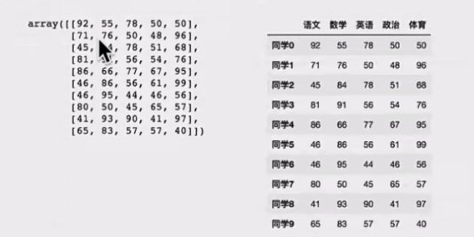

- 便捷的数据处理能力

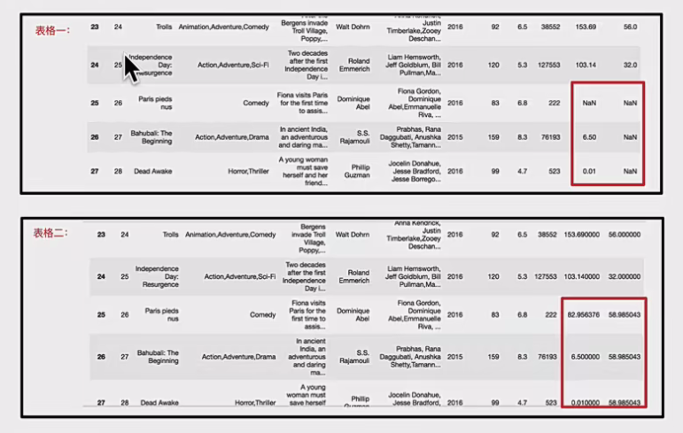

- 读取文件方便

- 封装了Matplotlib、Numpy的画图和计算

---

<p align = "justify" style = "text-indent:2em">Pandas中一共有三种数据结构，分别为: Series、DataFrame和Multilndex (老版本中叫Panel)。其中Series是一维数据结构，DataFrame是二维的表格型数据结构，Multilndex是三维的数据结构。</p>

## Series

<p align = "justify" style = "text-indent:2em">Series是一个类似于一维数组的数据结构，它能够保存任何类型的数据，比如整数、字符串、浮点数等，主要由一组数据和与之相关的索引两部分构成。</p>

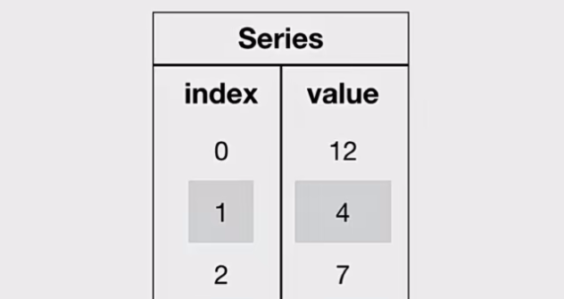

### Series的创建

```python
# 导入pandas
import pandas as pd

pd.Series(data=None, index=None, dtype=None)
```

- 参数:
    - data: 传入的数据，可以是ndarray、list等
    - index: 索引，必须是唯一的，且与数据的长度相等。如果没有传入索引参数，则默认会自动创建一个从0-N的整数索引。
    - dtype: 数据的类型

通过已有数据创建

- 指定内容，默认索引

```python
pd.Series(np.arange(10))
```

```python
# 运行结果
0   0
1   1
2   2
3   3
4   4
5   5
6   6
7   7
8   8
9   9
dtype: int64
```

- 指定索引

```python
pd.Series([6.7,5.6,3,10,2], index=[1,2,3,4,5])
```

```python
# 运行结果
1   6.7
2   5.6
3   3.0
4   10.0
5   2.0
dtype: float64
```

- 通过字典数据创建

```python
color_count = pd.Series({'red':100, 'blue':200,  'green': 500, 'yellow': 1000})
color_count
```

```python
# 运行结果
blue    200
green   500
red     100
yellow  1000
dtype: int64
```

### Series的属性

为了更方便地操作Series对象中的索引和数据，<b>Series中提供了两个属性index和values</b>。

- index

```python
color_count.index

# 结果
Index(['blue', 'green', 'red', 'yellow'], dtype='object')
```

- values

```python
color_count.values

# 结果
array([200, 500, 100, 1000])
```

也可以使用索引来获取数据:

```python
color_count[2]

# 结果
100
```

---

## DataFrame

DataFrame是一个类似于二维数组或表格(如excel)的对象，既有行索引，又有列索引。

- 行索引，表明不同行，横向索引，叫index，0轴，axis=0

- 列索引，表名不同列，纵向索引，叫columns，1轴，axis=1

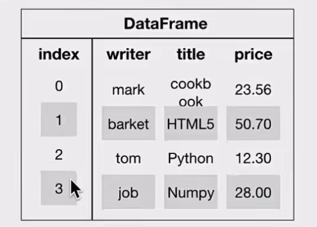

### DataFrame的创建

```python
# 导入pandas
import pandas as pd

pd.DataFrame(data=None, index=None, columns=None)
```

- 参数:
    - index: 行标签。如果没有传入索引参数，则默认会自动创建一个从0-N的整数索引。

    - columns: 列标签。如果没有传入索引参数，则默认会自动创建一个从0-N的整数索引。

- 通过已有数据创建

---

举例一:

```python
pd.DataFrame(np.random.randn(2,3))
```

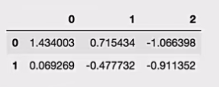

回忆咱们在前面直接使用np创建的数组显示方式，比较两者的区别。

举例二: 创建学生成绩表

```python
# 生成10名同学，5门功课的数据
score = np.random.randint(40, 100, (10, 5))

# 结果
array([[92,55,78,50,50],
       [71,76,50,48,96],
       [45,84,78,51,68],
       [81,91,56,54,76],
       [86,66,77,67,95],
       [46,86,56,61,99],
       [46,95,44,46,56],
       [80,50,45,65,57],
       [41,93,90,41,97],
       [65,83,57,57,40]])
```

但是这样的数据形式很难看到存储的是什么的样的数据，可读性比较差!!

---

问题: 如何让数据更有意义的显示?

```python
# 使用Pandas中的数据结构
score_df = pd.DataFrame(score)
```

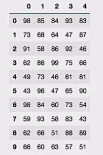

给分数数据增加行列索引，显示效果更佳。

- 增加行、列索引

```python
# 构造行索引序列
subjects = ["语文", "数学", "英语", "政治", "体育"]

# 构造列索引序列
stu = ['同学' + str(i) for i in range(score_df.shape[0])]

# 添加行索引
data = pd.DataFrame(score, columns=subjects, index=stu)
```

效果：

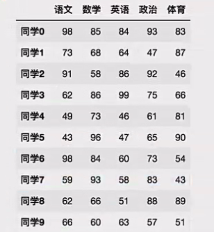

---

### DataFrame的属性

- shape

```python
data.shape

# 结果
(10, 5)
```

- index

DataFrame的行索引列表

```python
data.index

# 结果
Index(['同学0', '同学1', '同学2', '同学3', '同学4', '同学5', '同学6', '同学7', '同学8', '同学9'], dtype='object')
```

- columns

DataFrame的列索引列表

```python
data.columns

# 结果
Index(['语文', '数学', '英语', '政治', '体育'], dtype='object')
```

- values

直接获取其中array的值

```python
data.values

array([[92,55,78,50,50],
       [71,76,50,48,96],
       [45,84,78,51,68],
       [81,91,56,54,76],
       [86,66,77,67,95],
       [46,86,56,61,99],
       [46,95,44,46,56],
       [80,50,45,65,57],
       [41,93,90,41,97],
       [65,83,57,57,40]])
```

- T

转置

```python
data.T
```

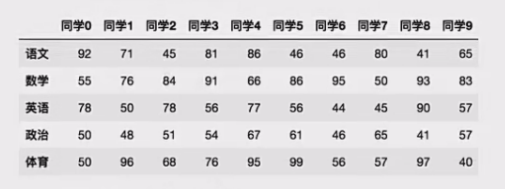

- head(5): 显示前5行内容

如果不补充参数，默认5行。填入参数N则显示前N行

```python
data.head(5)
```

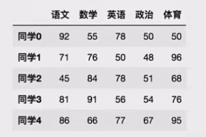

- tail(3):显示后3行内容

如果不补充参数，默认3行。填入参数N则显示后N行

```python
data.tail(3)
```


---

### DatatFrame索引的设置

需求：

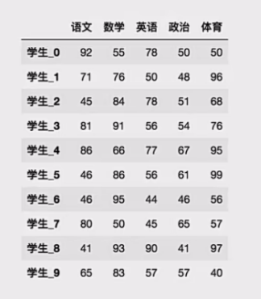

#### 修改行列索引值

```python
stu = ["学生_" + str(i) for i in range(score_df.shape[0])]

# 必须整体全部修改
data.index = stu
```

注意: 以下修改方式是错误的

```python
# 错误修改方式
data.index[3] = '学生_3'
```

#### 重设索引

- reset_index(drop=False)

    - 设置新的下标索引

    - drop: 默认为False，不删除原来索引，如果为True,删除原来的索引值

```python
# 重置索引，drop=False
data.reset_index()
```

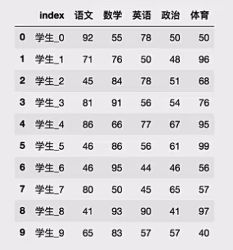

```python
# 重置索引，drop=True
data.reset_index(drop=True)
```

#### 以某列值设置为新的索引

- set_index(keys, drop=True)

    - keys: 列索引名成或者列索引名称的列表

    - drop: boolean,default,True.当做新的索引，删除原来的列

设置新索引案例

1、创建

```python
df = pd.DataFrame({'month': [1,4,7,10], 
'year': [2012,2014,2013,2014], 'sale': [55,40,84,31]})

    month   sale    year
0   1       55      2012
1   4       40      2014
2   7       84      2013
3   10      31      2014
```

2、以月份设置新的索引

```python
df.set_index('month')

month   sale    year
1       55      2012
4       40      2014
7       84      2013
10      31      2014
```

3、设置多个索引，以年和月份

```python
df = df.set_index(['year', 'month'])
df

year   month    sale
2012   1        55
2013   4        40
2013   7        84
2014   10       31
```

> 注: 通过刚才的设置，这样DataFrame就变成了一个具有Multilndex的DataFrame。

---

## Multindex与Panel

### Multilndex

Multilndex是三维的数据结构;

多级索引(也称层次化索引)是pandas的重要功能，可以在Series、DataFrame对象上拥有2个以及2个以上的索引。

#### multilndex的特性

打印刚才的df的行索引结果

```python
df.index

MultiIndex(levels=[[2012,2013,2014], [1,4,7,10]],
           labels=[[0,2,1,2],[0,1,2,3]],
           names=['year','month'])
```

多级或分层索引对象

- index属性

    - names: levels的名称

    - levels: 每个level的元组值

```python
df.index.names
# FrozenList(['year','month'])

df.index.levels
# FrozenList([[1,2],[1,4,7,10]])
```

#### multilndex的创建

```python
arrays =[[1,1,2,2],['red','blue','red','blue']]
pd.MultiIndex.from_arrays(arrays, names=('number','color'))

# 结果
MultiIndex(levels=[[1,2],['blue', 'red']],
           codes=[[0,0,1,1],[1,0,1,0]],
           names=['number','color'])
```

---

### Panel【了解】

#### panel的创建
- class pandas.Panel (data=None, items=None, major_axis=None, minor_axis=None)

    - 作用: 存储3维数组的Panel结构

    - 参数:

        - data: ndarray或者dataframe

        - items: 索引或类似数组的对象，axis=0

        - major_axis: 索引或类似数组的对象，axis=1

        - minor_axis:索引或类似数组的对象，axis=2

```python
p = pd.Panel(data=np.arange(24).reshape(4,3,2),items=list('ABCD'),major_axis=pd.date_range('20130101',periods=3),minor axis=['first','second'])

# 结果
<class "pandas.core.panel.Panel'>
Dimensions: 4 (items) x 3 (major_axis) x 2 (minor_axis)
Items axis: A to D
Major_axis axis: 2013-01-01 00:00:00 to 2013-01-03 00:00:00 
Minor_axis axis: first to second
```