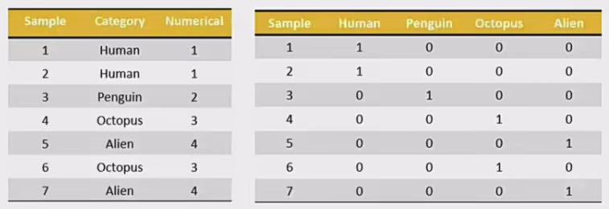
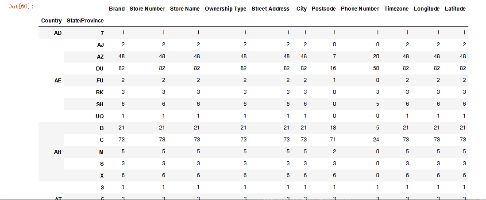

## 如何处理nan

- 获取缺失值的标记方式(NaN或者其他标记方式)

- 如果缺失值的标记方式是NaN

    - 判断数据中是否包含NaN:

        - pd.isnull(df)

        - pd.notnull(df)

    - 存在缺失值nan:

        - 1、删除存在缺失值的: dropna(axis='rows')

            - 注: 不会修改原数据，需要接受返回值

        - 2、替换缺失值: fillna(value, inplace=True)

            - value:替换成的值

            - inplace: True: 会修改原数据，False: 不替换修改原数据，生成新的对象

- 如果缺失值没有使用NaN标记，比如使用“？”

    - 先替换“？”为np.nan，然后继续处理

---

## 电影数据的缺失值处理

- 电影数据文件获取

```python
# 读取电影数据
movie = pd.read_csv("./data/IMDB-Movie-Data.csv" )
movie.head()
```


### 判断缺失值是否存在

- pd.notnull()

```python
pd.notnull(movie)

np.all(pd.notnull(movie))

# 输出：
False
```

- pd.isnull()

### 存在缺失值nan，并且是np.nan

- 1、制除

pandas删除缺失值，使用dropna的前提是，缺失值的类型必须是np.nan

```python
# 不修改原数据
movie.dropna()

# 可以定义新的变量接受或者用原来的变量名
data = movie.dropna()
```

- 2、替换缺失值

```python
# 替换存在缺失值的样本的两列
# 替换填充平均值，中位数
# movie['Revenue (Millions)'].fillna (movie['Revenue(Millions)'].mean(), inplace=True)
```

替换所有缺失值:

```python
for i in movie.columns:
    if np.all(pd.notnull(movie[i])) == False:
        print(i)
        movie[i].fillna(movie[i].mean(), inplace=True)
```

### 不是缺失值nan，有默认标记的

数据是这样的:


```python
wis = pd.read_csv("https://archive.ics.uci.edu/ml/machine-learning-databases/breast-cancer-wisconsin/breast-cancer-wisconsin.data")
```

以上数据在读取时，可能会报如下错误:

```python
URLError: <urlopen error [SSL: CERTIFICATE_VERIFY_FAILED] certificate verify failed...
```

<b>解决办法:</b>

```python
# 全局取消证书验证
import ssl
ssl._create_default_https_context = ssl._create_unverified _context
```

<b>处理思路分析:</b>

- 1、先替换“？”为np.nan

    - df.replace(to_replace=, value=)
    
        - to_replace: 替换前的值
        
        - value: 替换后的值

```python
# 把一些其它值标记的缺失值，替换成np.nan
wis = wis.replace(to_replace='？', value=np.nan)
```

- 2、在进行缺失值的处理

```python
# 删除
wis = wis.dropna()
```
---

## 离散化

连续属性离散化的目的是为了简化数据结构，<b>数据离散化技术可以用来减少给定连续属性值的个数</b>。离散化方法经常作为数据挖掘的工具。

## 数据的离散化

<b>连续属性的离散化就是在连续属性的值域上，将值域划分为若干个离散的区间，最后用不同的符号或整数 值代表落在每个子区间中的属性值。</b>

离散化有很多种方法，这使用一种最简单的方式去操作:

- 原始人的身高数据: 165, 174, 160, 180, 159, 163, 192, 184

- 假设按照身高分几个区间段: 150~ 165, 165~ 180, 180~ 195

这样我们将数据分到了三个区间段，我可以对应的标记为矮、中、高三个类别，最终要处理成一个“哑变量”矩阵。

## 股票的涨跌幅离散化

我们对股票每日的“p_change”进行离散化：


### 读取股票的数据

先读取股票的数据，筛选出p_change数据

```python
data = pd.read_csv("./data/stock_day.csv" )
p_change = data['p_change']
```

### 将股票涨跌幅数据进行分组


使用的工具:

- pd.qcut(data, q):

    - 对数据进行分组将数据分组，一般会与value_counts搭配使用，统计每组的个数
    
    - series.value_counts(): 统计分组次数

```python
# 自行分组
qcut = pd.qcut(p_change, 10)

# 计算分到每个组数据个数
qcut.value_counts()
```

自定义区间分组:

- pd.cut(data, bins)

```python
# 自己指定分组区间
bins = [-100, -7, -5, -3, 0, 3, 5, 7, 100]
p_counts = pd.cut(p_change, bins)
```

### 股票涨跌幅分组数据变成one-hot编码

- 什么是one-hot编码

把每个类别生成一个布尔列，这些列中只有一列可以为这个样本取值为1。其又被称为<b>热编码</b>。

把下图中左边的表格转化为使用右边形式进行表示:



- pandas.get_dummies(data, prefix=None)

    - data: array-like, Series, or DataFrame

    - prefix: 分组名字

```python
# 得出one-hot编码矩阵
dummies = pd.get_dummies(p_counts, prefix="rise" )
```


---

## pd.concat实现数据合并

- pd.concat([data1, data2], axis=1)

    - 按照行或列进行合并，axis=0为列索引，axis=1为行索引
    
比如我们将刚才处理好的one-hot编码与原数据合并


```python
# 按照行索引进行
pd.concat([data, dummies], axis=1)
```

---

## pd.merge

- pd.merge(left, right, how='inner', on=None)

    - 可以指定按照两组数据的共同键值对合并或者左右各自

    - left: DataFrame

    - right: 另一个DataFrame

    - on: 指定的共同键

    - how: 按照什么方式连接

|Merge method|SQL Join Name|Description|
|:--:|:--:|:--:|
|left|LEFT OUTER JOIN|Use keys from left frame only|
|right|RIGHT OUTER JOIN|Use keys from right frame only|
|outer|FULL OUTER JOIN|Use union of keys from both frames|
|inner|INNER JOIN|Use intersection of keys from both frames|

### pd.merge合并

```python
left = pd.DataFrame({'key1': ['K0', 'K0', 'K1', 'K2'],
                        'key2': ['K0', 'K1', 'K0', 'K1'],
                        'A': ['A0', 'A1', 'A2', 'A3'],
                        'B': ['B0', 'B1', 'B2', 'B3']})

right = pd.DataFrame({'key1': ['K0', 'K1', 'K1', 'K2'],
                        'key2': ['K0', 'K0', 'K0', 'K0'],
                        'C': ['C0', 'C1', 'C2', 'C3'],
                        'D': ['D0', 'D1', 'D2', 'D3']})

# 默认内连接
result = pd.merge(left, right, on=['key1', 'key2'])
```


- 右连接

```python
result = pd.merge(left, right, how='right', on=['key1',  'key2'])
```


- 外链接

```python
result = pd.merge(left, right, how='outer', on=['key1', 'key2'])
```


---

## 交叉表与透视表的作用

探究股票的涨跌与星期几有关？

以下图当中表示，week代表星期几，1、0代表这一天股票的涨跌幅是好还是坏，里面的数据代表比例。

可以理解为所有时间为星期一等等的数据当中涨跌幅好坏的比例。


- 交叉表: <b>交叉表用于计算一列数据对于另外一列数据的分组个数(用于统计分组频率的特殊透视表)</b>

    - pd.crosstab(value1, value2)

- 透视表: <b>透视表是将原有的DataFrame的列分别作为行索引和列索引，然后对指定的列应用聚集函数</b>。

    - data.pivot_table()

    - DataFrame.pivot_table([], index=[])

---

## 案例分析

### 数据准备

- 准备两列数据，星期数据以及涨跌幅是好是坏数据

- 进行交叉表计算

```python
# 寻找星期几跟股票张得的关系
# 1、先把对应的日期找到星期几
date = pd.to_datetime(data.index).weekday
data['week'] = date

#2、假如把p_change按照大小去分个类0为界限
data['posi_neg'] = np.where(data['p_change']>0, 1, 0)

# 通过交叉表找寻两列数据的关系
count = pd.crosstab(data['week'], data['posi_neg'])
```

但是我们看到count只是每个星期日子的好坏天数，并没有得到比例，该怎么去做？

- 对于每个星期一等的总天数求和，运用除法运算求出比例

```python
# 算数运算，先求和
sum = count.sum(axis=1).astype(np.float32)

# 进行相除操作，得出比例
pro = count.div(sum, axis=0)
```

### 查看效果

使用plot画出这个比例，使用stacked的柱状图

```python
pro.plot(kind='bar', stacked=True)
plt.show()
```


### 使用pivot_table(透视表)实现

使用透视表，刚才的过程更加简单

```python
# 通过透视表，将整个过程变成更简单一些
data.pivot_table(['posi_neg'], index='week')
```

---

分组与聚合通常是分析数据的一种方式，通常与一些统计函数一起使用，查看数据的分组情况

想一想其实刚才的交叉表与透视表也有分组的功能，所以算是分组的一种形式，只不过他们主要是计算次数或者计算比例!!看其中的效果:


## 分组与聚合


## 分组API

- DataFrame.groupby(key, as_index=False)

    - key: 分组的列数据，可以多个
    
- 案例: 不同颜色的不同笔的价格数据

```python
col =pd.DataFrame({'color': ['white','red','green','red','green'], 'object': ['pen','pencil','pencil','ashtray','pen'],'price1':[5.56,4.20,1.30,0.56,2.75],'price2':[4.75,4.12,1.60,0.75,3.15]})

col
```


- 进行分组，对颜色分组，price进行聚合

```python
# 分组，求平均值
col.groupby(['color'])['price1'].mean()
col['price1'].groupby(col['color']).mean()

color
green   2.025
red     2.380
white   5.560
Name: pricel, dtype: float64

# 分组，数据的结构不变
col.groupby(['color'], as_index=False) ['pricel'].mean()

color   price1
green   2.025
red     2.380
white   5.560
```

---

## 星巴克零售店铺数据

<p align = "justify" style = "text-indent:2em">现在我们有一组关于全球星巴克店铺的统计数据，如果我想知道美国的星巴克数量和中国的哪个多，或者我想知道中国每个省份星巴克的数量的情况，那么应该怎么办？</p>

> 数据来源:https://www.kaggle.com/starbucks/store-locations/data


### 数据获取

从文件中读取星巴克店铺数据

```python
# 导入星巴克店的数据
starbucks = pd.read_csv("./data/starbucks/directory.csv")
```

### 进行分组聚合

```python
# 按照国家分组，求出每个国家的星巴克零售店数量
count = starbucks.groupby(['Country']).count()
```

画图显示结果:

```python
count['Brand'].plot(kind='bar', figsize=(20, 8))
plt.show()
```


假设我们加入省市一起进行分组

```python
# 设置多个索引，set_index()
starbucks.groupby(['country', 'State/Province']).count()
```



仔细观察这个结构，与我们前面讲的哪个结构类似？？

与前面的Multilndex结构类似

---

## 需求

现在我们有一组从2006年到2016年1000部最流行的电影数据

数据来源: https://www.kaggle.com/damianpanek/sunday-eda/

    - 问题1: 我们想知道这些电影数据中评分的平均分，导演的人数等信息，我们应该怎么获取?

    - 问题2: 对于这一组电影数据，如果我们想rating，runtime的分布情况，应该如何呈现数据?

    - 问题3: 对于这一组电影数据，如果我们希望统计电影分类(genre)的情况，应该如何处理数据?

## 实现

首先获取导入包，获取数据

```python
%matplotlib inline
import pandas as pd
import numpy as np
from matplotlib import pyplot as plt
```

```python
#文件的路径
path = "./data/IMDB-Movie-Data.csv"

#读取文件
df = pd.read_csv(path)
```

### 问题一:

我们想知道这些电影数据中评分的平均分，导演的人数等信息，我们应该怎么获取?

- 得出评分的平均分

使用mean函数

```python
df ["Rating"].mean( )
```

- 得出导演人数信息

求出唯一值，然后进行形状获取

```python
## 导演的人数
# df["Director"].unique().shape[0]
np.unique(df["Director"]).shape[0]

644
```

### 问题二:

对于这一组电影数据，如果我们想Rating，Runtime(Minutes)的分布情况，应该如何呈现数据?

- 直接呈现，以直方图的形式

选择分数列数据，进行plot

```python
df["Rating"].plot(kind='hist', figsize=(20, 8))
```


- Rating进行分布展示

进行绘制直方图

```python
plt.figure(figsize=(20, 8), dpi=80)
plt.hist(df["Rating"].values, bins=20)
plt.show()
```

修改刻度的间隔

```python
# 求出最大最小值
max_ = df["Rating"].max()
min_ = df["Rating"].min()

# 生成刻度列表
t1 = np.linspace(min_, max_, num=21)

# 修改刻度
plt.xticks(t1)

# 添加网格
plt.grid()
```


- Runtime(Minutes)

```python
# Runtime (Minutes)分布

# 1.创建画布
plt.figure(figsize=(20, 8), dpi=100)

# 2.绘制图像
plt.hist(movie["Runtime (Minutes)"].values, bins=20)

# 2.1 添加刻度
max_ = movie["Runtime (Minutes)"].max()
min_ = movie["Runtime (Minutes)"].min()

t1 = np.linspace(min_, max_, num=21)

plt.xticks(t1)

# 2.2 添加网格
plt.grid()

# 3.显示
plt.show()
```


进行绘制直方图

### 问题三:

对于这一组电影数据，如果我们希望统计电影分类(genre)的情况，应该如何处理数据？

- 思路分析

    - 思路

        - 1、创建一个全为0的dataframe，列索引置为电影的分类，temp_df

        - 2、遍历每一部电影，temp_df中把分类出现的列的值置为1

        - 3、求和

- 1、创建一个全为0的dataframe，列索引置为电影的分类，temp_df

```python
# 进行字符串分割
temp_list = [i.split(",") for i in df["Genre"]]

# 获取电影的分类
genre_list = np.unique([i for j in temp_list for i in j])

# 增加新的列
temp_df = pd.Dataframe(np, zeros([df, shape[0], genre_list.shape[0]]), columns=genre_list)
```

- 2、遍历每一部电影，temp_df中把分类出现的列的值置为1

```python
for i in range(1000):
    # temp_list[i]['Action', 'Adventure', 'Animation']
    temp_df.ix[i, temp_list[i]]=1
print(temp_df.sum().sort_values())
```

- 3、求和，绘图

```python
temp_df.sum().sort_values(ascending=False).plot(kind="bar",figsize=(20,8),fontsize=20,colormap="cool")
```

