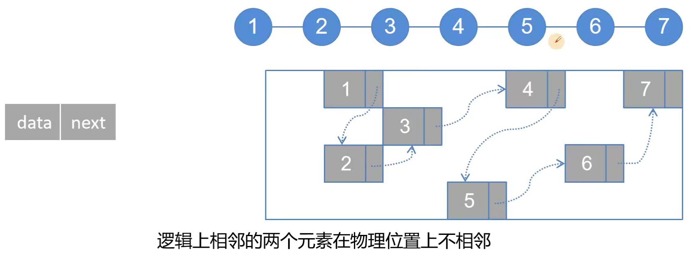
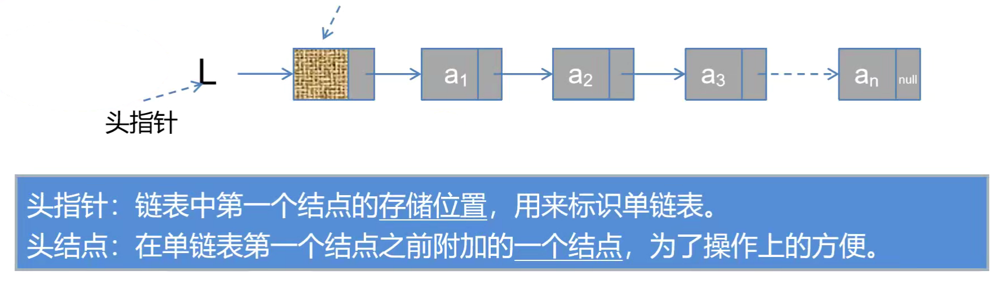
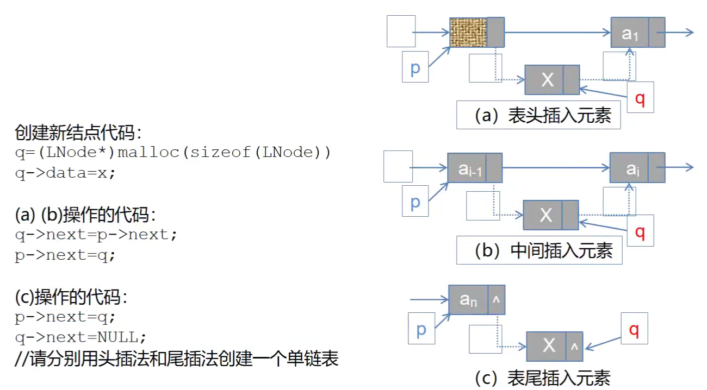
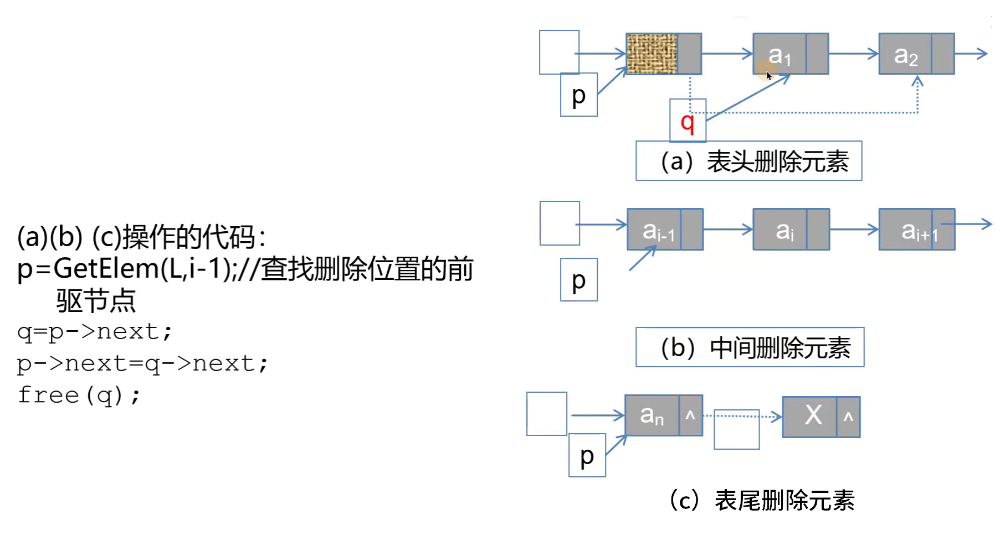
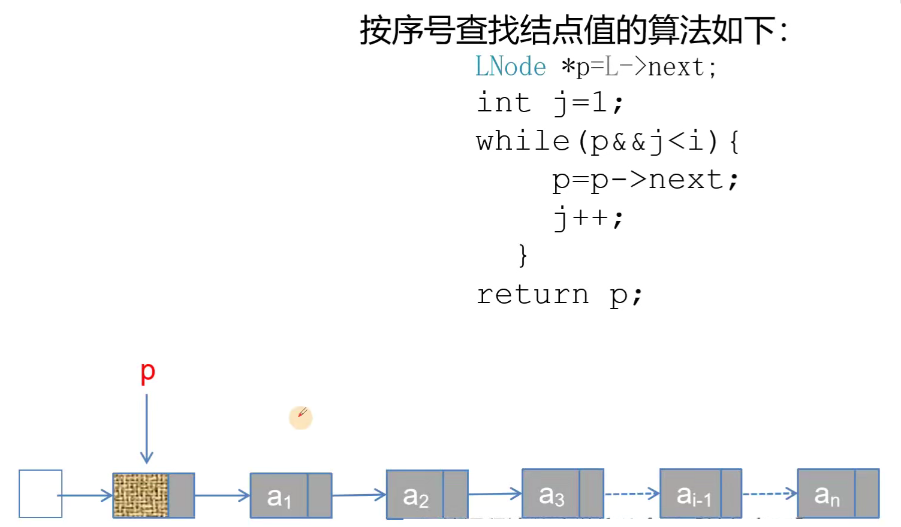

## 单链表的定义

<p align = "justify" style = "text-indent:2em">线性表的链式存储又称单链表。</p>



### 单链表定义代码展示

```C++
typedef int ElemType;

typedef struct LNode {
    ElemType data;  //定义数据域
    struct LNode *next; //定义指针域
} LNode, *LinkList; //定义单链表结点类型
```




### 单链表的优缺点


## 单链表的基本操作

<p align = "justify" style = "text-indent:2em">主要是讨论顺序表的插入、删除及查找的算法。</p>

### 单链表的插入操作

#### 图形解析



#### 头插法建立单链表

```C++
//头插法新建链表
//LNode*是结构体指针，和LinkList完全相等
void list_head_insert(LNode *&L) {
    LNode *s;   //用来指向申请的新结点
    ElemType x; //定义要输入结点的值
    L = (LinkList) malloc(sizeof(LNode));   //创建头结点，申请头结点空间，头指针指向头结点
    L->next = NULL;
    scanf("%d", &x);    //输入结点的值
    while (x != 9999) {
        s = (LinkList) malloc(sizeof(LNode));   //创建新结点
        s->data = x;
        s->next = L->next;  //s的next指向原本链表的第一个结点
        L->next = s;    //头结点的next指向新结点
        scanf("%d", &x);
    }
}
```

#### 尾插法建立单链表

```C++
//尾插法新建链表
//LNode*是结构体指针，和LinkList完全相等
void list_tail_insert(LNode *&L) {
    ElemType x; //定义要输入结点的值
    L = (LinkList) malloc(sizeof(LNode));   //创建头结点，申请头结点空间，头指针指向头结点
    L->next = NULL;
    scanf("%d", &x);    //输入结点的值
    LNode *s, *r = L;   //s用来指向申请的新结点,r始终指向链表尾部
    while (x != 9999) {
        s = (LinkList) malloc(sizeof(LNode));   //创建新结点
        s->data = x;
        r->next = s;    //新结点给尾结点的next指针
        r = s;  //r要指向新的尾部
        scanf("%d", &x);
    }
    r->next = NULL;
}
```

#### 尾插法建立单链表完整代码实现

```C++
#include <stdio.h>
#include <stdlib.h>

typedef int ElemType;

typedef struct LNode {
    ElemType data;  //定义数据域
    struct LNode *next; //定义指针域
} LNode, *LinkList; //定义单链表结点类型

//尾插法新建链表
//LNode*是结构体指针，和LinkList完全相等
void list_tail_insert(LNode *&L) {
    ElemType x; //定义要输入结点的值
    L = (LinkList) malloc(sizeof(LNode));   //创建头结点，申请头结点空间，头指针指向头结点
    L->next = NULL;
    scanf("%d", &x);    //输入结点的值
    LNode *s, *r = L;   //s用来指向申请的新结点,r始终指向链表尾部
    while (x != 9999) {
        s = (LinkList) malloc(sizeof(LNode));   //创建新结点
        s->data = x;
        r->next = s;    //新结点给尾结点的next指针
        r = s;  //r要指向新的尾部
        scanf("%d", &x);
    }
    r->next = NULL;
}

//链表打印
void print_linklist(LinkList L) {
    L = L->next;
    while (L != NULL) {
        printf("%d", L->data);
        L = L->next;
        if(L != NULL){
            printf(" ");
        }
    }
    printf("\n");
}

int main() {
    LinkList L; //L是链表头指针，是结构体类型
    list_tail_insert(L);    //输入数据可以为3 4 5 6 7 9999，头插法新建链表
    print_linklist(L);  //链表打印
    return 0;
}
```

#### 往第i个位置插入元素

```C++
//新结点插入第i个位置
bool ListFrontInsert(LinkList L, int pos, ElemType e) {
    LinkList p = getElem(L, pos - 1);   //指向插入元素的前一个位置
    if (NULL == p) {
        return false;
    }
    LinkList q;
    q = (LinkList) malloc(sizeof(LNode));   //为新插入的结点申请空间
    q->data = e;
    q->next = p->next;
    p->next = q;
    return true;
}
```

#### 往第i个位置插入元素完整代码

```C++
#include <stdio.h>
#include <stdlib.h>

typedef int ElemType;

typedef struct LNode {
    ElemType data;  //定义数据域
    struct LNode *next; //定义指针域
} LNode, *LinkList; //定义单链表结点类型

//尾插法新建链表
//LNode*是结构体指针，和LinkList完全相等
void list_tail_insert(LNode *&L) {
    ElemType x; //定义要输入结点的值
    L = (LinkList) malloc(sizeof(LNode));   //创建头结点，申请头结点空间，头指针指向头结点
    L->next = NULL;
    scanf("%d", &x);    //输入结点的值
    LNode *s, *r = L;   //s用来指向申请的新结点,r始终指向链表尾部
    while (x != 9999) {
        s = (LinkList) malloc(sizeof(LNode));   //创建新结点
        s->data = x;
        r->next = s;    //新结点给尾结点的next指针
        r = s;  //r要指向新的尾部
        scanf("%d", &x);
    }
    r->next = NULL;
}

//按序号查找结点值
//NULL代表查找的节点不存在
//L（头结点）的位置是0
LinkList getElem(LinkList L, int pos) {
    int i = 0;
    if (pos < 0) {
        return NULL;
    }
    while (L && i < pos) {
        L = L->next;
        i++;
    }
    return L;
}

//新结点插入第i个位置
bool ListFrontInsert(LinkList L, int pos, ElemType e) {
    LinkList p = getElem(L, pos - 1);   //指向插入元素的前一个位置
    if (NULL == p) {
        return false;
    }
    LinkList q;
    q = (LinkList) malloc(sizeof(LNode));   //为新插入的结点申请空间
    q->data = e;
    q->next = p->next;
    p->next = q;
    return true;
}

//链表打印
void print_linklist(LinkList L) {
    L = L->next;
    while (L != NULL) {
        printf("%d", L->data);
        L = L->next;
        if(L != NULL){
            printf(" ");
        }
    }
    printf("\n");
}

int main() {
    LinkList L; //L是链表头指针，是结构体类型
    bool ret;
    list_tail_insert(L);    //输入数据可以为3 4 5 6 7 9999，头插法新建链表
    print_linklist(L);  //链表打印
    ret = ListFrontInsert(L, 2, 99);
    if (ret) {
        printf("insert success!\n");
        print_linklist(L);
    } else {
        printf("defate success!\n");
    }
    return 0;
}
```

### 单链表的删除操作

#### 图形解析



#### 删除第i个位置元素

```C++
//删除第i个位置元素
//删除时L是不会变的；所以不需要加引用
bool list_del(LinkList L, int pos) {
    LinkList p = getElem(L, pos - 1);   //指向要删除元素的前一个结点
    if (NULL == p) {
        return false;
    }
    LinkList q;
    q = p->next;    //指向要删除元素的结点指针
    p->next = q->next;  //断链
    free(q);    //释放被删除结点的空间
    return true;
}
```

#### 删除第i个位置元素完整代码

```C++
#include <stdio.h>
#include <stdlib.h>

typedef int ElemType;

typedef struct LNode {
    ElemType data;  //定义数据域
    struct LNode *next; //定义指针域
} LNode, *LinkList; //定义单链表结点类型

//尾插法新建链表
//LNode*是结构体指针，和LinkList完全相等
void list_tail_insert(LNode *&L) {
    ElemType x; //定义要输入结点的值
    L = (LinkList) malloc(sizeof(LNode));   //创建头结点，申请头结点空间，头指针指向头结点
    L->next = NULL;
    scanf("%d", &x);    //输入结点的值
    LNode *s, *r = L;   //s用来指向申请的新结点,r始终指向链表尾部
    while (x != 9999) {
        s = (LinkList) malloc(sizeof(LNode));   //创建新结点
        s->data = x;
        r->next = s;    //新结点给尾结点的next指针
        r = s;  //r要指向新的尾部
        scanf("%d", &x);
    }
    r->next = NULL;
}

//按序号查找结点值
//NULL代表查找的节点不存在
//L（头结点）的位置是0
LinkList getElem(LinkList L, int pos) {
    int i = 0;
    if (pos < 0) {
        return NULL;
    }
    while (L && i < pos) {
        L = L->next;
        i++;
    }
    return L;
}

//删除第i个位置元素
//删除时L是不会变的；所以不需要加引用
bool list_del(LinkList L, int pos) {
    LinkList p = getElem(L, pos - 1);   //指向要删除元素的前一个结点
    if (NULL == p) {
        return false;
    }
    LinkList q;
    q = p->next;    //指向要删除元素的结点指针
    p->next = q->next;  //断链
    free(q);    //释放被删除结点的空间
    return true;
}

//链表打印
void print_linklist(LinkList L) {
    L = L->next;
    while (L != NULL) {
        printf("%d", L->data);
        L = L->next;
        if (L != NULL) {
            printf(" ");
        }
    }
    printf("\n");
}

int main() {
    LinkList L; //L是链表头指针，是结构体类型
    bool ret;
    list_tail_insert(L);    //输入数据可以为3 4 5 6 7 9999，头插法新建链表
    print_linklist(L);  //链表打印
    ret = list_del(L, 2);
    printf("list del success!\n");
    print_linklist(L);  //链表打印
    return 0;
}
```

### 单链表的查找操作

#### 按序号查找结点的算法



```C++
//按序号查找结点值
//NULL代表查找的节点不存在
//L（头结点）的位置是0
LinkList getElem(LinkList L, int pos) {
    int i = 0;
    if (pos < 0) {
        return NULL;
    }
    while (L && i < pos) {
        L = L->next;
        i++;
    }
    return L;
}
```

#### 按值查找结点的算法

```C++
//按值查找结点值
LinkList LocateElem(LinkList L, ElemType pos) {
    L = L->next;
    while (L != NULL && pos != L->data) {
        L = L->next;
    }
    return L;
}
```

#### 查找算法完整代码

```C++
#include <stdio.h>
#include <stdlib.h>

typedef int ElemType;

typedef struct LNode {
    ElemType data;  //定义数据域
    struct LNode *next; //定义指针域
} LNode, *LinkList; //定义单链表结点类型

//尾插法新建链表
//LNode*是结构体指针，和LinkList完全相等
void list_tail_insert(LNode *&L) {
    ElemType x; //定义要输入结点的值
    L = (LinkList) malloc(sizeof(LNode));   //创建头结点，申请头结点空间，头指针指向头结点
    L->next = NULL;
    scanf("%d", &x);    //输入结点的值
    LNode *s, *r = L;   //s用来指向申请的新结点,r始终指向链表尾部
    while (x != 9999) {
        s = (LinkList) malloc(sizeof(LNode));   //创建新结点
        s->data = x;
        r->next = s;    //新结点给尾结点的next指针
        r = s;  //r要指向新的尾部
        scanf("%d", &x);
    }
    r->next = NULL;
}

//按序号查找结点值
//NULL代表查找的节点不存在
//L（头结点）的位置是0
LinkList getElem(LinkList L, int pos) {
    int i = 0;
    if (pos < 0) {
        return NULL;
    }
    while (L && i < pos) {
        L = L->next;
        i++;
    }
    return L;
}

//按值查找结点值
LinkList LocateElem(LinkList L, ElemType pos) {
    L = L->next;
    while (L != NULL && pos != L->data) {
        L = L->next;
    }
    return L;
}

//链表打印
void print_linklist(LinkList L) {
    L = L->next;
    while (L != NULL) {
        printf("%d", L->data);
        L = L->next;
        if(L != NULL){
            printf(" ");
        }
    }
    printf("\n");
}

int main() {
    LinkList L; //L是链表头指针，是结构体类型
    LNode *search;  //用来存储拿到的结点
    list_tail_insert(L);    //输入数据可以为3 4 5 6 7 9999，头插法新建链表
    print_linklist(L);  //链表打印
    search = getElem(L, 2);
    if (search != NULL) {
        printf("search success!\n");
        printf("search=%d\n", search->data);
    }
    search = LocateElem(L, 7);
    if (search != NULL) {
        printf("search success!\n");
        printf("search=%d\n", search->data);
    }
    return 0;
}
```