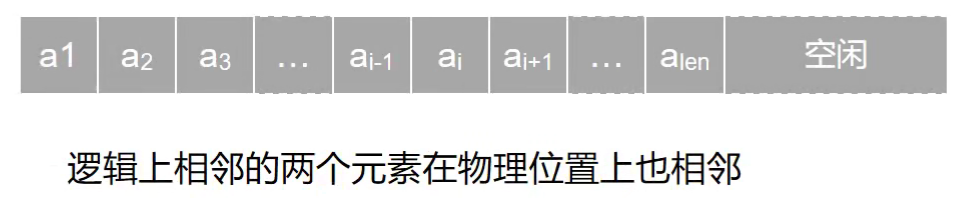
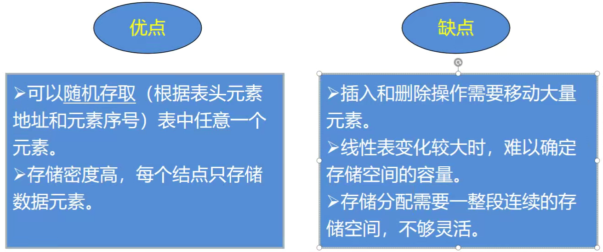
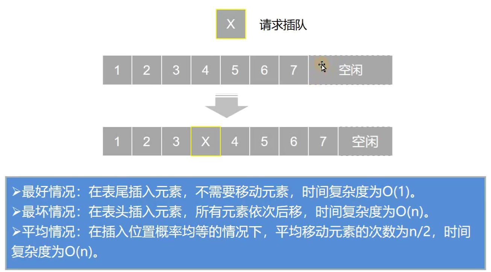
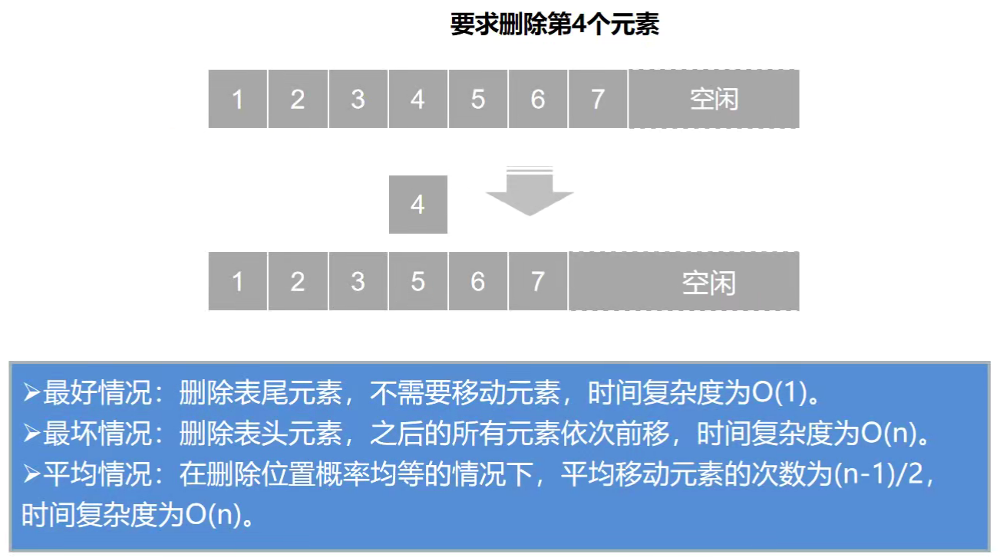

## 顺序表的定义

<p align = "justify" style = "text-indent:2em">线性表的顺序存储又称顺序表。</p>



### 顺序表定义代码展示

```C++
#define MaxSize 50  //定义线性表的最大长度
typedef int ElemType;   //让顺序表存储其他类型元素时；可以快速完成代码修改

typedef struct {
    ElemType data[MaxSize]; //顺序表的元素
    int len; //顺序表的当前长度
} SqList;   //顺序表类型的定义
```

### 顺序表的优缺点



## 顺序表的基本操作

<p align = "justify" style = "text-indent:2em">主要是讨论顺序表的插入、删除及查找的算法。</p>

### 顺序表的插入操作

#### 图形解析



#### 代码实现

```C++
//顺序表的插入操作
//操作过程中顺序表要改变，所以要使用&
bool ListInsert(SqList &L, int i, ElemType e) {

    //判断i是否合法
    if (i < 1 || i > L.len + 1) {
        return false;
    }

    //定义线性表的最大长度
    if (L.len > MaxSize) {
        return false;
    }

    //遍历顺序表元素，并且找到要插入的元素位置
    for (int j = L.len; j >= i; j--) {
        L.data[j] = L.data[j - 1];
    }
    L.data[i - 1] = e;  //放入要插入的元素
    L.len++;    //长度要加一
    return true;    //插入成功返回true
}
```

### 顺序表的删除操作

#### 图形解析



#### 代码实现

```C++
//顺序表的删除操作
//操作过程中顺序表要改变以及del要改变，所以要使用&
bool ListDelete(SqList &L, int i, ElemType &del) {

    //判断i是否合法
    if (i < 1 || i > L.len) {
        return false;   //一旦运行到这个语句，程序结束，将不会在执行下面的程序
    }

    del = L.data[i - 1];    //将要删除的元素存入del中
    for (int j = i; j < L.len; j++) {
        L.data[j - 1] = L.data[j];
    }
    L.len--;
    return true;
}
```

### 顺序表的查找操作

```C++
//顺序表的查询操作
int LocateElem(SqList L, ElemType e) {
    int i;
    for (i = 0; i < L.len; i++) {
        if (e == L.data[i]) {
            return i + 1; //如果找到就返回其位置,i为下标
        }
    }
    return 0;   //循环结束没有找到，则返回0
}
```

## 完整代码实现

```C++
#include <stdio.h>

//顺序表的初始化及插入与删除及查询操作

#define MaxSize 50  //定义线性表的最大长度
typedef int ElemType;   //让顺序表存储其他类型元素时；可以快速完成代码修改

typedef struct {
    ElemType data[MaxSize]; //顺序表的元素
    int len; //顺序表的当前长度
} SqList;   //顺序表类型的定义

//顺序表的插入操作
//操作过程中顺序表要改变，所以要使用&
bool ListInsert(SqList &L, int i, ElemType e) {

    //判断i是否合法
    if (i < 1 || i > L.len + 1) {
        return false;
    }

    //定义线性表的最大长度
    if (L.len > MaxSize) {
        return false;
    }

    //遍历顺序表元素，并且找到要插入的元素位置
    for (int j = L.len; j >= i; j--) {
        L.data[j] = L.data[j - 1];
    }
    L.data[i - 1] = e;  //放入要插入的元素
    L.len++;    //长度要加一
    return true;    //插入成功返回true
}

//打印顺序表
void PrintSqlist(SqList L) {
    int i;
    for (i = 0; i < L.len; i++) {
        printf("%3d", L.data[i]);
    }
    printf("\n");
}

//顺序表的删除操作
//操作过程中顺序表要改变以及del要改变，所以要使用&
bool ListDelete(SqList &L, int i, ElemType &del) {

    //判断i是否合法
    if (i < 1 || i > L.len) {
        return false;   //一旦运行到这个语句，程序结束，将不会在执行下面的程序
    }

    del = L.data[i - 1];    //将要删除的元素存入del中
    for (int j = i; j < L.len; j++) {
        L.data[j - 1] = L.data[j];
    }
    L.len--;
    return true;
}

//顺序表的查询操作
int LocateElem(SqList L, ElemType e) {
    int i;
    for (i = 0; i < L.len; i++) {
        if (e == L.data[i]) {
            return i + 1; //如果找到就返回其位置,i为下标
        }
    }
    return 0;   //循环结束没有找到，则返回0
}

int main() {
    SqList L;   //定义顺序表L
    bool ret;   //ret装函数的返回值
    //手动在顺序表中赋值
    L.data[0] = 1;
    L.data[1] = 2;
    L.data[2] = 3;
    L.len = 3;  //总计三个元素
    ret = ListInsert(L, 2, 8);
    if (ret) {
        printf("Insert sqlist success!\n");
        PrintSqlist(L);
    } else {
        printf("Insert sqlist defalse!\n");
    }
    printf("----------------------\n");
    ElemType del;   //将要删除的元素存入del中
    ret = ListDelete(L, 3, del);
    if (ret) {
        printf("Delete sqlist success!\n");
        printf("del element = %d\n", del);
        PrintSqlist(L);
    } else {
        printf("Delete sqlist defalse!\n");
    }
    printf("----------------------\n");
    int pos;    //pos接受函数的返回值
    pos = LocateElem(L, 8);
    if (pos) {
        printf("success find this element!\n");
        printf("find pos=%d\n", pos);
    } else {
        printf("Don't find this element!\n");
    }
    return 0;
}

```