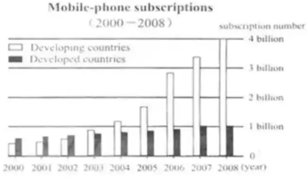
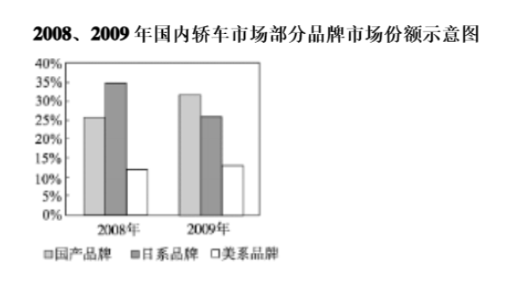
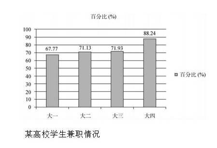
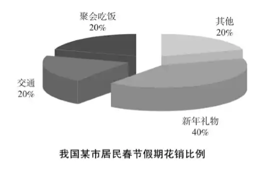

# 【前言】

## 写作学习的几个问题

（1）写作应该怎么学?

**答**：动笔写，无论是考前突击还是长线备考，不动笔的写作课不是写作课。

（2）作文自己写不出来，怎么办?

**答**：缺什么背什么，缺汉语思路，背汉语思路，缺英文表达，背英文表达。

（3）真题还是模拟预测重要?

**答**：都重要，但如果一定要选，真题比模拟预测重要。

## 英语（一/二）题型及分值分布

---

# 图标作文

## 全球手机市场

### 【参考题目】

<b>Directions:</b> ln this section，you are asked to write an essay based on the following chart. In your writing, you should

 1）Interpret the chart and

 2）Give your comments.

 You should write at least 150 words.

### 【参考范文】

 Given is a column chart, clearly illustrating the remarkable contrasts in mobile-phone subscriptions between developing and developed nations from 2000 to 2008. During this period, the subscription in developed countries showed a slight growth, from 600 million to 900 million. Then, it remained stable at 1 billion in 2007 and 2008. By contrast, the number of mobile phones sold in developing countries was merely 500 million, but it boosted sharply, reaching the peak at 4 billion in 2008.

 Such statistics can be associated with the rapid advance in the global mobile phone industry, but what resulted in the differences above? (To my understanding，at least two fundamental reasons can account for this phenomenon.) For one thing, in recent years, developing countries were characterized by their economic boom, which enabled residents there to possess additional money to purchase and utilize mobile phones. A case in point is China. For another, compared with developing countries, developed nations enjoyed a smaller market, due to their smaller population. So, it displayed the trend of saturation.

 Accordingly, mobile phone manufacturers are supposed to pay more attention to the market in developing nations, due to its huge potential. In addition，it is advisable for them to work out comprehensive strategies to consolidate the market in developed countries. lf they do their utmost, the future of mobile-phone industry will be promising.

### 【参考译文】

下面是一个柱状图，清楚地说明了2000年至2008年发展中国家和发达国家在手机订阅方面的显著差异。在此期间，发达国家的订阅量略有增长，从6亿增加到9亿。然后，它在2007年和2008年稳定在10亿。相比之下，发展中国家的手机销量仅为5亿部，但却大幅增长，2008年达到40亿部的峰值。

这些统计数据可能与全球手机行业的快速发展有关，但是什么导致了上述差异？（据我所知，至少有两个根本原因可以解释这一现象。）首先，近年来，发展中国家的经济繁荣使那里的居民能够拥有额外的钱来购买和使用手机。中国就是一个很好的例子。另一方面，与发展中国家相比，发达国家由于人口较少，市场较小。因此，它显示出饱和的趋势。

因此，由于发展中国家的市场潜力巨大，手机制造商应该更加关注该市场。此外，他们最好制定全面的战略来巩固发达国家的市场。如果他们尽最大努力，手机行业的未来将充满希望。

---

## 中国手机市场

### 【参考题目】

<b>Directions:</b> Write a short essay based on the following chart. In your writing, you should:

 1）interpret the chart and

 2）give your comments

 You should write at least 150

### 【参考范文】

 This is a column chart, which clearly illustrates the remarkable changes in China's car market shares among domestic, Japanese and American brands from 2008 to 2009. During this year, the percentage of Japanese brands showed a sharp fall, from 35% to 25%. By contrast, the proportion of China's cars surged quickly, from 25% to approximately 33%. Meanwhile, the share of American brands remained stable at 15%.

 Such statistics can be associated with the fierce competition of the car market of China, but what resulted in the phenomenon above? For one thing, in recent years, China's cars were characterized by the better enhanced quality and the lower prices, which enabled a host of Chinese customers to choose their national brands. A case in point is my family. For another, compared with the past years, the relationship between China and Japan became more terrible. Thus, a large number of Chinese did not purchase Japanese products, including cars. 

 Accordingly, China's car pnanufacturers are supposed to pay more attention to the domestic market, because of its huge potential. In addition, it is advisable for them to work out comprehensive strategies to enhance the quality of their products and after-sale(s) service. If they try their utmost (to do so), the future of China's automobile industry will be promising.

### 【参考译文】

这是一个柱状图，清楚地说明了从2008年到2009年，中国汽车市场份额在国内、日本和美国品牌中的显著变化。今年，日本品牌的比例急剧下降，从35%降至25%。相比之下，中国汽车的比例迅速飙升，从25%飙升至约33%。与此同时，美国品牌的份额稳定在15%。

这样的统计数据可以与中国汽车市场的激烈竞争联系在一起，但是什么导致了上述现象？一方面，近年来，中国汽车的特点是质量更好，价格更低，这使得许多中国客户能够选择自己的民族品牌。我的家人就是一个很好的例子。另一方面，与过去几年相比，中日关系变得更加糟糕。因此，大量中国人没有购买包括汽车在内的日本产品。 

因此，中国的汽车制造商应该更加关注国内市场，因为其潜力巨大。此外，建议他们制定全面的战略，以提高产品质量和售后服务。如果他们尽最大努力，中国汽车工业的未来将充满希望。

---

## 高校学生兼职

### 【参考题目】

<b>Directions:</b> Write an essay based on the following chart. In your writing，you should

 1）interpret the chart, and

 2）give your comments

 You should write about 150 words.

### 【参考范文】

 This is a column chart, clearly illustrating the striking contrasts in part-time jobs by college students in a certain university. Overall, seniors have the largest proportion of part-time jobs, with 88.24%. Then, the next are juniors and sophomores, at 71.93% and 71.13% respectively. Finally come freshmen, with 67.77%. It is also noticeable that over half of students in four grades take part-time jobs.

 Such statistics can be associated with the popularity of leisure-time jobs among youngsters in college, but what result in this phenomenon? For one thing. college life is characterized by two long vacations-summer and winter vacations, which enable students in college to have adequate spare time to broaden their horizons and gain additional income by doing part-time jobs. For another，compared with students in lower grades，seniors possess richer professional knowledge, greater demand for working experience and less courses. So, a larger percentage of them take part-time positions.

 As an adult student, l deem that it is necessary for us to do part-time jobs, which may bring us an opportunity to know the society，arouse our passion for life and helps ease our financial burden.

### 【参考译文】

这是一个柱状图，清楚地说明了某所大学大学生兼职工作的鲜明对比。总体而言，大四学生兼职比例最高，为88.24%。其次是大三和大二学生，分别为71.93%和71.13%。最后是大一新生，占67.77%。同样值得注意的是，四个年级超过一半的学生从事兼职工作。

这些统计数据可能与大学年轻人中休闲工作的流行有关，但是什么导致了这种现象？一方面大学生活的特点是暑假和寒假两个长假，这使大学里的学生有足够的业余时间来开阔视野，并通过兼职获得额外的收入。另一方面，与低年级学生相比，高年级学生的专业知识更丰富，对工作经验的需求更大，课程更少。因此，他们中有更大比例的人从事兼职工作。

作为一名成年学生，我认为我们有必要做兼职，这可能会给我们带来了解社会的机会，激发我们对生活的热情，并有助于减轻我们的经济负担。

---

## 春节假期花销

### 【参考题目】

<b>Directions:</b> Write a short essay based on the following chart. In your writing, you should:

 1）interpret the chart, and

 2）give your comment.

 You should write at least 150 words.

### 【参考范文】

 Given is a pie chart, clearly illustrating the striking contrasts in residents' expense(s) during Spring Festival holidays in a certain city of China. Overall, new-year gifts are the largest proportion, with 40%. Then, the next are transportation and gathering dinners, at the same 20%. Finally comes the total expenditure on/of other items with 20%.

 Such statistics can be associated with the significance of Spring Festival for Chinese, but what result in the phenomenon above? For one thing, Spring Festival vacations are characterized by the fact that during this period, people will visit their friends, relatives and family members to express their wishes with gifts. This enables new-year gifts to be the largest part of their spending. For another, compared with the past years, more youngsters do not work or study in their hometowns, but they choose to go back home to celebrate the new year together with their family members or friends by gathering dinners. (Thus. a certain percentaae of their money is spent on transportation and gathering dinners.)

 As a youngster, l prefer traveling to celebrate the new year, which can bring me new experience, arouse my passion for life and help me know different customs or cultures.

### 【参考译文】

下面是一张饼图，清楚地说明了中国某城市春节假期居民支出的显著对比。总体而言，新年礼物所占比例最大，为40%。其次是交通和聚会晚餐，同样占20%。最后是其他项目的总支出，占20%。

这样的统计数据可以与春节对中国人的意义联系在一起，但是什么导致了上述现象？首先，春节假期的特点是，在这段时间里，人们会拜访朋友、亲戚和家人，用礼物表达他们的愿望。这使得新年礼物成为他们支出的最大部分。另一方面，与往年相比，更多的年轻人不在家乡工作或学习，而是选择回家与家人或朋友一起吃晚饭庆祝新年。（因此，他们一定比例的钱花在了交通和聚会上。）

作为一个年轻人，我更喜欢旅行来庆祝新年，这可以给我带来新的体验，激发我对生活的热情，帮助我了解不同的习俗或文化。

---

以上仅供参考，强烈推荐大家可以去看橙啦石雷鹏老师的英语写作课，全是干货！
