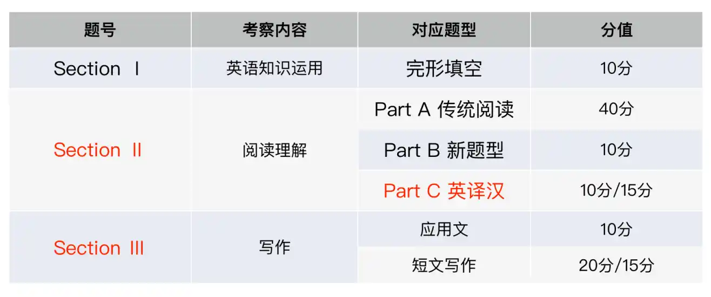

# 【前言】

## 写作学习的几个问题

（1）写作应该怎么学?

**答**：动笔写，无论是考前突击还是长线备考，不动笔的写作课不是写作课。

（2）作文自己写不出来，怎么办?

**答**：缺什么背什么，缺汉语思路，背汉语思路，缺英文表达，背英文表达。

（3）真题还是模拟预测重要?

**答**：都重要，但如果一定要选，真题比模拟预测重要。

## 英语（一/二）题型及分值分布

---

# 应用文写作

## 辞职+道歉

### 【参考题目】

<b>Directions:</b> Two months ago, you got a job as an editor for the magazine Design & Fashion. But now you find that the work is not what you expected. You decided to quit. Write a letter to your boss, Mr. Wang, telling him your decision, stating your reasons, and making apologies. You should write about 100 words. Do not sign your own name at the end of the letter. Use "Li Ming" instead. Do not write your address. (10 points)

### 【参考范文】

Dear Mr.Wang,

I am really excited to recall the past two months when I worked as an editor for your magazine. However, I am writing for the purpose of quitting since this work is not what I expected.

It was your and other colleagues’ tremendous help that enabled me to master certain ability and experience. Thus, I am quite grateful to you for your help. Anyway, my competence, compared with the demands of this job, is not adequate and I cannot do it well. In short, I am keen on computer science rather than editing. To conclude, it is not advisable for me to continue this work.

Finally, Please stand in my shoes and accept my apologies.

Yours sincerely,

Li Ming

### 【参考译文】

尊敬的王先生：

我很高兴回忆起过去两个月，我在贵杂志担任编辑的经历。然而，我写作的目的是辞职，因为这项工作不是我所期望的。

正是你和其他同事的巨大帮助使我掌握了一定的能力和经验。因此，我非常感谢你的帮助。无论如何，与这份工作的要求相比，我的能力是不够的，我做不好。简而言之，我热衷于计算机科学，而不是编辑。最后，我不宜继续这项工作。

最后，请站在我的立场思考一下并接受我的道歉。

您真诚的

李明

---

## 道歉+建议

### 【参考题目】

<b>Directions:</b> You have just come back from Canada and found a music CD in your luggage(n.行李箱) that you forgot to return to Bob, your landlord(n.房东) there. Write him a letter to 1) make an apology; 2) suggest a solution. You should write about 100 words. Do not sign your own name at the end of the letter. Use “Li Ming” instead. Do not write the address. (10 points)

### 【参考范文】

Dear Bob,

l am very pleased to recall the past days when l lived in your house. However, l am writing to apologize because l forgot to return a CD to you.

lt was your tremendous help that enabled me to enjoy a comfortable and fruitful trip of learning in Canada. Therefore, l am quite grateful for your help. Anyway, I, compared with you, am not so careful and l did not find your CD in my luggage until l came back to China. Thus, l deem that it is advisable for me to send it back immediately by EMS. Of course, if you can think of any other better solution, please feel free to inform me.

Once again, I am deeply sorry for any inconvenience caused.

Yours sincerely,

Li Ming

### 【参考译文】

亲爱的鲍勃：

我很高兴回忆起过去我住在你家的日子。然而，我写信是为了道歉，因为我忘了把CD还给你。

正是你的巨大帮助，让我在加拿大享受了一次舒适并富有成果的学习之旅。因此，我非常感谢你的帮助。无论如何，与你相比，我还是粗心，直到我回到中国，我才在行李中找到你的CD。因此，我认为我最好立即用特快专递寄回。当然，如果你能想出其他更好的解决方案，请随时通知我。

对于由此给您带来的不便，我再次深表歉意。

您真诚的

李明

---

## 求助+描述

### 【参考题目】

<b>Directions:</b> You want to contribute to Project Hope by offering financial aid to a child in a remote area. Write a letter to the department concerned, asking them to help find a candidate. You should specify what kind of child you want to help and how you will carry out your plan.

Write your letter with no less than 100 words. Do not sign your name at the end of the letter; use "Li Ming" instead. Do not write the address. (10 points)

### 【参考范文】

Dear Sir or Madam,

As a senior (at Peking University) who pays great attention to Project Hope, l am writing for the purpose of finding a candidate since l intend to offer financial help to him/her.

Project Hope is featured with warm people's help, which enables a host of poor children to gain the opportunity of education. Thus, in my opinion, it is rational for everyone to contribute to Project Hope and l want to help a child in a remote area, whose family is so impoverished that they cannot afford tuition. Compared with others, l am not richer but l am willing to do my utmost to help her/ him finish education from high school to college.

Finally, I want to say that l am quite grateful for your hard work and l am looking forward to your favorable reply at your earliest convenience.

Yours sincerely,

Li Ming

### 【参考译文】

尊敬的先生/女士：

作为一名（北京大学）非常关注希望工程的大四学生，我写信是为了寻找候选人，因为我打算为他/她提供经济帮助。

希望工程的特点是得到了人们的热情帮助，使一大批贫困儿童获得了受教育的机会。因此，在我看来，每个人都加入希望工程是合理的，我想帮助一个偏远地区的孩子，他们的家庭非常贫困，无法负担学费。与其他人相比，我并不富裕，但我愿意尽我所能帮助她/他完成从高中到大学的教育。

最后，我想说的是，我非常感谢你的辛勤工作，我期待着你在方便的时候尽早给予我良好的答复。

您真诚的

李明

---

## 描述+建议

### 【参考题目】

<b>Directions:</b> Write a letter to your university library, making suggestions for improving its service.

You should write about 100 words on ANSWER SHEET 2.

Do not sign your own name at the end of the letter.

Use "Li Ming" instead.

Do not write the address.(10 points)

### 【参考范文】

Dear Sir or Madam,

As a senior at this university who is keen on reading in library in the spare time, l am writing for the purpose of making suggestions for enhancing the service here.

Above all, compared with students' demands in study, the variety and quantity of books here are inadequate. Accordingly, it is advisable for you to purchase more latest books. In addition, because a host of seniors, including me, are preparing for the national entrance examination for postgraduate studies and they study in reading rooms, it is of great necessity to prolong the opening hours.

Finally, l deem that with our shared efforts, the library service will be improved a lot.

Yours sincerely,

Li Ming

### 【参考译文】

尊敬的先生/女士：

作为这所大学的一名大四学生，我热衷于利用业余时间在图书馆阅读，我写信的目的是为加强图书馆的服务提出建议。

最重要的是，与学生的学习需求相比，这里的书籍种类和数量都不足。因此，你最好多买一些最新的书。此外，由于包括我在内的许多高年级学生正在准备研究生入学考试，他们在阅览室学习，因此延长开放时间是非常必要的。

最后，我相信通过我们的共同努力，图书馆的服务会得到很大的改善。

您真诚的

李明

---

## 招募+通知

### 【参考题目】

<b>Directions:</b> You are supposed to write for the Postgraduate' Association（研究生协会） a notice to recruit volunteers for an international conference（会议） on globalization, you should conclude the basic qualification of applicants and the other information you think relative.

You should write about 100 words. Do not sign your own name at the end of the letter.Use "postgraduate association" instead. (10 points)

### 【参考范文】

Notice

Friday, June 10

This notice is for the purpose of recruiting 25 volunteers for the international conference on globalization, which is scheduled tobe held in our university.

This conference will start on June 20th and last (for) three days. Since amajority of its participants are foreigners, it is appropriate for applicants to be able to speak at least one foreign language, such as English, French or Spanish, which will help volunteers communicate with foreign experts or scholars smoothly. In addition to this qualification, applicants are supposed to be warmhearted and considerate and it is your service that will enable foreign guests to enjoy a comfortable trip in China.

There will be an interview for applicants in the Office of Postgraduates'Association at 14:00 on June 16.

Postgraduate' Association

### 【参考译文】

通知

6月10日 星期五

本通知旨在为定于我校举行的全球化国际会议招募25名志愿者。

这次会议将于6月20日开始，为期三天。由于大多数参与者是外国人，申请者至少能说一门外语是合适的，如英语、法语或西班牙语，这将有助于志愿者与外国专家或学者顺利沟通。除此之外，申请人还应热情周到，正是您的服务将使外国客人在中国享受一次舒适的旅行。

6月16日14:00，研究生协会办公室将对申请者进行面试。

研究生协会

---

## 通知+介绍

### 【参考题目】

<b>Directions:</b> 47. Directions: Suppose your university is going to host a summer campfor high school students. Write a notice

1）briefly introduce the camp activities, and

2）call for volunteers

You should write about 100 words on the ANSWER SHEET. Do not use your name or the name of your university. Do not write your address. (10 points)

### 【参考范文】

Notice

Friday, June 20

lt is so great to hear that a summer camp for high school students will be hosted by our university and this notice is for the purpose of briefly introducing relevant activities and calling for 25 volunteers.

This camp is scheduled to start on July and last for two weeks. Then, the main activities include attending lectures by prestigious experts or scholars, visiting our university museum, and participating in the reception dinner. Thus, volunteers are supposed to possess certain experience and competence in organizing activities. ln addition, it is advisable for applicants to be familiar with our campus so that you can show them around in the spare time.

We deem that with your support, this camp will be successful.

the Students' Union

### 【参考译文】

通知

6月20日 星期五

很高兴听到我们大学将为高中生举办夏令营，本通知旨在简要介绍相关活动，并招募25名志愿者。

这个训练营定于7月开始，为期两周。然后，主要活动包括参加著名专家或学者的讲座，参观我们大学的博物馆，以及参加招待晚宴。因此，志愿者应该在组织活动方面具有一定的经验和能力。此外，申请人最好熟悉我们的校园，这样你就可以在业余时间带他们参观。

我们相信，在你们的支持下，这个训练营一定会取得成功。

学生会

---

## 观点+建议

### 【参考题目】

<b>Directions:</b> Restrictions on the use of plastic bags have not been so successful in some regions. "White Pollution" isstill going on. Write a letter to the editor(s) of your local newspaper to

1）give your opinions briefly, and

2）make two or three suggestions.

You should write about 100 words on ANSWER SHEET 2. Do not sign your own name at the end of the letter. Use "Li Ming" instead.Do not write the address. (10 points)

### 【参考范文】

Dear Sir or Madam,

As a loyal reader of your newspaper who pays great attention to the environmental protection, l am writing for the purpose of making suggestions to reduce "White Pollution".

Plastic bags, to my understanding, are characterized by the damage to the environment. However, compared with the public expectation, restrictions on the use of plastic bags have not been so satisfactory in certain regions. Thus, it is advisable for your newspaper to more specifically report the harm of "White Pollution". In addition, you are supposed to educate and encourage readers to utilize paper or cloth bags instead of plastic ones.

l am convinced that with our shared efforts, "VWhite Pollution" will be alleviated a lot and even be eliminated.

Yours sincerely,

Li Ming

### 【参考译文】

尊敬的先生/女士：

作为贵报的忠实读者，我非常关注环境保护，我写这篇文章的目的是为减少“白色污染”提出建议。

据我所知，塑料袋的特点是对环境的破坏。然而，与公众的期望相比，某些地区对塑料袋使用的限制并没有那么令人满意。因此，你的报纸最好更具体地报道“白色污染”的危害。此外，你应该教育和鼓励读者使用纸袋或布袋，而不是塑料袋。

我相信，在我们的共同努力下，“白色污染”将大大减轻，甚至消除。

您真诚的

李明

---

## 推荐+描述

### 【参考题目】

<b>Directions:</b> 47. Directions: Suppose your university is going to host a summer campfor high school students. Write a notice

1）briefly introduce the camp activities, and

2）call for volunteers

You should write about 100 words on the ANSWER SHEET. Do not use your name or the name of your university. Do not write your address. (10 points)

### 【参考范文】

Notice

Friday, June 20

lt is so great to hear that a summer camp for high school students will be hosted by our university and this notice is for the purpose of briefly introducing relevant activities and calling for 25 volunteers.

This camp is scheduled to start on July and last for two weeks. Then, the main activities include attending lectures by prestigious experts or scholars, visiting our university museum, and participating in the reception dinner. Thus, volunteers are supposed to possess certain experience and competence in organizing activities. ln addition, it is advisable for applicants to be familiar with our campus so that you can show them around in the spare time.

We deem that with your support, this camp will be successful.

the Students' Union

### 【参考译文】

通知

6月20日 星期五

很高兴听到我们大学将为高中生举办夏令营，本通知旨在简要介绍相关活动，并招募25名志愿者。

这个训练营定于7月开始，为期两周。然后，主要活动包括参加著名专家或学者的讲座，参观我们大学的博物馆，以及参加招待晚宴。因此，志愿者应该在组织活动方面具有一定的经验和能力。此外，申请人最好熟悉我们的校园，这样你就可以在业余时间带他们参观。

我们相信，在你们的支持下，这个训练营一定会取得成功。

学生会

---

以上仅供参考，强烈推荐大家可以去看橙啦石雷鹏老师的英语写作课，全是干货！

