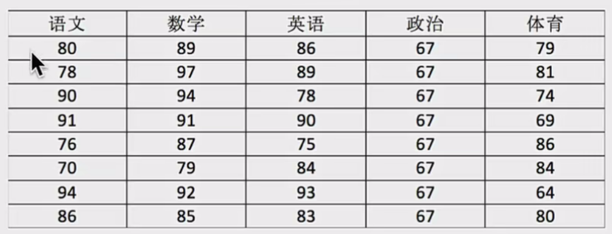
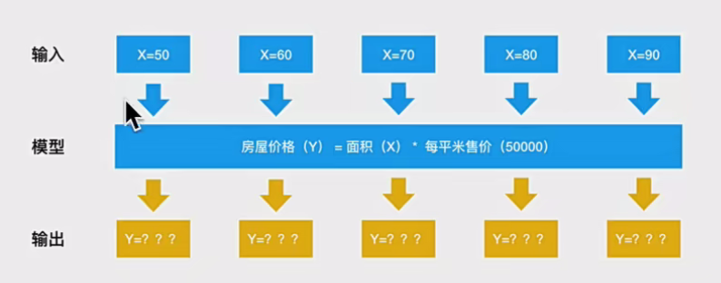
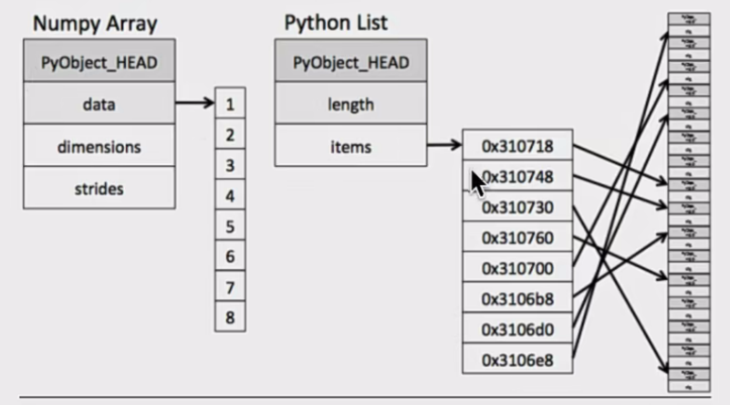

## Numpy介绍

Numpy（Numerical Python）是一个开源的Python科学计算库，<b>用于快速处理任意维度的数组</b>。

Numpy<b>支持常见的数组和矩阵操作</b>。对于同样的数值计算任务，使用Numpy比直接使用Python要简洁的多。

Numpy<b>使用ndarray对象来处理多维数组</b>，该对象是一个快速而灵活的大数据容器。

---

## ndarray介绍

```python
NumPy provides an N-dimensional array type, the ndarray, which describes a collection of "items" of the same type.
```

NumPy提供了一个<b>N维数组类型ndarray</b>，它描述了<b>相同类型</b>的“items”的集合。



用ndarray进行存储：

```python
import numpy as np

# 创建ndarray
score = np.array(
[[80, 89, 86, 67, 79],
[78, 97, 89, 67, 81],
[90, 94, 78, 67, 74],
[91, 91, 90, 67, 69],
[76, 87, 75, 67, 86],
[70, 79, 84, 67, 84],
[94, 92, 93, 67, 64],
[86, 85, 83, 67, 80]])

score
```

返回结果：

```python
array([[80, 89, 86, 67, 79],
       [78, 97, 89, 67, 81],
       [90, 94, 78, 67, 74],
       [91, 91, 90, 67, 69],
       [76, 87, 75, 67, 86],
       [70, 79, 84, 67, 84],
       [94, 92, 93, 67, 64],
       [86, 85, 83, 67, 80]])
```

<b>提问：</b>

使用python列表可以存储一维数组，通过列表的嵌套可以实现多维数组，那么为什么还需要使用Numpy的ndarray呢?

---

## ndarray与Python原生list运算效率对比

在这里我们通过一段代码运行来体会到ndarray的好处。

```python
import random
import time
import numpy as np

a =[]
for i in range(100000000):
    a.append(random.random())

# 通过%time魔法方法，查看当前行的代码运行一次所花费的时间
%stime sum1=sum(a)

b=np.array(a)
%time sum2=np.sum(b)
```

其中第一个时间显示的是使用原生Python计算时间，第二个内容是使用numpy计算时间:

```python
CPU times: user 852 ms, sys: 262 ms, total: 1.11 s Wall time: 1.13 s
CPU times: user 133 ms, sys: 653 μs, total: 133 ms Wall time: 134 ms
```

从中我们看到ndarray的计算速度要快很多，节约了时间。

<p align = "justify" style = "text-indent:2em"><b>机器学习的最大特点就是大量的数据运算</b>，那么如果没有一个快速的解决方案，那可能现在python也在机器学习领域达不到好的效果。</p>



<p align = "justify" style = "text-indent:2em">Numpy专门针对ndarray的操作和运算进行了设计，所以数组的存储效率和输入输出性能远优于Python中的嵌套列表，数组越大，Numpy的优势就越明显。</p>

<b>思考:</b>

ndarray为什么可以这么快?

---

## ndarray的优势

### 内存块风格

ndarray到底跟原生python列表有什么不同呢，请看一张图:



<p align = "justify" style = "text-indent:2em">从图中我们可以看出ndarray在存储数据的时候，数据与数据的地址都是连续的，这样就给使得批量操作数组元素时速度更快。</p>

<p align = "justify" style = "text-indent:2em">这是因为ndarray中的所有元素的类型都是相同的，而Python列表中的元素类型是任意的，所以ndarray在存储元素时内存可以连续，而python原生list就只能通过寻址方式找到下一个元素，这虽然也导致了在通用性能方面Numpy的ndarray不及Python原生list，但在科学计算中，Numpy的ndarray就可以省掉很多循环语句，代码使用方面比Python原生list简单的多。</p>

### ndarray支持并行化运算（向量化运算）

<p align = "justify" style = "text-indent:2em">numpy内置了并行运算功能，当系统有个核心时，做某种计算时，numpy会自动做并行计算。</p>

### 效率远高于纯Python代码

<p align = "justify" style = "text-indent:2em">Numpy底层使用C语言编写，内部解除了GIL（全局解释器锁），其对数组的操作速度不受Python解释器的限制，所以，其效率远高于纯Python代码。</p>