## 几何应用

### 平面图形的面积

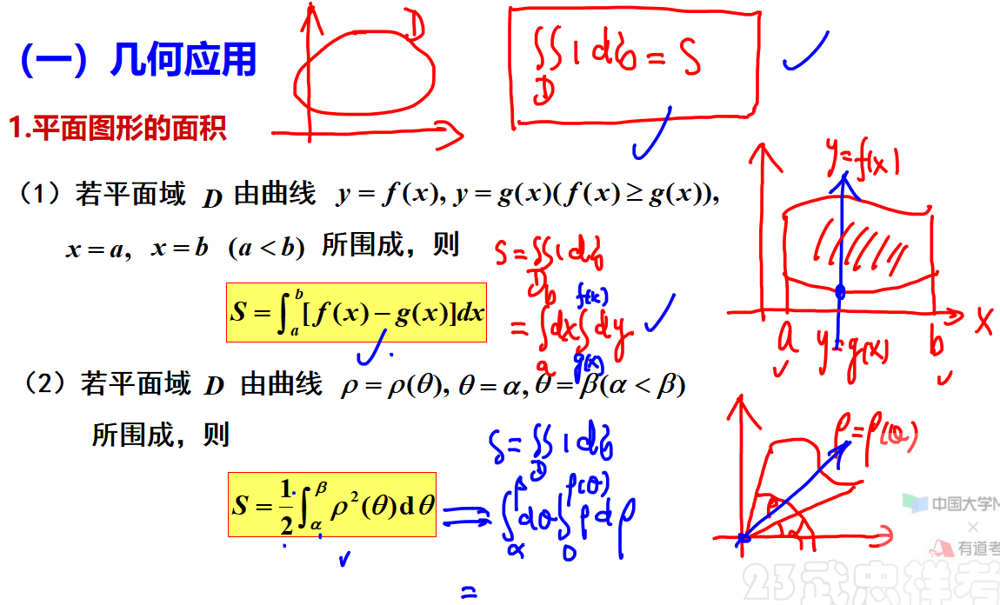

---

### 旋转体体积

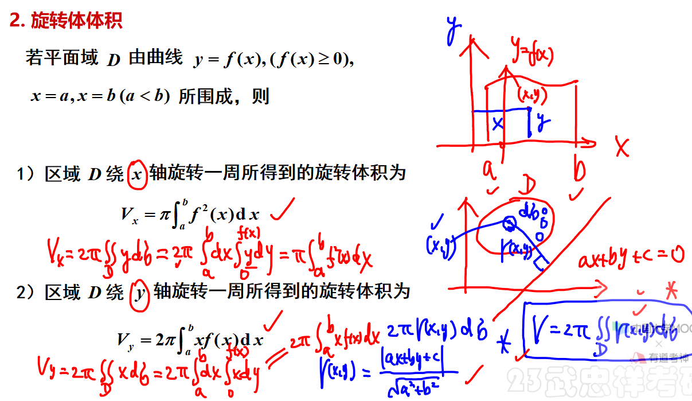

---

### 曲线弧长（数三不要求）

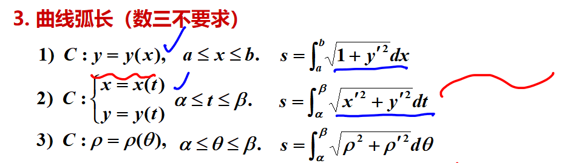

---

### 旋转体侧面积（数三不要求）

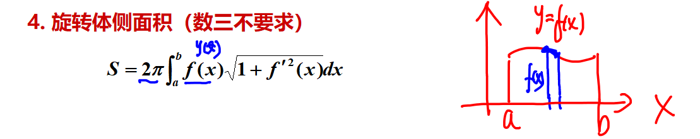

---

## 物理应用（数三不要求）

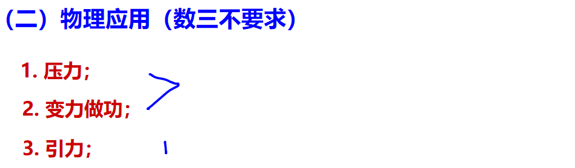

---

## 常考题型与典型例题 

1、几何应用

2、物理应用

---

### 例题1

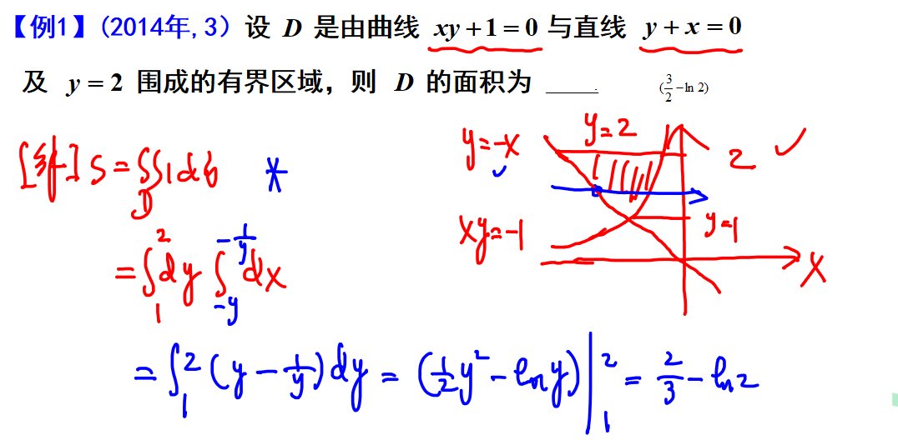

---

### 例题2

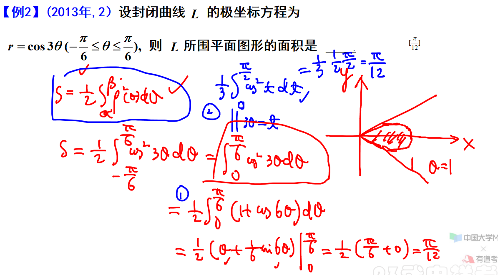

---

### 例题3

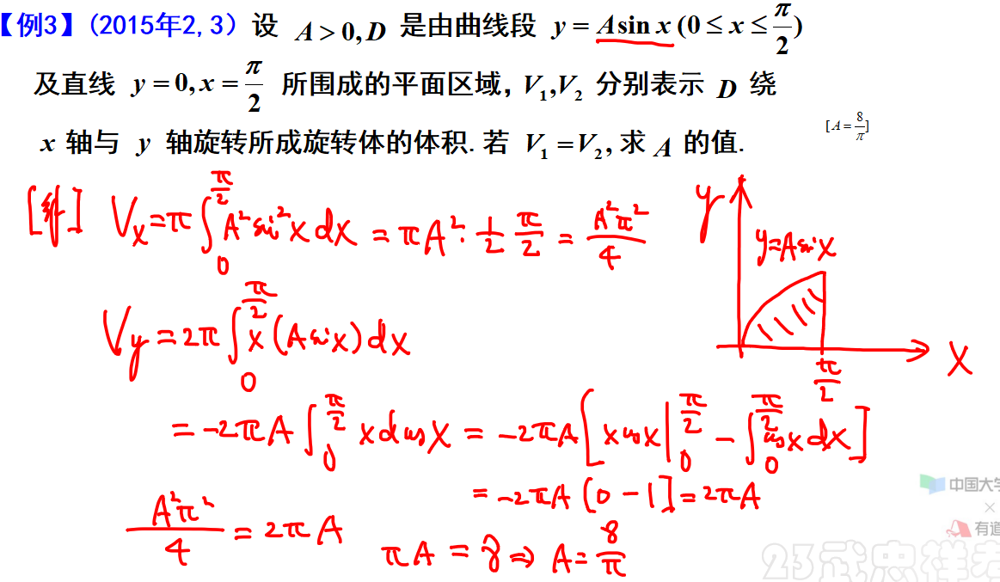

---

### 例题4

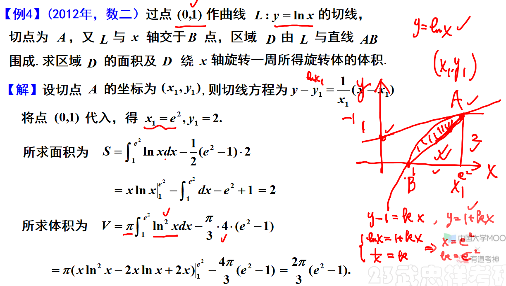

---

### 例题5

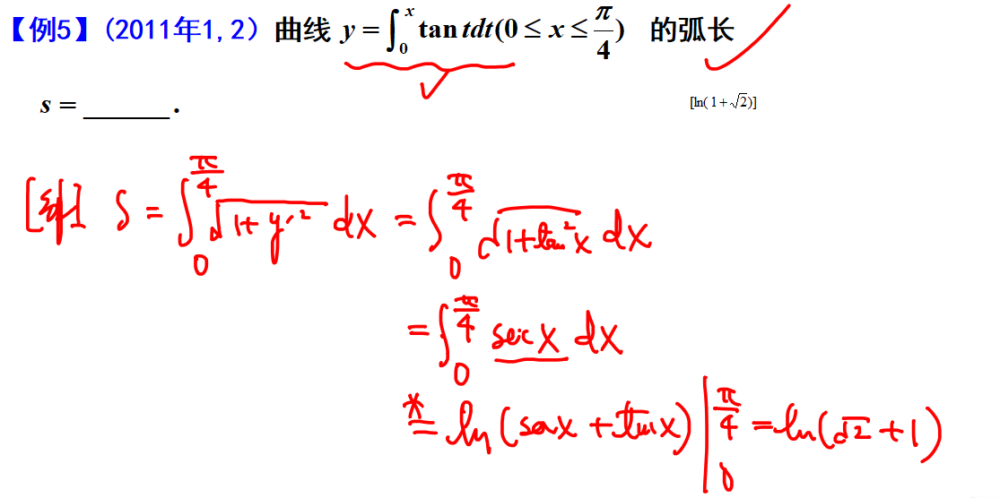

---

### 例题6

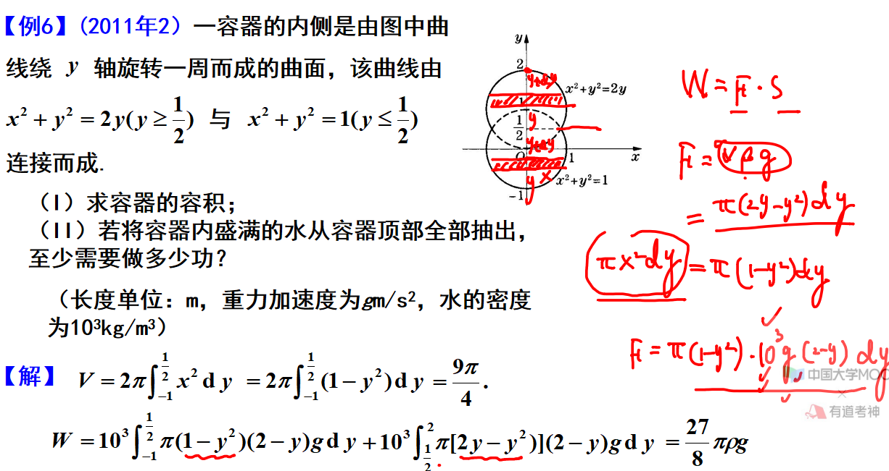

---

### 例题7

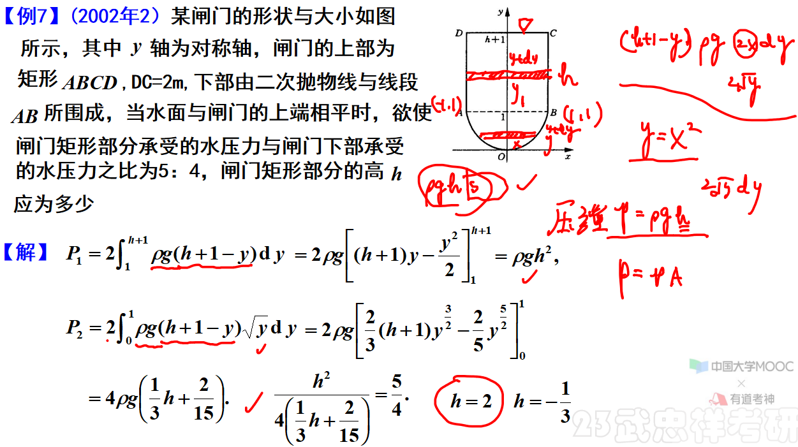

---

内容取自武忠祥老师基础班教程，参考书《高等数学·基础篇》